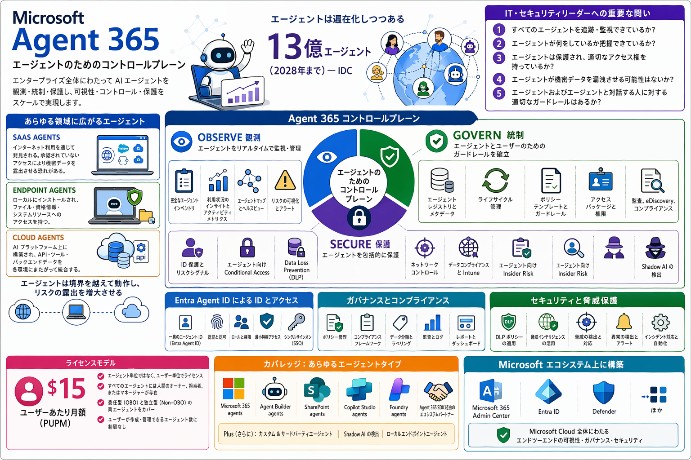

# 00 概要 — Microsoft Agent 365 とは？

[← 目次](./README.md) ｜ [Step 1：前提 →](./01-prerequisites.md)

はじめての方向けに、**Agent 365 が何で・なぜ必要で・何ができるか**をやさしく整理します。
（用語の中身は [Step 2](./02-entra-agent-id.md) 以降で深掘りします。）


*▲ Agent 365 の全体像 — コントロールプレーン（Observe / Govern / Secure）・対象エージェント・Entra Agent ID・エコシステム*

---

## ひとことで

Agent 365 は、組織の中で動く **AI エージェントを「見える化・統制・保護」するための仕組み**です。
エージェントを、人の社員と同じように **ID を持たせて・権限を管理し・監視し・退役**まで一元的に扱えるようにします。

## なぜ必要？（解決する課題）

AI エージェントは増えやすく、放っておくと **Shadow AI（管理外エージェント）** になります。
次の問いに即答できない状態が「対策前」です。

- 今、組織にエージェントは **何体**ある？
- それぞれ **誰の権限**で動いている？
- **データ**は守られている？
- **攻撃や不正利用**を検知できる？

Agent 365 は、これらに答えられる状態を作ります。

## 3 本柱：Observe → Govern → Secure

| 柱 | やること | 例 |
| --- | --- | --- |
| **Observe（可観測性）** | まず見える化（棚卸し） | レジストリ / Agent Map / ダッシュボード |
| **Govern（ガバナンス）** | ルールで統制 | ライフサイクル / 承認 / ポリシー / 条件付きアクセス |
| **Secure（セキュリティ）** | 脅威とデータを保護 | Defender / Purview / DLP / Entra |

> [!TIP]
> 順番が大事です。**まず Observe（見える化）から**始め、Govern（統制）→ Secure（保護）へ広げます。

## どんなエージェントを管理できる？

Microsoft ネイティブ（Copilot Studio / Foundry）から、**SDK 連携・自社開発・外部 SaaS・端末上のローカル AI** まで横断して管理します。
左ほど深く統制でき、右ほど「見えにくい（まず可視化が必要）」ゾーンです。本ワークショップの題材（LangChain + Node.js 自前ホスト）は、この **「自社開発・自前ホスト＝サードパーティ／カスタム」** に当たります（→ [Step 3](./03-third-party-management.md)）。

## エージェントのライフサイクル

```
登録 ─▶ 承認 ─▶ 公開 ─▶ 運用（監視・保護）─▶ 廃止
```

本ワークショップでは、この一連を **実機（Step 4〜8）** で体験します。

---

## 最初に覚える用語（ミニ辞典）

| 用語 | 説明 |
| --- | --- |
| **Entra Agent ID** | エージェント専用の「身分証」。人やアプリの ID とは別種の、新しい ID。 |
| **Blueprint（ブループリント）** | エージェントを作るための「設計図／テンプレート」。 |
| **Instance（インスタンス）** | 設計図から作った「実体」。**これを作って初めて Agent ID が付く。** |
| **AI Teammate** | Teams などで人のように振る舞うエージェント。instance 作成時に Agent ID ＋ ユーザーが払い出される。 |
| **a365 CLI** | 自前 / サードパーティのエージェントを Agent 365 の管理下に置くための **コマンドツール**（→ [Step 3](./03-third-party-management.md)）。 |
| **OBO（委任）** | ユーザーの代理として、**ユーザーの権限**で動く方式。 |
| **S2S（自律）** | **エージェント自身の権限**で、無人で動く方式。 |
| **Agent Registry** | 組織内エージェントの一覧（台帳）。管理センターで確認。 |
| **Observability** | エージェントの活動ログ・実行トレースを集める仕組み。 |

> [!NOTE]
> 各用語の中身は [Step 2：Agent Registry / Entra Agent ID](./02-entra-agent-id.md) と [Step 3：サードパーティ管理](./03-third-party-management.md) で詳しく解説します。

---

[← 目次](./README.md) ｜ [Step 1：前提 →](./01-prerequisites.md)
