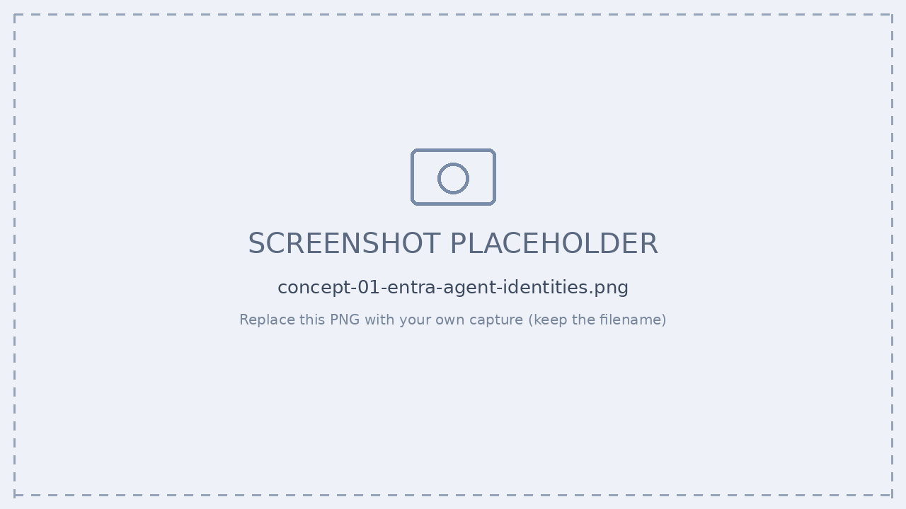

# 深掘り — Entra Agent ID / Agent Registry / Blueprint→Instance の中身

[← 目次](./README.md) ｜ [← 前提](./00-prerequisites.md) ｜ [Step 3 登録 →](./step3-register.md)

[00-prerequisites.md](./00-prerequisites.md) では「3 レイヤー」と「Blueprint→Instance」を概観しました。
このページでは、**そもそも Entra Agent ID とは何か**、**`a365 setup all` が内部で何を作っているか**、**AI Teammate の instance 作成で何が払い出されるか**、そして **Agent Registry** を一段深く掘り下げます。

---

## 1. そもそも Entra Agent ID とは？

Microsoft Entra Agent ID は、その名のとおり **AI エージェントを Microsoft Entra 上で管理するための「新しい種類の ID」** です。
**ユーザー ID** とも **アプリケーション ID** とも異なります。エージェントの操作は、人やアプリの操作とは性質が違うため、専用の ID 種別が用意されました。

| ID の種類 | 特徴 |
| --- | --- |
| アプリケーション ID | 長期利用が前提。**安定性**が求められる。 |
| ユーザー ID | 資格情報・組織階層・メールなど**ユーザー属性**に紐づく。 |
| **Agent ID** | 自動化プロセスの中で**動的に作成**される ID。ワークフロー内で**1 日に何千回も作成・破棄**されうる。ユーザー認証はしないが、**ユーザーのように振る舞う**（＝OBO）シナリオもある。 |

> [!NOTE]
> Entra Agent ID は、既存の Entra ID 機能を**エージェントにも拡張**したものと捉えると分かりやすいです。現時点で主に次の 5 つを実現します：
> ① Agent の登録と管理（Agent Registry）／ ② Agent ID の条件付きアクセス／ ③ ガバナンス（Governance Agent ID）／ ④ ID Protection（攻撃・不正エージェントの阻止）／ ⑤ セキュア ネットワーク アクセス（Global Secure Access for Agents）

---

## 2. 4 つのオブジェクトの関係（ここが混乱の山）

Agent ID 周りは **4 つのオブジェクト**が登場します。まずここを切り分けます。

| オブジェクト | わかりやすく言うと |
| --- | --- |
| **Agent identity blueprint** | Agent ID を作成する**テンプレート**。認証・アクセス許可・アクティビティログ等の重要情報を含む。 |
| **Agent identity blueprint principal** | blueprint を**テナントに登録した時にできる実体**。実際にトークンを取得し、Agent ID を作成し、blueprint に代わって**監査ログに表示**される。 |
| **Agent Identity** | エージェント**1 体ごとの ID**。この ID で Microsoft サービスにアクセスする。 |
| **Agent's User Account** | Teams や Outlook など「ユーザーでないと動かないシステム」を使うときに必要。**Agent Identity と 1:1**。 |

```
                Agent identity blueprint  （テンプレート：認証/権限/監査の設計図）
                          │
            テナントに登録 │  ← ここで principal が作られる
                          ▼
        Agent identity blueprint principal  （実体：トークン取得・Agent ID 作成・監査の主体）
                          │
        ┌─────────────────┼─────────────────┐   ← 1 つの blueprint から最大 250 体
        ▼                 ▼                 ▼
   Agent Identity A   Agent Identity B   Agent Identity C
        │  （1:1）
        ▼
   Agent's User Account A   （Teams/Outlook 用。AI Teammate で払い出される）
```

> [!IMPORTANT]
> **テナント内のすべての Agent ID は、必ず Agent identity blueprint から作られます。**
> blueprint は「情報を保持するだけ」ではなく、`AgentIdentity.CreateAsManager` という特別な Graph 権限を持ち、**自分自身が Agent ID を作成する**主体でもあります。

---

## 3. Agent ID Blueprint の詳細

建物の設計図が配管・電気・構造まで含むように、**Agent ID Blueprint** は認証・アクセス許可・アクティビティログまで含む「設計図」です。
1 つの blueprint から作られた各エージェントは、**独自の ID・資格情報・権限**を持ちつつ、blueprint で定義された**共通特性を共有**します。

### blueprint が保持する主なもの

| 区分 | 内容 |
| --- | --- |
| 共有プロパティ | 説明 / アプリロール / 検証済み発行元 / 認証プロトコル設定（`OptionalClaims` 等） |
| **資格情報** | Agent ID が Entra からアクセストークンを要求する際に使う。blueprint に付与した OAuth 権限は、**そこから作られた全 Agent ID に付与**される。 |
| **必要なリソースアクセス** | エージェントが必要とする API/権限の**宣言**。同意レビュー時に管理者へ提示される。 |
| **継承可能なアクセス許可** | 管理者が blueprint principal に許可を付与すると、**組織内の全 Agent ID が自動で継承**する。 |
| ID 作成用 | OAuth クライアント ID / 資格情報 / `AgentIdentity.CreateAsManager` 権限。 |

> [!TIP]
> **セキュリティを大規模にスケールできるのが blueprint の価値です。**
> - 条件付きアクセス ポリシーを **blueprint に対して**適用すると、そこから作られた全 Agent ID が対象になります。
> - **blueprint を無効化**すると、その全 Agent ID が認証できなくなります（一括停止）。

### blueprint principal の役割

blueprint をテナントに追加すると、対応する **blueprint principal** が必ず作られます。

- **トークン発行**：blueprint でトークンを取得すると、トークンの `oid`（オブジェクト ID）クレームは principal を指す → テナント内で追跡可能。
- **監査ログ**：blueprint による操作（Agent ID 作成など）は principal が実行したものとして記録される → 説明責任が明確。
- **削除**：顧客は principal を削除することで、そのテナントから blueprint を消去できる。

---

## 4. `a365 setup all` は内部で何を作っているか

`a365 setup all` は、本来 **Microsoft Graph で手作業で行う Agent ID 作成フローを自動化**したものです。手動 Graph 版（[Zenn / Graph 編](https://zenn.dev/microsoft/articles/91df843374fbde)）の流れと対応づけると、中で何が起きているかが見えます。

| Graph 手動フロー | `a365 setup all` の対応出力（例） | 生成物 |
| --- | --- | --- |
| ① Graph に接続 | 要件チェック（Azure 認証 / Graph モジュール） | — |
| ② **Blueprint を作成** | `Found existing blueprint`（無ければ新規作成） | Agent identity blueprint（appId） |
| ③ **資格情報を追加** | `Client secret is valid, skipping creation` | クライアントシークレット（※本番は WIF/Managed ID 推奨） |
| ④ **Blueprint Principal を作成** | 継承権限の構成 / 委任・同意の付与 | blueprint principal（`AgentIdentity.CreateAsManager` 自動付与） |
| ⑤ Blueprint のトークン取得 | S2S app role assignments / delegated consent | `roles` に `AgentIdentity.CreateAsManager` |
| ⑥ **Agent Identity を作成** | `Agent identity created (ID: 097c…)` | Agent Identity |
| ⑦ 登録・設定 | `Agent registered (ID: T_f379…)` / `appsettings.json` にスタンプ | レジストリ登録・設定反映 |

> [!IMPORTANT]
> **blueprint principal は自動では作られません。** Graph で手作業する場合、Step ④ を飛ばすと Agent Identity 作成時に
> `400: The Agent Blueprint Principal for the Agent Blueprint does not exist.` が出ます。
> principal を作ると `AgentIdentity.CreateAsManager` が**自動付与**され、**この権限は取り消せません**（無効化は principal ごと削除）。
> `a365 setup all` はこの一連を冪等（`reused` = 既存再利用）に処理します。

> [!WARNING]
> `a365 setup all` で **AI Teammate** を作るには、手動の `a365.config.json`（`agentUserPrincipalName` 等）＋ `--aiteammate` が必要です（[Step 3](./step3-register.md) 参照）。無印は通常 agent モードになります。

---

## 5. AI Teammate：instance 作成で Agent ID ＋ User が払い出される

ここが「Blueprint→Instance」の核心です。

- **blueprint はテンプレート**であって実体ではありません。
- 管理センターで **`+ Add instance`**（または Graph で `agentIdentity` を作成）した**瞬間**に、**Agent Identity**（Entra Agent ID）が払い出されます。
- さらに **AI Teammate** の場合は、Teams/Outlook など「ユーザーでないと動かない」面で動作するために、**Agent's User Account** が **Agent Identity と 1:1** で同時に払い出されます。

```
+ Add instance
     │
     ├──▶ Agent Identity（Entra Agent ID：例 12f560ef-…）     ← Microsoft サービスへのアクセス主体
     │
     └──▶ Agent's User Account（例 hana-assistant@tenant…）    ← Teams で @mention できる実体（AI Teammate）
```

instance 作成画面で入力する主な項目（[管理センター](https://learn.microsoft.com/microsoft-365/admin/manage/agent-registry)）：

| 項目 | 内容 |
| --- | --- |
| Instance display name | Teams での表示名（透明性のため「Assistant」等を含めると良い：例 `Hana (Onboarding Assistant)`） |
| Agent Instance alias | agent user の UPN 前半（例 `hana-assistant` → `hana-assistant@tenant.onmicrosoft.com`） |
| Owner / Reports to（Sponsor） | instance の責任者。**Sponsor は必須**で、**User オブジェクト**を指定（SP やグループ不可）。 |
| License | agent user は実ユーザー扱い。ライセンス割り当てが必要になることがある。 |

> [!TIP]
> - instance 作成後、blueprint 詳細の **Entra agent ID が「—」から実値**に変わります。この値が Observability 送信時の `agentId` です。
> - **1 つの blueprint から最大 250 体**の Agent Identity を作成できます。
> - **Sponsor（スポンサー）** は Agent ID のライフサイクル（更新・延長・削除）の判断責任者。スポンサーが組織を離れると**自動的にマネージャーへ変更**されます。

---

## 6. Agent Registry（エージェント レジストリ）

**Agent Registry** は、組織で使えるすべてのエージェントを一元表示するインベントリです。
**M365 管理センター › Agents › All agents › Registry**、または **Entra 管理センター › Agent ID › Microsoft Entra Agent Registry** から確認します。


*▲ Entra 管理センター › Agent ID › All agent identities（Blueprint Principal も確認可）*


*▲ M365 管理センター › Agents › All agents › Registry*

### 4 つのエージェント種別

| 種別 | 説明 |
| --- | --- |
| Microsoft エージェント | Microsoft が構築・保守。 |
| 外部パートナー構築エージェント | 信頼された外部開発元が公開。 |
| 組織によって発行された | 承認済みカスタム（LOB / 基幹業務）エージェント。 |
| 作成者が共有する | 個々のユーザー/開発者が作成・共有（Shared エージェント）。 |

### レジストリ概要・リスク

- **概要カウント**：エージェント合計数 / 所有者がいないエージェント / アンマネージド（A365 外で作成・管理）エージェント。
- **リスク列**：Entra・Defender・Purview の**高重大度リスクを集約**表示（シャドウエージェント、所有者未割当、過剰権限、プロンプトインジェクション、機密データアクセス、CA 違反、承認待ち など）。`レビュー` リンクから各セキュリティポータルへ。
- **フィルタ／アクション**：Status / Publisher / Channel（Copilot/Teams/Outlook/M365 アプリ/SharePoint）/ Platform でフィルタ。Refresh / Export（CSV・30 項目超）/ Add agent（manifest .zip アップロード）/ ピン留め / 列カスタマイズ / Graph API（プレビュー）。

### 登録経路（どう登録されるか）

エージェントの**作り方によって登録経路が変わります**。

| 作られ方 | 登録 |
| --- | --- |
| Copilot Studio / Microsoft 365 Agents / Foundry | **自動登録** |
| 上記以外の MS プラットフォーム / Microsoft 以外 | **Microsoft Graph API でセルフサービス登録** |
| カスタム（自前ホスト） | **manifest（.zip）を管理センターにアップロード**（[Step 5](./step5-publish.md)） |

レジストリに登録するには、各エージェントについて次の **2 種類の情報**が必要です。

- **エージェント インスタンス**：実行・管理に必要な操作情報。
- **エージェント カード マニフェスト**：他のエージェント/アプリが検索・発見・操作するための検出メタデータ。

---

## 7. （参考）Graph API で Agent ID を手動作成する

中身を理解するための参考として、Graph で手作業する場合の流れです（詳細・サンプルコードは [Zenn / Graph 編](https://zenn.dev/microsoft/articles/91df843374fbde)）。

```text
Step 1: Graph に接続（Scopes: AgentIdentityBlueprint.Create, .AddRemoveCreds.All,
                      AgentIdentityBlueprintPrincipal.Create, User.Read）
Step 2: Agent identity blueprint を作成   POST /v1.0/applications/graph.agentIdentityBlueprint
Step 3: 資格情報（client secret）を追加     ※本番は Managed Identity / FIC 推奨
Step 4: blueprint principal を作成         POST /v1.0/servicePrincipals/graph.agentIdentityBlueprintPrincipal
Step 5: blueprint のトークン取得（client_credentials）→ roles に AgentIdentity.CreateAsManager
Step 6: Agent Identity を作成              POST /beta/servicePrincipals/microsoft.graph.agentIdentity
                                          （displayName / agentIdentityBlueprintId / sponsors 必須）
Step 7: 確認  Entra 管理センター › Agent identities › All agent identities
```

- **必要ライセンス**：Microsoft 365 Copilot ／ Frontier プログラム有効。
- **必要ロール**：Agent ID Developer または Agent ID Administrator（blueprint 作成）、Privileged Role Administrator（Graph 権限付与）。
- **注意**：Agent Identity 作成 API は現在 **beta エンドポイントのみ**。Sponsor は **User オブジェクト必須**。

> このフローを**まるごと自動化したのが `a365 setup all`** です（[セクション 4](#4-a365-setup-all-は内部で何を作っているか) 参照）。

---

## 参考リンク

- [エージェント ID ブループリント（Microsoft Learn）](https://learn.microsoft.com/entra/agent-id/agent-blueprint)
- [Microsoft 365 管理センターのエージェント レジストリ（Microsoft Learn）](https://learn.microsoft.com/microsoft-365/admin/manage/agent-registry)
- [Microsoft Entra Agent ID 入門編（Zenn）](https://zenn.dev/microsoft/articles/a52eae77302ce7)
- [Microsoft Entra Agent ID を作成する方法（Graph 編・サンプルコード付き／Zenn）](https://zenn.dev/microsoft/articles/91df843374fbde)

---

[← 前提](./00-prerequisites.md) ｜ [Step 3 登録 →](./step3-register.md)
