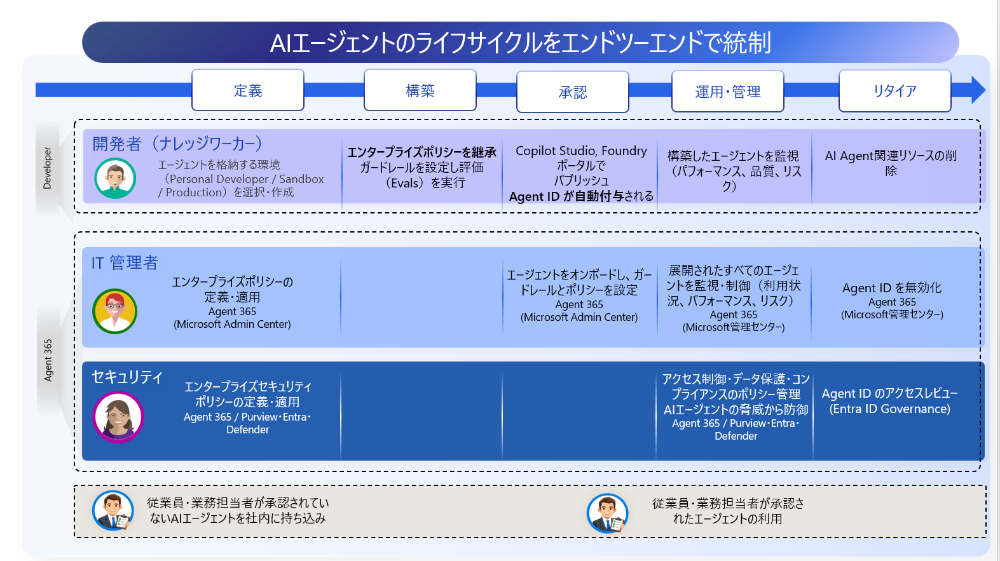

# Step 1 — Agent 365 を利用する前提条件

[← 00 概要](./00-overview.md) ｜ [← 目次](./README.md) ｜ [Step 2：Agent Registry / Entra Agent ID →](./02-entra-agent-id.md)

Agent 365 を使い始めるための、**組織側の前提（ライセンス・権限・対象 Agent・担当者）** を整理します。
（自前ホストで**開発**するための環境・ツール・3 レイヤーの考え方は [Step 3：サードパーティ管理](./03-third-party-management.md) にまとめています。）

---

## 1. ライセンス

| 区分 | 内容 |
| --- | --- |
| **基盤（必須）** | Microsoft 365 テナント |
| **ライセンス（必須）** | **Microsoft Agent 365**（評価可）、または **Microsoft 365 E7** |
| **ライセンス前提（エンタープライズ顧客）** | Agent 365 ライセンスの前提として **Microsoft 365 E5**、または **Business Premium + Defender / Purview** が必要 |
| ネットワーク（任意） | Entra Internet Access / Global Secure Access（エージェントの通信制御を使う場合） |
| データ準備（推奨） | アクセスデータ・**秘密度ラベル**・**DLP ポリシー**の事前準備 |

> [!NOTE]
> Observability や Defender for AI などの保護機能も、上記ライセンス（Agent 365）が前提です。

---

## 2. 権限（RBAC / ロール）

Agent 365 を中核に、**Entra（ID）・Defender（監視）・Purview（データ保護）** の周辺 RBAC を**最小権限**で役割分担します。

| 担当 | 主な必要 RBAC | 概要 |
| --- | --- | --- |
| **統括管理** | **AI Administrator** | 可視化・承認・公開・ブロック・構成・ガバナンスの**中心ロール** |
| 閲覧・監査 | AI Reader ／ Reports Reader | 設定・利用状況・レポートの参照（読み取り専用） |
| Entra（ID/アクセス） | Conditional Access・Identity Governance・Agent ID・Agent Registry Administrator | 条件付きアクセス、アクセスパッケージ、Agent ID・レジストリ管理 |
| Defender（監視・対応） | Security Administrator ／ Reader | 脅威・アラート・インシデントの閲覧と対応 |
| Purview（データ保護） | Data Security AI Viewer ／ Content Viewer ほか | DSPM・DLP の参照、プロンプト/応答の確認、eDiscovery |

> [!TIP]
> **AI Administrator** ＝ エージェントの承認・公開・ブロック、アクセス制御、テナント全体の同意付与（Graph app 権限を除く）。
> ✕ 対象外：ユーザーライセンス/サインイン管理・Entra 構成・特権ロール割り当て（PIM）・高権限同意。

### 2.1 AI Admin と AI Reader の詳細

Agent 365 の中核となる 2 つのロールを、**できること／できないこと／想定する担当者**で整理します。**AI Admin が「管理・実行」、AI Reader が「閲覧・監査」**の役割分担です。

#### 🛡 AI Admin（AI 管理者）

> Microsoft Entra ロール ｜ Microsoft 365 Admin Center ｜ **Agent ライフサイクル管理**

AI とエージェントスコープの管理を提供します。**現場のビジネス担当者に意思決定を委譲**し、IT 管理者の負担を増やさずに**スピード・説明責任・監査可能性**を高めます。

| ✅ 実行可能 | 🚫 対象外 / 不可 |
| --- | --- |
| Copilot エージェントの**承認・発行・ブロック・アクティブ化** | ユーザーライセンス・サインインセッションの管理 |
| エージェントごとの**アクセス制御**（全員 / グループ / 利用不可） | Entra 構成・ワークロード ID・ID 管理 |
| **テナント全体の同意付与**（Graph app 権限を除く） | 特権ロールの割り当て（PIM 含む） |
| 使用状況レポート・導入分析情報・サービス正常性の表示 | グローバル管理者権限が必要な高権限同意 |

> [!IMPORTANT]
> **引き続き Global Admin が必要な作業例：**
> - Microsoft Graph アプリ権限が必要なエージェントへの**テナント全体の同意**
> - **Entra ID 構成**（条件付きアクセス・認証ポリシー・ワークロード ID）
> - **特権ロールの割り当て・管理**（PIM 含む）

**想定する担当者：**

| 担当者 | 役割 |
| --- | --- |
| **ビジネス部門責任者** | IT 部門へのエスカレーションなしに、自部門の Copilot エージェントを自律管理 |
| **Copilot CoE 担当者** | エージェントのライフサイクル全体（審査・承認・公開・廃止）を一元管理 |
| **AI 推進チーム** | グローバル管理者に依存せず、AI 活用の展開スピードと説明責任を両立 |

#### 🔍 AI Reader（AI 閲覧者）

> Microsoft Entra ロール ｜ Microsoft 365 Copilot Agent ガバナンス ｜ **読み取り専用**

可視性・監視・レポートを目的とした**読み取り専用ロール**。AI Admin が表示できる管理センターの機能と設定を**閲覧**できますが、**設定の変更・管理操作は一切不可**です。

| ✅ 実行可能 | 🚫 対象外 / 不可 |
| --- | --- |
| テナント内の**全エージェント**（1st party / 3rd party / カスタム）の閲覧 | エージェントの承認・ブロック・構成変更 |
| 公開ステータス・ライフサイクル状態の確認 | アクセス制御やグループの変更 |
| エージェントの所有者・メタデータの読み取り | ID / Entra 設定への操作 |
| 使用状況レポート・導入分析情報・組織分析情報の表示 | サポート要求の作成・管理 |
| サービス正常性ダッシュボードの読み取り | エージェントの可用性・ライセンス・同意の管理 |

**想定する担当者：**

| 担当者 | 役割 |
| --- | --- |
| **セキュリティチーム** | 管理者権限のリスクなしでエージェントインベントリを監視・リスク評価 |
| **監査担当者** | コンプライアンスレポート作成のためライフサイクル状態・メタデータを確認 |
| **ガバナンス委員会** | 運用負荷なしで監督機能を維持。最小権限の原則に準拠したアクセス付与 |

---

## 3. Agent 365 が対象とする Agent

| 対象 Agent | 扱い |
| --- | --- |
| **Copilot Studio（推奨）** | ネイティブで**自動登録**。PoC の中心に最適。 |
| Microsoft 365 Agents / Foundry | ネイティブ連携（自動登録）。 |
| **自前ホスト / SDK 連携**（本ワークショップ題材） | `a365` SDK で登録・管理（→ [Step 3](./03-third-party-management.md)）。 |
| 他クラウド 3P（Bedrock / Google Vertex AI / Agentforce / Databricks） | **Registry Sync** で可視化（プレビュー）。 |
| 端末上のローカル Agent | Defender / Intune / Purview で検出（Shadow AI 対策）。 |

> [!NOTE]
> 深い統制（条件付きアクセス・DLP 等）はネイティブ／SDK 連携が優位。右にいくほど「可視化中心」になります。

---

## 4. Agent 365 を利用する担当者（誰が・どんな役割）

エージェントのライフサイクル（**定義 → 構築 → 承認 → 運用・管理 → リタイア**）を、**開発者・IT 管理者・セキュリティ**の3者でエンドツーエンドに統制します。

*▲ AI エージェントのライフサイクルを、開発者・IT 管理者・セキュリティの3者で統制（従業員は承認済みエージェントを利用）*

| 担当者 | 主なポータル | 役割 |
| --- | --- | --- |
| **開発者**（ナレッジワーカー） | Copilot Studio / Foundry | エージェントを構築・公開。Sandbox / Production を選択。公開で **Agent ID が自動付与**。 |
| **IT 管理者**（AI Administrator） | Agent 365（M365 管理センター） | オンボード・**承認・公開**・ポリシー適用・監視・**無効化**。 |
| **セキュリティ管理者** | Microsoft Defender | 脅威検知・防御・調査（Advanced Hunting）。 |
| **コンプライアンス担当** | Microsoft Purview | DSPM・DLP・監査・eDiscovery。 |
| **ID 管理者** | Microsoft Entra | Agent ID・条件付きアクセス・アクセスレビュー（ID Governance）。 |
| **利用者**（従業員） | Teams / Copilot | 承認されたエージェントを利用。 |

> [!TIP]
> 意思決定層・AI 推進 / Copilot CoE は**概念中心でOK**（実機は任意）。既存の ID／セキュリティ／コンプラ体制に合わせて分掌します。

---

[← 00 概要](./00-overview.md) ｜ [Step 2：Agent Registry / Entra Agent ID →](./02-entra-agent-id.md)
