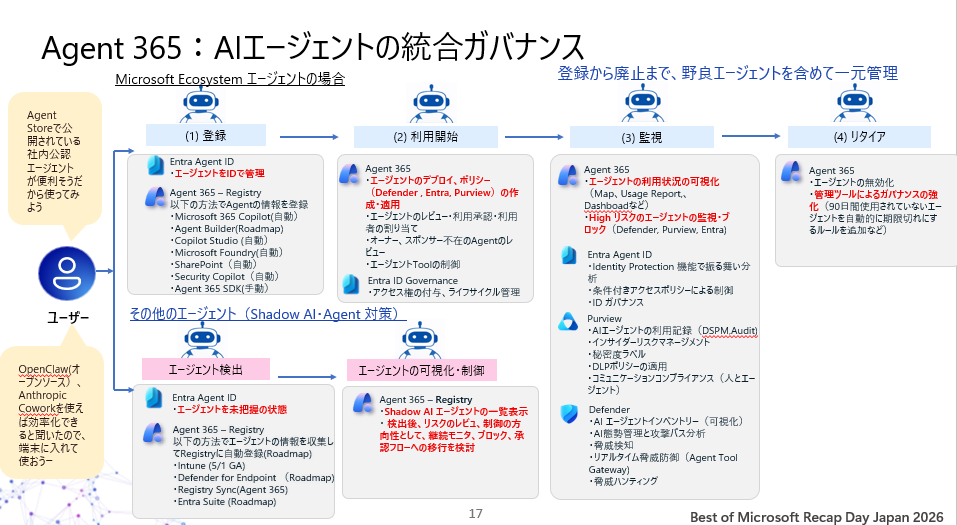
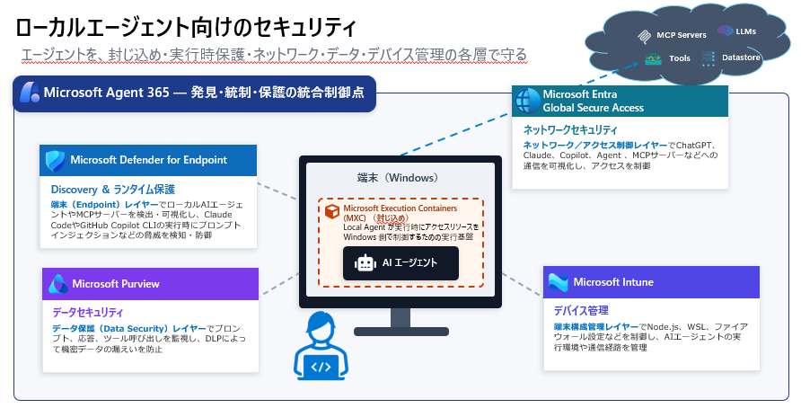
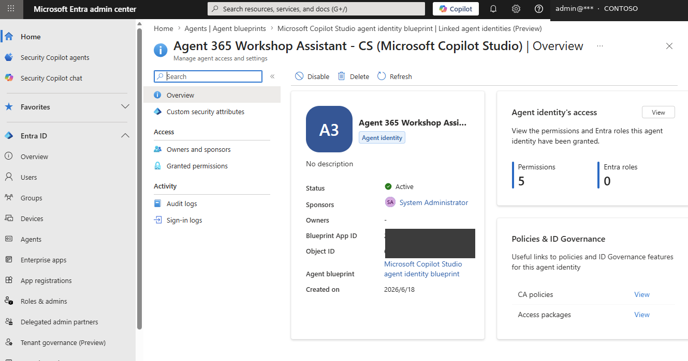
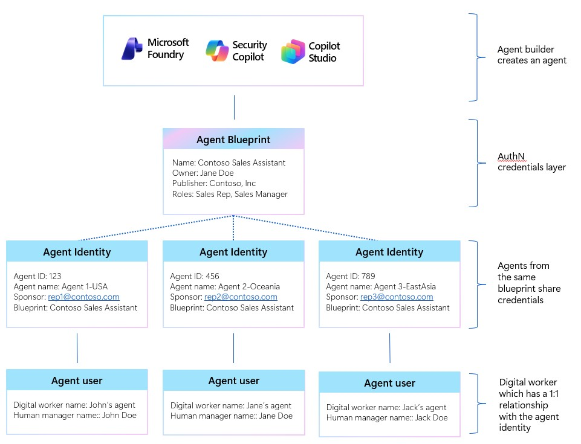

# Step 2 — Agent Registry / Entra Agent ID

[← Step 1：前提](./01-prerequisites.md) ｜ [← 目次](./README.md) ｜ [Step 3：サードパーティ管理 →](./03-third-party-management.md)

ここではまず **Agent Registry**（組織内エージェントの一覧・各タブと、Copilot Studio を例にした 公開 → 登録 → 確認）を見て、その土台となる **Entra Agent ID**（とは・4 つのオブジェクト・Blueprint → Instance）を掘り下げます。
（3 レイヤーの考え方や `a365` での具体的な作り方は [Step 3：サードパーティ管理](./03-third-party-management.md) で扱います。）

---

## 1. Agent Registry（エージェント レジストリ）

**Agent Registry** は、組織で使えるすべてのエージェントを一元表示するインベントリです。
**M365 管理センター › Agents › All agents › Registry**、または **Entra 管理センター › Agent ID › Microsoft Entra Agent Registry** から確認します。

> Copilot Studio を例にした**登録の実機手順（ストア公開申請 → 承認 → Registry 確認）は [Step 4：登録](./04-register.md)** に、払い出された **Entra Agent ID の画面**は本ページ **§2** にあります。

### 4 つのエージェント種別

| 種別 | 説明 |
| --- | --- |
| Microsoft エージェント | Microsoft が構築・保守。 |
| 外部パートナー構築エージェント | 信頼された外部開発元が公開。 |
| 組織によって発行された | 承認済みカスタム（LOB / 基幹業務）エージェント。 |
| 作成者が共有する | 個々のユーザー/開発者が作成・共有（Shared エージェント）。 |

### レジストリ概要・リスク

- **概要カウント**：エージェント合計数 / 所有者がいないエージェント / アンマネージド（A365 外で作成・管理）エージェント。
- **リスク列**：Entra・Defender・Purview の**高重大度リスクを集約**表示（シャドウエージェント、所有者未割当、過剰権限、プロンプトインジェクション、機密データアクセス、CA 違反、承認待ち など）。`レビュー` リンクから各セキュリティポータルへ。
- **フィルタ／アクション**：Status / Publisher / Channel（Copilot/Teams/Outlook/M365 アプリ/SharePoint）/ Platform でフィルタ。Refresh / Export（CSV・30 項目超）/ Add agent（manifest .zip アップロード）/ ピン留め / 列カスタマイズ / Graph API（プレビュー）。

> レジストリに登録するには各エージェントについて **エージェント インスタンス**（実行・管理に必要な操作情報）と **エージェント カード マニフェスト**（他のエージェント/アプリが発見・操作するための検出メタデータ）の 2 種類が必要です。登録経路は [Step 3：サードパーティ管理](./03-third-party-management.md) を参照。

### 危険にさらされているエージェント（Agents at risk）

M365 管理センターの **概要（Overview）ページ › Agents at risk カード**では、**Microsoft Entra／Microsoft Purview／Microsoft Defender** の3プラットフォームを横断して検出された**高重大度リスク**を持つエージェントのテナントレベルの要約が表示されます。最もリスクの高い上位3エージェントが可視化され、**View agents** から Registry のリスクレベル順プレフィルタ済みビューに直接遷移できます。

> [!IMPORTANT]
> **Risks 列（および Security タブの詳細）の閲覧には Microsoft 365 E7 または Agent 365 ライセンスが必須**です。ライセンスが無いテナントではこの列自体が表示されません。

Registry の **Risks 列**は、次の10種類のリスクを重大度別に集約します（重大度が高いものほど優先的にレビュー）。

| リスクの種類 | 重大度 | シグナルソース | トリガー |
| --- | --- | --- | --- |
| シャドウ エージェント | Critical | Entra／M365 管理センター | レジストリ未登録・所有者なし・Entra Agent ID なし |
| 所有者未割り当て | Critical | Entra／M365 管理センター | 所有者・スポンサーが記録に無い |
| 過剰なアクセス許可 | Critical | Entra／Defender | 宣言された機能を超えるアクセス権（最小特権違反） |
| セキュリティ構成の誤り | High | Defender | Security Exposure Management が検出した悪用可能な攻撃パス |
| プロンプト インジェクション | High | Defender／Entra Security Service Edge (SSE) | AI Prompt Shield が実行時のインジェクション試行を検知／ブロック |
| 機密データ アクセス | High | Purview | 一致する DLP ポリシー例外なしでラベル付きデータにアクセス |
| 条件付きアクセス違反 | High | Entra | 定義された条件（場所・デバイス・リスクスコア）の範囲外でアクセス試行 |
| 承認待ち | Medium | M365 管理センター | IT ガバナンスレビュー完了前にエージェントが稼働している可能性 |
| 操作上の例外 | Medium | M365 管理センター | エージェントの会話・ツール実行でのエラー／失敗 |
| コンプライアンス／保持期間のギャップ | Medium | Purview | 必要な監査証跡・保持ポリシーが欠落した相互作用 |

Risks 列の数値を選択すると、エージェント詳細フライアウトの **Security タブ**に遷移し、対応する全プラットフォームの合算リスク数・**Enabled policies and protection**（Entra/Purview が適用中の既定保護）・**Block** アクションが確認できます。**レビュー** リンクは該当のセキュリティポータル（Defender／Purview／Entra）へ遷移しますが、遷移先で実際に調査できるかはロールに依存します。

| ロール | Defender で調査 | Purview で調査 | Entra で調査 |
| --- | --- | --- | --- |
| AI Administrator | 不可 | 不可 | 一部可 |
| Reports Reader | 不可 | 不可 | 不可 |
| Security Reader / Security Administrator | 可 | 不可 | 可 |
| Global Reader | 可 | 不可 | 可 |

> [!NOTE]
> Purview 側のリスク調査には、**Insider Risk Management Analyst** または **Insider Risk Management Investigator** ロールの割り当てが別途必要です（上表のどのロールにも自動では含まれません）。また、Registry のリスク数はそれぞれのセキュリティポータル表示に対して**最大1時間遅延**する場合があります。

### 管理対象の整理 — どのエージェントが・どう載るか

Agent Registry は **Microsoft ネイティブだけでなく、SDK 連携・他クラウド・外部 SaaS・端末上のローカル AI まで**横断して載せ、一元管理します。


*▲ ① Microsoft Ecosystem エージェント＝登録から廃止まで一元管理／② 野良・ローカルエージェント＝検出して管理下へ（Registry に自動登録）*

| エージェントの種類 | Registry への載り方 | 管理の深さ |
| --- | --- | --- |
| **Microsoft ネイティブ**（Copilot Studio / Foundry / M365 Agents） | **自動登録**（Entra Agent ID 付与） | 深い統制（CA・DLP・ライフサイクル） |
| **SDK 連携 / 自前ホスト**（本ワークショップ題材） | **`a365` SDK で登録**（→ [Step 3](./03-third-party-management.md)） | ネイティブ同等のフル統制 |
| **他クラウド 3P**（Bedrock / Google Vertex AI / Agentforce / Databricks Genie） | **Registry Sync**（プレビュー） | 可視化・棚卸し中心（メタデータ取り込み・削除等） |
| **外部 SaaS / MCP サーバー** | **Entra Global Secure Access（境界制御）** | ネットワークで可視化・制御 |
| **端末上のローカル Agent**（Claude Code / Cursor / OpenClaw 等） | **Defender / Intune / Purview で検出 → Registry に統合**（Shadow AI 対策） | 端末側で検出・可視化・ランタイム保護 |

> [!NOTE]
> - **Registry Sync**：他クラウドの既存エージェントを管理センターに同期して可視化（現状は手動トリガー）。深い統制はネイティブ／SDK が優位。
> - **ローカル Agent（Shadow AI）**：端末に入り込んだ野良エージェントを **Defender for Endpoint / Intune / Purview** で検出 → リスクレビュー後に **承認 / ブロック / 監視** → Registry に自動登録して一元管理。

### Registry Sync で取れる情報の違い（ネイティブ／SDK 統合 vs 3rd party cloud）

「Registry に載っている」ことと「Entra Agent ID として深く統制されている」ことは**イコールではありません**。特に Registry Sync（プレビュー）経由のエージェントは、**可視化・棚卸し用のメタデータのみ**を持ち込む点が、ネイティブ／SDK 統合エージェントと大きく異なります。

| 項目 | ネイティブ登録／SDK 統合（Entra Agent ID あり） | Registry Sync（Amazon Bedrock / Google Vertex AI / Salesforce Agentforce / Databricks Genie） |
| --- | --- | --- |
| Entra Agent ID | **発行される**（blueprint → instance） | **発行されない**。Entra 上の ID 実体は無く、Registry 上の表示のみ |
| Risks 列（Entra/Defender/Purview 集約） | フル対応（10種のリスクを検出） | 限定的。Entra 側のシグナル（CA 違反・過剰権限など）は評価対象外 |
| CA・DLP・IRM 等の深い統制 | 可能（本 Step／[Step 8：ガバナンス](./08-governance.md)） | **不可**。可視化・棚卸し（オンボード状況の把握）が主目的 |
| エージェント詳細タブ | Details / Users / Data & Tools / Security / Permissions / Certification / Activity / Instances をすべて取得 | 接続（Connection）単位の同期結果が中心。個々のエージェントの Security/Permissions タブ相当の情報は持たない |
| 同期後に取得できる項目 | span 単位のテレメトリ（[Step 7：観測](./07-observability.md)）まで含む | Platform provider／Region／Last run date／Last sync status／Total synced agents／Synchronization results（接続のメタデータ） |
| 認証方式 | Entra 上のテナント同意・ロールベース | プラットフォームごとの API 資格情報（例：Bedrock は IAM アクセスキー、Vertex AI はサービスアカウントキー、Agentforce は OAuth Connected App） |
| 同期方式 | リアルタイム（span がプッシュ型で送信） | **管理者による手動トリガー**（`Sync agents` ボタン） |
| エージェント管理アクション | Block／削除／CA 適用など | AI プラットフォーム API がサポートする範囲のエージェント管理操作のみ |

> [!IMPORTANT]
> **2026年7月1日より、サードパーティ クラウドエージェントの検出経路が変わりました（本資料時点で施行済み）。** これまで Microsoft Defender for Cloud のコネクタ経由で検出していたサードパーティ クラウドエージェント（Bedrock・Vertex AI 等）は、この日以降 **Registry Sync** 経由での検出に一本化されました。Defender for Cloud 側の検出を使っていた場合は、事前に Registry Sync への接続設定が必要です。

> [!TIP]
> 深い統制（CA・DLP・条件付きブロックなど）が必要なサードパーティ／自前ホスト型エージェントは、Registry Sync ではなく **Agent 365 SDK** で統合してください（→ [Step 3：サードパーティ管理](./03-third-party-management.md)）。Registry Sync はあくまで「まず存在を把握する」ための棚卸し機能で、Bedrock・Vertex AI 側で追加の SDK 統合を行えばオブザーバビリティ等を段階的に追加できます。


*▲ ローカルエージェントは単一製品では守りきれない。**封じ込め（MXC）・実行時保護（Defender for Endpoint）・データ（Purview）・ネットワーク（Entra Global Secure Access）・デバイス管理（Intune）** の各層で守り、**Agent 365 が発見・統制・保護の統合制御点**になる。*

---

## 2. Copilot Studio エージェントの Entra Agent ID（実機例）

**Copilot Studio で作ったエージェントは `a365`/manifest なしで自動的に Registry／Entra Agent ID に載ります**（自前ホストの題材との対比）。ここでは、その結果として **Entra 側に払い出された Agent ID の画面**を確認します。
（ストアへの公開申請 → 承認 → Registry 確認までの**実機手順は [Step 4：登録](./04-register.md)** に移しました。）


*▲ Microsoft Entra 管理センター（[entra.microsoft.com](https://entra.microsoft.com/)）› Agents › Agent blueprints › 該当の **Agent identity**。Status: Active ／ Sponsors ／ Blueprint App ID ／ Object ID ／ Permissions・Entra roles ／ CA policies・Access packages。**Entra 側でガバナンスされる**。*

> [!NOTE]
> Copilot Studio 製は **Microsoft が自動で Registry／Entra Agent ID に載せる**ため、開発者は `a365` を使わずに「見える化・統制・保護」の対象になります（自前ホストとの対比 → [Step 3：サードパーティ管理](./03-third-party-management.md)）。登録の実機手順（ストア公開申請 → 承認 → Registry 確認）は [Step 4：登録](./04-register.md) を参照。

---

> ここからは、Registry に載るエージェントの**土台＝Entra Agent ID** の仕組みを掘り下げます。

## 3. Entra Agent ID の全体像（登場人物と関係）

Agent ID 周りは **ビルダー → Agent Blueprint → Agent Identity → Agent user** の階層です。**まずこの関係を押さえれば迷いません。**


*▲ ビルダー（Foundry / Security Copilot / Copilot Studio）が **Agent Blueprint**（テンプレート：Name / Owner / Publisher / Roles）を作る → 同じ blueprint から複数の **Agent Identity**（Agent ID・Sponsor を持ち、資格情報を共有）→ 各 Identity に **Agent user**（デジタルワーカー。人の manager に紐づく。Identity と 1:1）。*

| オブジェクト | わかりやすく言うと |
| --- | --- |
| **Agent identity blueprint** | Agent ID を作成する**テンプレート**。認証・アクセス許可・アクティビティログ等の重要情報を含む。 |
| **Agent identity blueprint principal** | blueprint を**テナントに登録した時にできる実体**。実際にトークンを取得し、Agent ID を作成し、blueprint に代わって**監査ログに表示**される。 |
| **Agent Identity** | エージェント**1 体ごとの ID**。この ID で Microsoft サービスにアクセスする。 |
| **Agent's User Account** | Teams や Outlook など「ユーザーでないと動かないシステム」を使うときに必要。**Agent Identity と 1:1**。 |

> [!IMPORTANT]
> **テナント内のすべての Agent ID は、必ず Agent identity blueprint から作られます。**
> blueprint は「情報を保持するだけ」ではなく、`AgentIdentity.CreateAsManager` という特別な Graph 権限を持ち、**自分自身が Agent ID を作成する**主体でもあります。

---

## 4. そもそも Entra Agent ID とは？（他の ID との違い・できること）

Microsoft Entra Agent ID は、**AI エージェントを Microsoft Entra 上で管理するための「新しい種類の ID」** です。
**ユーザー ID** とも **アプリケーション ID** とも異なります。

| ID の種類 | 特徴 |
| --- | --- |
| アプリケーション ID | 長期利用が前提。**安定性**が求められる。 |
| ユーザー ID | 資格情報・組織階層・メールなど**ユーザー属性**に紐づく。 |
| **Agent ID** | 自動化プロセスの中で**動的に作成**される ID。ワークフロー内で**1 日に何千回も作成・破棄**されうる。ユーザー認証はしないが、**ユーザーのように振る舞う**（＝OBO）シナリオもある。 |

> [!NOTE]
> Entra Agent ID は、既存の Entra ID 機能を**エージェントにも拡張**したものです。現時点で主に次の 5 つを実現します：
> ① Agent の登録と管理（Agent Registry）／ ② Agent ID の条件付きアクセス／ ③ ガバナンス（Governance Agent ID）／ ④ ID Protection（攻撃・不正エージェントの阻止）／ ⑤ セキュア ネットワーク アクセス（Global Secure Access for Agents）

---

## 5. Agent ID Blueprint の詳細

建物の設計図が配管・電気・構造まで含むように、**Agent ID Blueprint** は認証・アクセス許可・アクティビティログまで含む「設計図」です。
1 つの blueprint から作られた各エージェントは、**独自の ID・資格情報・権限**を持ちつつ、blueprint で定義された**共通特性を共有**します。

| 区分 | 内容 |
| --- | --- |
| 共有プロパティ | 説明 / アプリロール / 検証済み発行元 / 認証プロトコル設定（`OptionalClaims` 等） |
| **資格情報** | Agent ID が Entra からアクセストークンを要求する際に使う。blueprint に付与した OAuth 権限は、**そこから作られた全 Agent ID に付与**される。 |
| **必要なリソースアクセス** | エージェントが必要とする API/権限の**宣言**。同意レビュー時に管理者へ提示される。 |
| **継承可能なアクセス許可** | 管理者が blueprint principal に許可を付与すると、**組織内の全 Agent ID が自動で継承**する。 |

> [!TIP]
> **セキュリティを大規模にスケールできるのが blueprint の価値です。**
> - 条件付きアクセス ポリシーを **blueprint に対して**適用すると、そこから作られた全 Agent ID が対象になります。
> - **blueprint を無効化**すると、その全 Agent ID が認証できなくなります（一括停止）。

**blueprint principal の役割**：blueprint をテナントに追加すると必ず作られ、①トークン発行（トークンの `oid` が principal を指す）②監査ログ（blueprint の操作は principal が実行したものとして記録）③削除（principal を消すとそのテナントから blueprint を消去）を担います。

---

## 6. AI Teammate：instance 作成で Agent ID ＋ User が払い出される

ここが「Blueprint→Instance」の核心です。

- **blueprint はテンプレート**であって実体ではありません。
- 管理センターで **`+ Add instance`**（または Graph で `agentIdentity` を作成）した**瞬間**に、**Agent Identity**（Entra Agent ID）が払い出されます。
- さらに **AI Teammate** の場合は、Teams/Outlook など「ユーザーでないと動かない」面で動作するために、**Agent's User Account** が **Agent Identity と 1:1** で同時に払い出されます。

```
+ Add instance
     │
     ├──▶ Agent Identity（Entra Agent ID：例 12f560ef-…）     ← Microsoft サービスへのアクセス主体
     │
     └──▶ Agent's User Account（例 hana-assistant@tenant…）    ← Teams で @mention できる実体（AI Teammate）
```

instance 作成画面で入力する主な項目：

| 項目 | 内容 |
| --- | --- |
| Instance display name | Teams での表示名（透明性のため「Assistant」等を含めると良い：例 `Hana (Onboarding Assistant)`） |
| Agent Instance alias | agent user の UPN 前半（例 `hana-assistant` → `hana-assistant@tenant.onmicrosoft.com`） |
| Owner / Reports to（Sponsor） | instance の責任者。**Sponsor は必須**。Agent Identity（instance）のスポンサーは原則 **User**（SP 不可）。※blueprint レベルのスポンサーは動的メンバーシップ/Microsoft 365 グループも指定可。 |
| License | agent user は実ユーザー扱い。ライセンス割り当てが必要になることがある。 |

> [!TIP]
> - instance 作成後、blueprint 詳細の **Entra agent ID が「—」から実値**に変わります。この値が Observability 送信時の `agentId` です。
> - **1 つの blueprint から最大 250 体**の Agent Identity を作成できます。
> - **Sponsor（スポンサー）** は Agent ID のライフサイクル（更新・延長・削除）の判断責任者。スポンサーが組織を離れた際にマネージャーへ引き継ぐ運用は、**Lifecycle Workflows（mover/leaver タスク）で構成**できます（自動ではなく設定が前提）。

---

## 参考リンク

- [Microsoft 365 管理センターのエージェント レジストリ（Microsoft Learn）](https://learn.microsoft.com/microsoft-365/admin/manage/agent-registry)
- [Microsoft 365 管理センターのエージェント詳細（Agent details / Security タブ）](https://learn.microsoft.com/microsoft-365/admin/manage/agent-details)
- [Registry sync in the Microsoft 365 agent registry（プレビュー）](https://learn.microsoft.com/microsoft-agent-365/admin/agent-registry)
- [Connect existing agents to Microsoft Agent 365（Bedrock/Vertex AI 等の既存エージェント統合）](https://learn.microsoft.com/microsoft-agent-365/connect-existing-agents)
- [Agent Registry convergence with Microsoft Agent 365](https://learn.microsoft.com/entra/agent-id/agent-registry-convergence)
- [Copilot Studio / Foundry のエージェント セキュリティ機能を Agent 365 へ移行する（2026年7月1日）](https://learn.microsoft.com/defender-xdr/security-for-ai/transition-agent-security-to-agent-365)
- [エージェント ID ブループリント（Microsoft Learn）](https://learn.microsoft.com/entra/agent-id/agent-blueprint)
- [Microsoft Entra Agent ID 入門編（Zenn）](https://zenn.dev/microsoft/articles/a52eae77302ce7)

---

[← Step 1：前提](./01-prerequisites.md) ｜ [Step 3：サードパーティ管理 →](./03-third-party-management.md)
