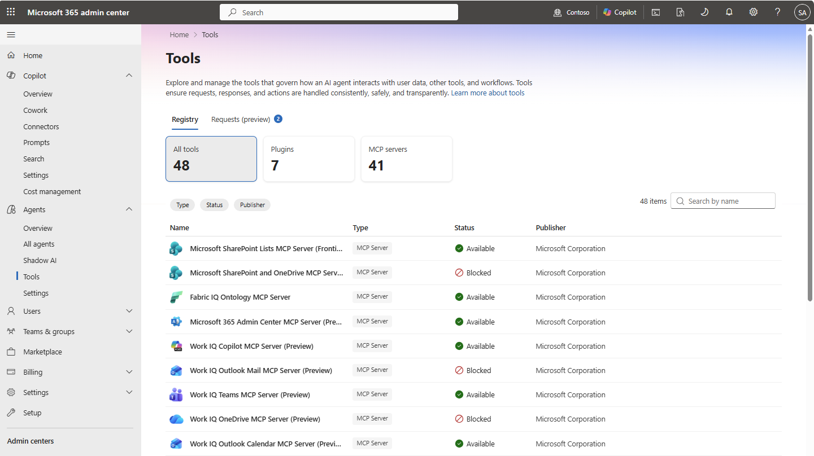
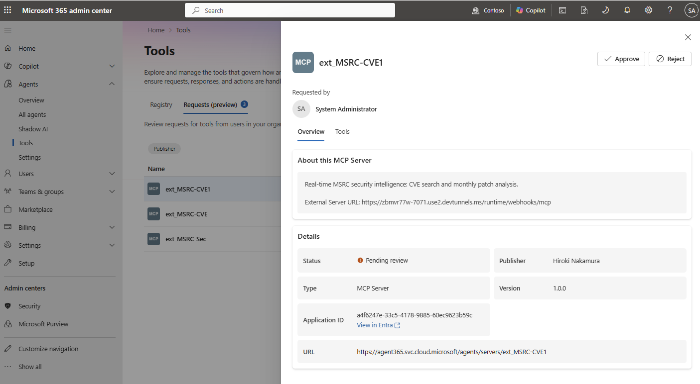
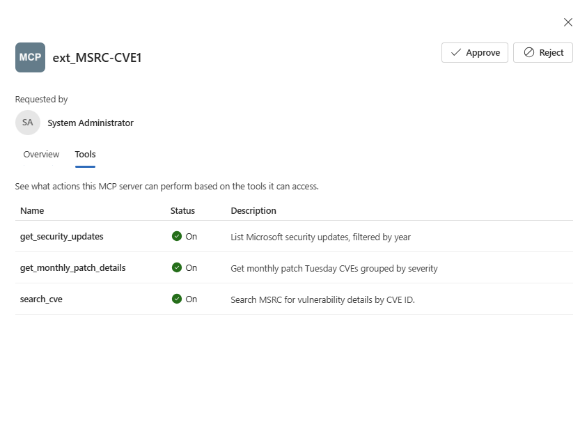
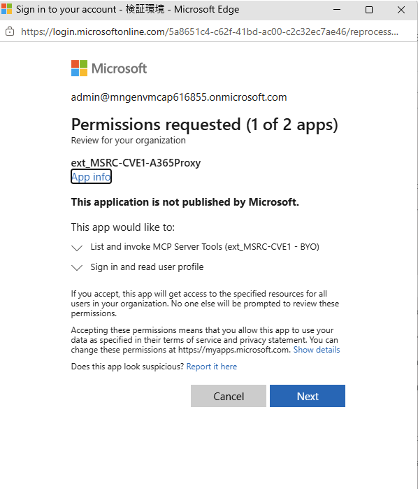
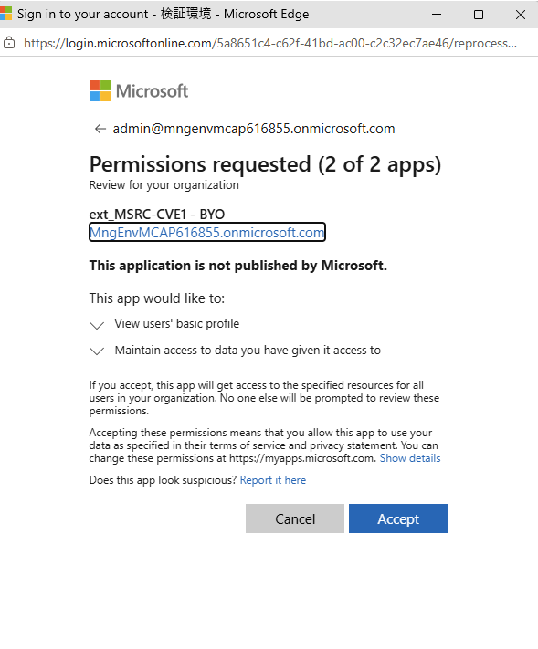
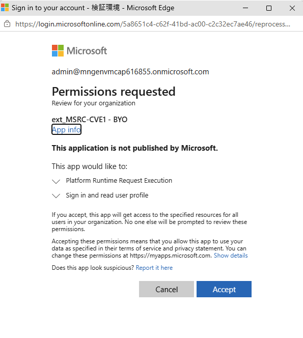
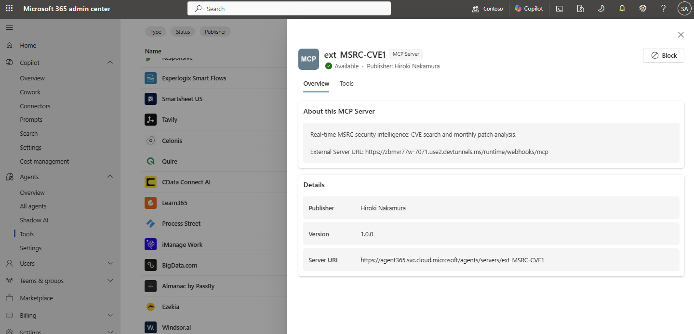
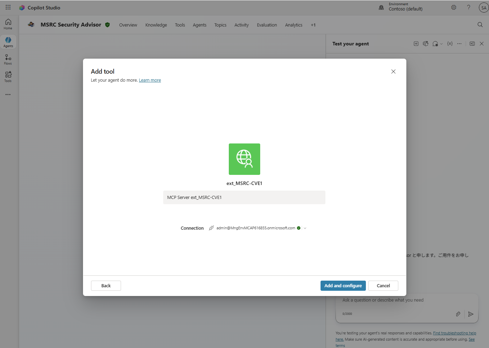

# Step 3 — サードパーティ管理：a365 CLI で自前 / 3P エージェントを管理下に

[← Step 2：Agent Registry / Entra Agent ID](./02-entra-agent-id.md) ｜ [← 目次](./README.md) ｜ [Step 4：登録 →](./04-register.md)

Microsoft 以外のプラットフォームや**自前ホストのカスタムエージェント**（本ワークショップの題材＝LangChain + Node.js）を Agent 365 の管理下に置く方法をまとめます。
**a365 コマンドの内容はこのページに集約**しています。以降のワークショップ（Step 4〜8）では、ここを参照しながら各コマンドを実行します。

---

## 0. 開発の前提（自前ホスト編）

自前ホストのエージェントを `a365` で管理下に置くには、まず **3 レイヤーの考え方**と**開発環境**を押さえます。

### 3 つのレイヤーを分けて考える

| レイヤー | 役割 |
| --- | --- |
| **① M365 Agents SDK** | メッセージ送受信を担う「配管」。チャネル抽象化・状態管理。**これ単体では Agent ID は付かない**（ただの bot）。 |
| **② Agent 365 SDK** | ①に **Observability・Notifications・MCP アクセス**を足す拡張。テレメトリは OpenTelemetry でここが送る。 |
| **③ Agent 365 / Entra Agent ID** | `blueprint → instance` で **agentic identity（Entra Agent ID）** を発行（→ [Step 2](./02-entra-agent-id.md)）。これがあって初めて agentic 認証・OBO・Observability が成立。 |

> [!IMPORTANT]
> **Agent ID は instance 化して初めて付く**（blueprint はテンプレート）。詳しくは [Step 2：Agent Registry / Entra Agent ID](./02-entra-agent-id.md)。

### 開発に必要なもの

- [ ] Node.js 18 以降（サンプルは Node.js / TypeScript / ts-node）
- [ ] Agent 365 DevTools CLI（`a365`）
- [ ] Azure CLI（`az`。orphan アプリ削除等）
- [ ] devtunnel CLI（ローカルを外部公開）
- [ ] **ライセンス**：Microsoft Agent 365、または Microsoft 365 E7（前提：エンタープライズ顧客は Microsoft 365 E5、または Business Premium + Defender/Purview）
- [ ] **ロール**：Global Administrator（または Agent ID Administrator）

### ポート設計（複数エージェントの並行運用）

エージェントごとにフォルダとポートを分ける（例：agent モード `3978`／AI Teammate `3979`）。

### 主要ファイルと役割

| ファイル | 役割 |
| --- | --- |
| `src/index.ts` | エントリポイント。OpenTelemetry 初期化（**他 import より前**）、Express、認証、`/api/messages`・`/api/health`。 |
| `src/agent.ts` | `AgentApplication` 本体。メッセージ処理、Observability トークン preload、通知。 |
| `src/token-cache.ts` | カスタム token resolver とローカルキャッシュ（`Use_Custom_Resolver=true` のとき）。 |
| `.env` | 全設定。`a365 setup all` が値をスタンプ。 |
| `a365.config.json` | **AI Teammate 用の手動 config**（agent user の UPN 等）。 |
| `a365.generated.config.json` | setup が生成。blueprint ID・同意状況・messaging endpoint。 |

---

## 1. 登録経路 — 作り方で変わる

エージェントの**作られ方**によって、Agent Registry への登録経路が変わります。

| 作られ方 | 登録 |
| --- | --- |
| Copilot Studio / Microsoft 365 Agents / Foundry | **自動登録** |
| 上記以外の MS プラットフォーム / Microsoft 以外 | **Microsoft Graph API でセルフサービス登録** |
| カスタム（自前ホスト）＝本ワークショップ | **`a365` CLI ＋ manifest（.zip）を管理センターにアップロード** |

---

## 2. a365 CLI コマンド リファレンス

| コマンド | 役割 |
| --- | --- |
| `a365 setup all [--aiteammate]` | 要件確認 → Blueprint 作成 → 資格情報 → 継承権限/同意 → **Agent Identity 作成** → 登録 → `.env` スタンプ（冪等＝再実行安全）。`--aiteammate` で AI Teammate 構成。 |
| `a365 publish` | `manifest.json` に blueprint ID を埋め、`manifest.zip` を生成（→ 管理センターにアップロード）。 |
| `a365 develop get-token` | 開発・テスト用のトークン取得。 |
| `a365 develop-mcp register-external-mcp-server` | **外部 MCP サーバーを登録**（Entra プロキシアプリ 2 つ＋権限を自動作成。管理者承認が必要）。詳細は **§6**。 |
| `a365 query-entra` | Entra 側の登録状態を照会（変更前の確認に）。 |
| `a365 logs export` | 実行ログのエクスポート。 |
| `a365 cleanup` | 作業ディレクトリの config を読み、**全 Agent 365 リソースを削除**（破壊的）。 |

> [!TIP]
> `--dry-run` や `a365 query-entra` で**変更前に状態を検証**するのが運用のセーフガードです。

---

## 3. `a365 setup all` は内部で何を作っているか

`a365 setup all` は、本来 **Microsoft Graph で手作業する Agent ID 作成フローを自動化**したものです。手動 Graph 版の流れと対応づけると、中で何が起きているかが見えます。

| Graph 手動フロー | `a365 setup all` の対応出力（例） | 生成物 |
| --- | --- | --- |
| ① Graph に接続 | 要件チェック（Azure 認証 / Graph モジュール） | — |
| ② **Blueprint を作成** | `Found existing blueprint`（無ければ新規作成） | Agent identity blueprint（appId） |
| ③ **資格情報を追加** | `Client secret is valid, skipping creation` | クライアントシークレット（※本番は WIF/Managed ID 推奨） |
| ④ **Blueprint Principal を作成** | 継承権限の構成 / 委任・同意の付与 | blueprint principal（`AgentIdentity.CreateAsManager` 自動付与） |
| ⑤ Blueprint のトークン取得 | S2S app role assignments / delegated consent | `roles` に `AgentIdentity.CreateAsManager` |
| ⑥ **Agent Identity を作成** | `Agent identity created (ID: 097c…)` | Agent Identity |
| ⑦ 登録・設定 | `Agent registered (ID: T_f379…)` / `appsettings.json` にスタンプ | レジストリ登録・設定反映 |

> [!IMPORTANT]
> **blueprint principal は自動では作られません**（Graph 手作業の場合 ④ を飛ばすと `400: The Agent Blueprint Principal ... does not exist`）。principal を作ると `AgentIdentity.CreateAsManager` が**自動付与**されます。`a365 setup all` はこの一連を冪等（`reused` = 既存再利用）に処理します。

---

## 4. （参考）Graph API で Agent ID を手動作成する

中身を理解するための参考です（詳細・サンプルコードは [Zenn / Graph 編](https://zenn.dev/microsoft/articles/91df843374fbde)）。

```text
Step 1: Graph に接続（Scopes: AgentIdentityBlueprint.Create, .AddRemoveCreds.All,
                      AgentIdentityBlueprintPrincipal.Create, User.Read）
Step 2: Agent identity blueprint を作成   POST /v1.0/applications/graph.agentIdentityBlueprint
Step 3: 資格情報（client secret）を追加     ※本番は Managed Identity / FIC 推奨
Step 4: blueprint principal を作成         POST /v1.0/servicePrincipals/graph.agentIdentityBlueprintPrincipal
Step 5: blueprint のトークン取得（client_credentials）→ roles に AgentIdentity.CreateAsManager
Step 6: Agent Identity を作成              POST /beta/servicePrincipals/microsoft.graph.agentIdentity
                                          （displayName / agentIdentityBlueprintId / sponsors 必須）
Step 7: 確認  Entra 管理センター › Agent identities › All agent identities
```

- **必要ライセンス**：Microsoft Agent 365（または Microsoft 365 E7）／ Frontier プログラム有効。
- **必要ロール**：Agent ID Developer または Agent ID Administrator（blueprint 作成）、Privileged Role Administrator（Graph 権限付与）。
- **注意**：Agent Identity 作成 API は現在 **beta エンドポイントのみ**。Sponsor は **User オブジェクト必須**。

---

## 5. 他クラウドの取り込み — Registry Sync と統合段階

自前ホスト以外（他クラウド／3P PaaS）のエージェントは、可視化から段階的に統制を強化します。

| 段階 | 内容 |
| --- | --- |
| ① 統合不要（事前統合パートナー） | Genspark・Zendesk・n8n 等。追加作業なしで可視化＋基本管理。 |
| ② Registry Sync（軽量統合） | Amazon Bedrock・Google Vertex AI・Agentforce・Databricks Genie を横断で可視化・棚卸し（プレビュー）。 |
| ③ SDK オンボード（完全統合） | **Entra Agent ID を付与**し、ポリシー適用・ライフサイクル管理までネイティブ同等に。 |

> [!NOTE]
> 深い統制（条件付きアクセス・DLP 等）はネイティブ／SDK 連携が優位です。可視化だけなら素早く始められます（→ Registry Sync はパブリックプレビュー）。

---

## 6. 外部 MCP サーバーの登録・承認・利用（BYO MCP）

自前／外部の **MCP サーバー**（Model Context Protocol）を Agent 365 に取り込み、エージェントのツールとして使えるようにします。流れは **① `a365` で登録 → ② 管理センターで承認（管理者同意）→ ③ エージェントに追加して利用** の 3 段です。

### 6.1 登録（`a365 develop-mcp register-external-mcp-server`）

外部 MCP サーバーを登録します。`--tools` で公開するツール名をカンマ区切りで指定します。

```powershell
a365 develop-mcp register-external-mcp-server `
  --server-name "ext_MSRC-CVE1" `
  --server-url "https://<your-tunnel>-7071.use2.devtunnels.ms/runtime/webhooks/mcp" `
  --auth-type "NoAuth" `
  --tools "get_security_updates,get_monthly_patch_details,search_cve"
```

| パラメータ | 内容 |
| --- | --- |
| `--server-name` | MCP サーバーの表示名（例 `ext_MSRC-CVE1`）。 |
| `--server-url` | MCP エンドポイント URL（例：devtunnel 経由の `/runtime/webhooks/mcp`）。 |
| `--auth-type` | 認証方式（例 `NoAuth`）。 |
| `--tools` | 公開するツール名（カンマ区切り）。 |

**実行ログ（マスク済み・抜粋）**

```console
Authentication context: API calls will use user admin@<tenant>.onmicrosoft.com in tenant <tenant-id>
Registering MCP server 'ext_MSRC-CVE1'...
Detected tenant ID from Azure CLI: <tenant-id>
Created Entra app 'ext_MSRC-CVE1-A365Proxy' (clientId: <clientId-1>)
Created Entra app 'ext_MSRC-CVE1-PublicClients' (clientId: <clientId-2>)
Updated redirect URIs on 'ext_MSRC-CVE1-A365Proxy'
Added API permission on 'ext_MSRC-CVE1-A365Proxy'
Added API permission on 'ext_MSRC-CVE1-PublicClients'
MCP server 'ext_MSRC-CVE1' has been registered successfully.

Please ask your tenant admin to approve MCP server 'ext_MSRC-CVE1'.
```

> [!IMPORTANT]
> 登録すると **Entra アプリが 2 つ自動作成**されます：**`<name>-A365Proxy`**（MCP プロキシ）と **`<name>-PublicClients`**（パブリッククライアント）。リダイレクト URI・API 権限も自動構成され、最後に **「テナント管理者に承認を依頼」** と表示されます。**承認が済むまで利用できません。**

### 6.2 承認（管理センター › Agents › Tools）

管理者は **M365 管理センター › Copilot › Agents › Tools** で MCP サーバーを確認・承認します。


*▲ ① **Tools** — All tools / Plugins / **MCP servers** を一覧。Type・Status・Publisher でガバナンス。*


*▲ ② **Requests (preview)** タブで対象 MCP を開く。**Overview**：説明・External Server URL・**Status: Pending review**・Application ID（View in Entra）・内部 URL。右上に **Approve / Reject**。*


*▲ ③ **Tools** タブ — この MCP が提供するツールを確認（`get_security_updates` / `get_monthly_patch_details` / `search_cve`、各 **On** と説明）。*

**Approve を押すと、管理者同意（複数アプリの権限承認）に進みます。**


*▲ ④ **Permissions requested（1 of 2 apps）** — `<name>-A365Proxy`。「List and invoke MCP Server Tools」「Sign in and read user profile」を確認 → **Next**。*


*▲ ⑤ **Permissions requested（2 of 2 apps）** — `<name> - BYO`。「View users' basic profile」「Maintain access…」→ **Accept**。*


*▲ ⑥ **Permissions requested** — 「Platform Runtime Request Execution」「Sign in and read user profile」→ **Accept**。これで登録が完了。*


*▲ ⑦ ステータスが **Available** に。右上は **Block** に変化（承認済み）。内部 Server URL は `https://agent365.svc.cloud.microsoft/agents/servers/<server-name>`。*

> [!NOTE]
> 承認は **AI Administrator / Global Administrator**。同意は「**組織全体**」に付与されます（*for all users in your organization*）。`NoAuth` の MCP でも、登録時に作られる**プロキシ用 Entra アプリ経由**でアクセスが仲介・制御されます。

### 6.3 利用（エージェントに追加）

承認後、MCP サーバーはエージェントの**ツール**として追加できます。


*▲ ⑧ 例：Copilot Studio のエージェント（MSRC Security Advisor）› **Add tool** → `MCP Server ext_MSRC-CVE1` を選択し、Connection を指定して **Add and configure**。自前ホストの custom engine agent でも同様にツールとして呼び出せる。*

> [!TIP]
> ツールの呼び出し・実行は **[Step 7：観測](./07-observability.md)** の Observability（`ExecuteToolScope` ／ Defender `CloudAppEvents`）で追跡できます。

---

## 7. GitHub Copilot / Claude Code の Agent 365 Skills で自動化する（推奨）

ここまでの §0〜§3（3レイヤーの理解・`a365 setup all`・Observability配線・MCPサーバー登録）は、**手動でも実行できますが、Microsoft 公式の Agent 365 Skills を使うと自然言語の指示だけで自動化**できます。

[**microsoft/agent365-skills**](https://github.com/microsoft/agent365-skills) は、**GitHub Copilot と Claude Code の両方で動く**エージェント向けスキル集（プラグイン）です。本 Step で扱ってきた「Blueprint作成 → AI Teammate化 → Observability配線 → WorkIQ MCPツール追加 → ローカルテスト」という一連の流れを、Copilot／Claude Code が対話形式で実行してくれます。

### 7.1 できること（6つのスキル）

| スキル | 役割 |
| --- | --- |
| `a365-setup` | **入り口**。CLI／Azure CLI／Entra ロールなどの前提を確認し、作りたいもの（AI Teammate か Agent (Non AI Teammate) か）を聞いて適切なスキルに振り分ける |
| `make-ai-teammate` | エージェントに **Teams/Outlook で動く AI Teammate**（Agentic User＝UPN 付き）のホスティング層を追加（Node.js は Express+CloudAdapter、.NET は ASP.NET Core、Python は aiohttp） |
| `make-a365-agent` | **Agent (Non AI Teammate)**（UPNを持たない System/Custom Engine Agent）として Blueprint・Entra 権限を作成（`obo` または `s2s`） |
| `instrument-observability` | [Step 7：観測](./07-observability.md) の OpenTelemetry 配線（span エクスポート・トークン取得）を自動生成 |
| `add-workiq-tools` | Mail／Calendar／Teams／SharePoint／OneDrive 等の **WorkIQ MCP ツール**を追加（`a365 develop add-mcp-servers` を内部で実行） |
| `test-local` | **AgentsPlayground** でローカル起動・動作確認（Bot Framework 認証不要） |

> [!NOTE]
> 本ワークショップの題材（LangChain + Node.js）に加え、.NET（AgentFramework／Semantic Kernel）・Python（AgentFramework／LangChain／OpenAI／Claude／Semantic Kernel／Google ADK）などマルチ言語・マルチフレームワークに対応しています。

### 7.2 導入方法

**GitHub Copilot（CLI／VS Code agent mode）の場合**

```bash
# もっとも簡単：Copilot CLI に直接インストール
gh skill add microsoft/agent365-skills
```

`.github/plugin/marketplace.json` を読み込み、6 つのスキルを一括インストールします。`/skills list` で確認でき、次のように呼び出せます。

```bash
gh copilot suggest "Make this agent an AI Teammate"
gh copilot suggest "Instrument observability for this agent"
```

VS Code agent mode や Copilot cloud agent など agentskills.io 互換ツール向けには、プロジェクト直下にインストーラを実行して `.agents/skills/` にコピーする方法もあります。

```bash
cd my-agent-project
node /path/to/agent365-skills/scripts/install.js
```

**Claude Code の場合**

```
/plugin marketplace add https://github.com/microsoft/agent365-skills
/plugin install agent365@agent365-skills
```

> [!TIP]
> どちらのツールでも、**トリガーフレーズ**（例：`"Make this agent an AI Teammate"` `"Add A365 observability to this agent"` `"Test this agent locally"`）を投げるだけで該当スキルが起動します。まず `a365-setup` から始めるのが推奨導線です（CLI/Azureの前提確認 → Blueprint作成 → 以降のスキルに自動委譲）。

### 7.3 前提条件

| 項目 | 内容 |
| --- | --- |
| ランタイム | Node.js 18+ ／ .NET 8.0+ ／ Python 3.11+（エージェントの言語による） |
| CLI | `a365` CLI（`dotnet tool install -g Microsoft.Agents.A365.DevTools.Cli`）／ Azure CLI |
| テナント側の一度きりの設定 | `a365` CLI 用のカスタム Entra アプリ登録が必要。**Application Administrator**（推奨・最小権限）／Cloud Application Administrator／Global Administrator のいずれかが `a365 setup requirements` を一度実行すれば、テナント内の全開発者がその状態を引き継ぐ |

### 7.4 安全性の設計

- **最小権限**：認証済みユーザーの権限を超える操作はできない（Azure CLI／MSAL の資格情報をそのまま CLI に橋渡しするのみで、プラグイン側には保存しない）
- **read-before-write**：変更前に必ず既存設定を読み取って表示し、破壊的操作は明示的な確認を要求
- **権限の自動付与なし**：`a365 setup all`（開発者実行）または `a365 setup permissions mcp`（Global Administrator 実行）を経由し、権限内容は必ず説明される
- **パスガード**：エージェントのプロジェクトディレクトリ外・プラグイン自身のディレクトリ内へのファイル書き込みを hook でブロック
- **テレメトリなし**：利用状況の収集・送信は行わない

> [!TIP]
> 本 Step の §2（a365 CLIコマンド）・§3（`setup all` の内部動作）・§6（外部MCPサーバー登録）を手作業で追う代わりに、まずこのスキルで一通り自動生成し、**生成された `.env` / `a365.generated.config.json` / `ToolingManifest.json` を見て中身を理解する**という順番でも学習効率がよいです。

---

## 参考リンク

- [エージェント レジストリ（管理センター）](https://learn.microsoft.com/microsoft-365/admin/manage/agent-registry)
- [Microsoft Entra Agent ID を作成する方法（Graph 編・サンプルコード付き／Zenn）](https://zenn.dev/microsoft/articles/91df843374fbde)
- [第三者エージェント連携（Entra Agent ID）](https://learn.microsoft.com/entra/agent-id/)
- [エージェントのツール管理（管理センター・MCP）](https://learn.microsoft.com/microsoft-365/admin/manage/manage-tools-for-agent)
- [microsoft/agent365-skills（GitHub Copilot / Claude Code 向け Agent 365 Skills）](https://github.com/microsoft/agent365-skills)
- [Agent 365 Developer Docs](https://learn.microsoft.com/microsoft-agent-365/developer/)
- [AI-Guided Setup](https://learn.microsoft.com/microsoft-agent-365/developer/ai-guided-setup)

---

[← Step 2：Agent Registry / Entra Agent ID](./02-entra-agent-id.md) ｜ [Step 4：登録 →](./04-register.md)
