# Step 4 — Agent 365 登録（Entra Agent ID 発行）

[← 目次](./README.md) ｜ [← Step 3：サードパーティ管理](./03-third-party-management.md) ｜ [次：Step 5 認証 →](./05-authentication.md)

## 目的

3P カスタムエージェントを **Agent 365 の管理下**に置き、**Entra Agent ID の付与**と **Block（Kill Switch）** までを確認します。

```
a365 setup all ──▶ a365 publish ──▶ 管理者が承認 ──▶ + Add instance ──▶ 管理下 / Block
 (--aiteammate)     (manifest.zip)   (Graph/Obs 同意)   (Entra Agent ID)   (レジストリ/Kill Switch)
```

> 担当・ポータル：**AI 管理者 ＝ M365 管理センター（Copilot Control System）**

> a365 コマンドの詳しい流れ・リファレンスは [Step 3：サードパーティ管理](./03-third-party-management.md) を参照。

---

## A：`a365 setup all --aiteammate` を通す

### 手順

1. **config 準備** — `a365.config.json` を AI Teammate 用に作成（`agentUserPrincipalName` / `agentUserDisplayName` の存在が AI Teammate 判定ポイント。通常 agent には無い）。
2. **setup 実行**

   ```powershell
   cd C:\path\to\agent365-langchain-nodejs
   a365 setup all --aiteammate
   ```

3. **generated config 確認**

   ```powershell
   Get-Content a365.generated.config.json | ConvertFrom-Json
   ```

   | 項目 | 確認内容 |
   | --- | --- |
   | `completed` | `True` であること（setup が完走した証拠） |
   | `agentBlueprintId` | blueprint の ID。`.env` の各 clientId/agentId と整合しているか |
   | `messagingEndpoint` | **devtunnel URL を指しているか**（古い/別物だと Teams から届かない＝最頻出の罠） |
   | `resourceConsents` | Microsoft Graph / Agent 365 Tools / Messaging Bot API / **Observability API** がすべて `consentGranted=True` か |

### 実行ログ（抜粋・マスク済み）

> [!IMPORTANT]
> 途中で **2 回、権限の承認**があります：**① アプリ権限（S2S）** の付与 `[y/N]: y`、**② 委任権限の管理者同意**（ブラウザでサインイン → ダイアログで **Allow**）。

```console
PS C:\agent365-langchain-nodejs> a365 setup all --aiteammate

Authentication context: user admin@<tenant>.onmicrosoft.com  (tenant <tenant-id>)

Checking requirements...
    Pass : Azure Authentication
    Warn : Frontier Preview Program — テナント登録は自動確認できません（事前に登録のこと）
    Pass : PowerShell Modules (Microsoft.Graph.Authentication, .Applications)
    Pass : Client App Configuration / 'wids' Optional Claim
    Requirements: 4 passed, 1 warning, 0 failed

... 〔中略：blueprint 作成・ディレクトリ伝播待ち〕 ...

Creating agent blueprint...
    Current user : System Administrator <admin@<tenant>.onmicrosoft.com>
    Display Name : LangChain Teammate Blueprint
    Blueprint application created successfully
        Blueprint ID : e722404b-…
    Creating blueprint client secret...
        Blueprint client secret : ****************************   〔redacted — 一度だけ表示〕
        Copy this value now - it will not be shown again automatically.

Configuring inheritable permissions...
    Microsoft Graph / Agent 365 Tools / Messaging Bot API / Observability API / Power Platform API  (kind=allAllowed)

# ── 権限の承認 ① アプリ権限（S2S） ───────────────────────────
Configuring application permissions...
    The following application permission will be granted to the agent blueprint:
        Observability API : Agent365.Observability.OtelWrite
    Assign this application permission now? [y/N]: y
    ✔ Application permissions granted.

# ── 権限の承認 ② 委任権限（管理者同意：ブラウザ） ─────────────
Configuring delegated permissions...
    Opening browser for admin consent...
    → Sign in and Accept the permission(s).
    ✔ Consent granted (All permissions).

Configuring messaging endpoint...
    Messaging endpoint URL : https://<your-tunnel>-3979.use2.devtunnels.ms/api/messages
    Registered successfully.

Updated: C:/path/to/agent365-langchain-nodejs/.env

... 〔中略〕 ...

Setup Summary
  1. Prerequisites                validated
  2. Azure hosting                skipped
  3. Blueprint                    created      'LangChain Teammate Blueprint' (ID: e722404b-…)
  4. Inheritable Permissions      configured
  5. Blueprint Permission Grants  granted      S2S app roles
  6. Messaging endpoint           registered
  7. Project settings             written

✔ Setup completed successfully
```

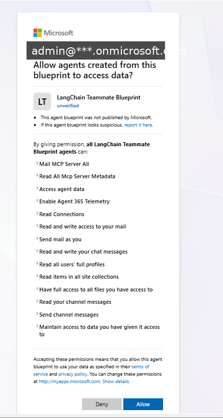
*▲ ② 管理者同意。blueprint から作られる全エージェントに付与される権限（Mail / MCP / Telemetry 等）を確認して **Allow**。*

---

## B：承認 — Requests タブから公開（Publish）する

`a365 publish` で登録すると、エージェントは **管理センター › Agents › All agents › Requests** タブに **`Pending review`** として現れます。IT 管理者がここで承認（＝ユーザーへ公開）して初めて利用可能になります。

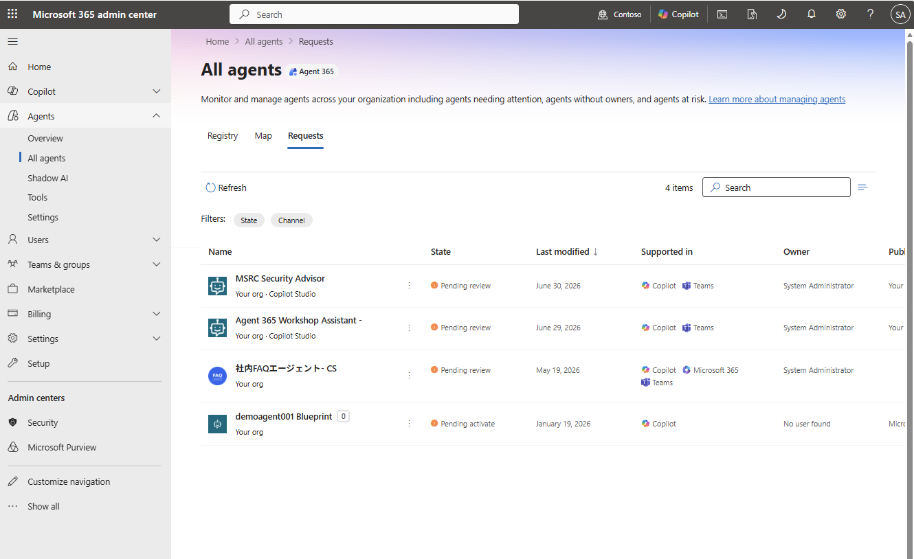
*▲ ① Agents › All agents › **Requests**。`Pending review`（レビュー待ち）/ `Pending activate`（有効化待ち）を確認。*

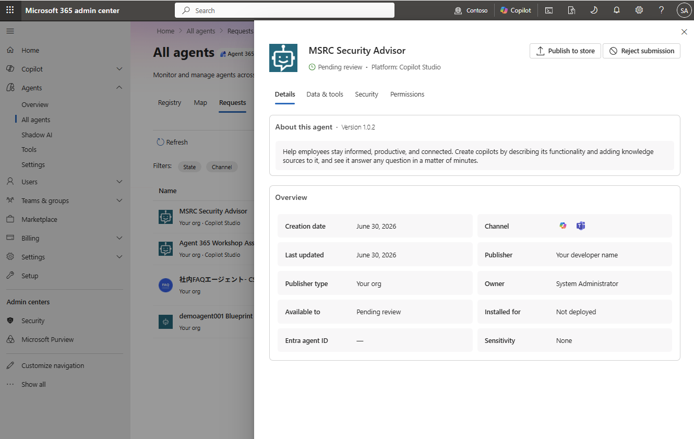
*▲ ② エージェントを開く。`Publish to store` で承認、`Reject submission` で却下。この時点では Entra agent ID は「—」。*

承認すると **「Publish new agent」ウィザード（4 ステップ）** が開きます。

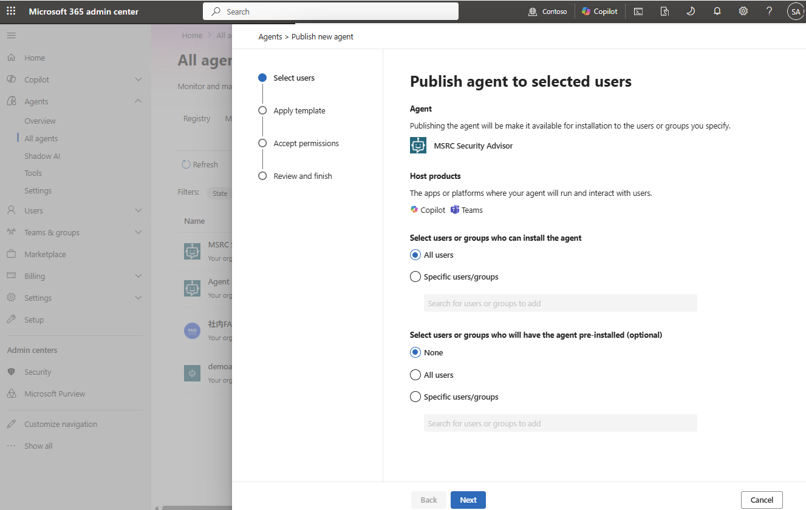
*▲ ③ **Select users** — インストールできるユーザー（All users / 特定）と事前インストール先を選択。Host products：Copilot / Teams。*

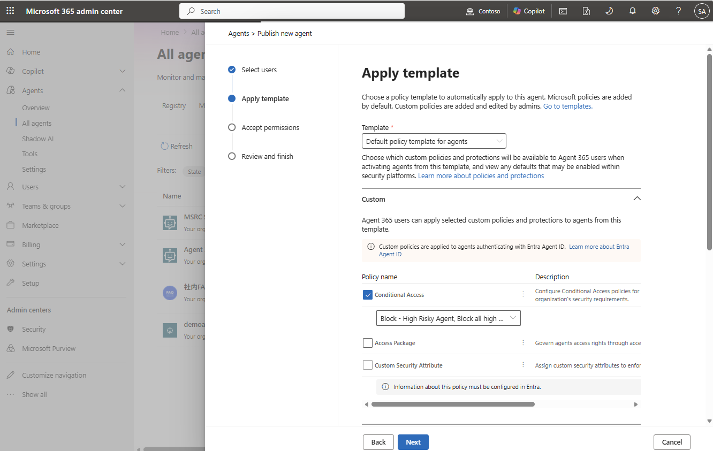
*▲ ④ **Apply template** — ポリシーテンプレートを適用。Custom で **Conditional Access**（例「Block - High Risky Agent」）・Access Package・Custom Security Attribute を選択（→ [Step 8：ガバナンス](./08-governance.md)）。*

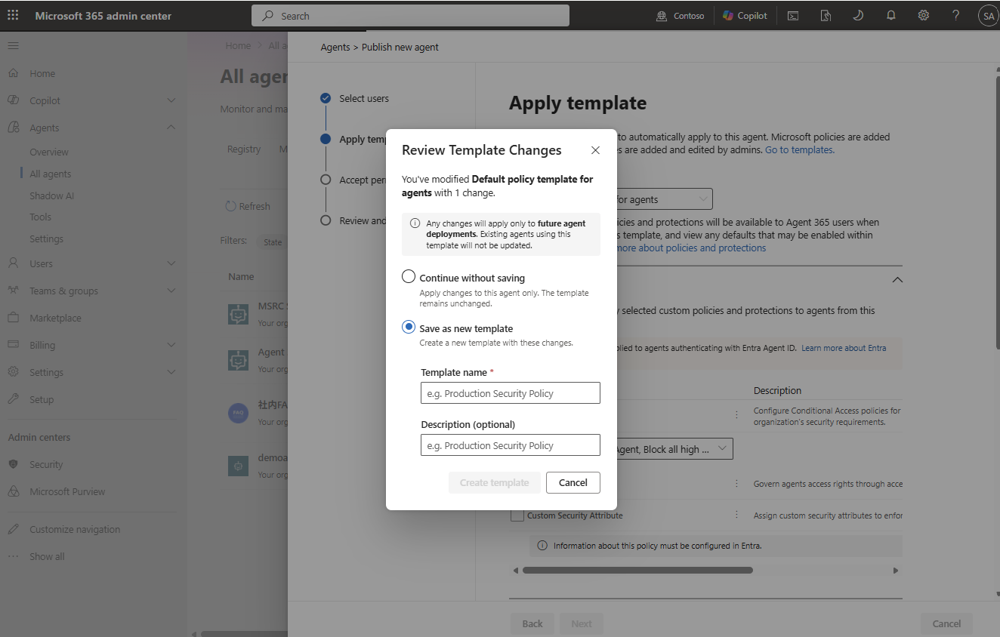
*▲ ⑤ 既定テンプレートを変更した場合：このエージェントだけに適用（Continue without saving）か、新規テンプレートとして保存（Save as new template）。*

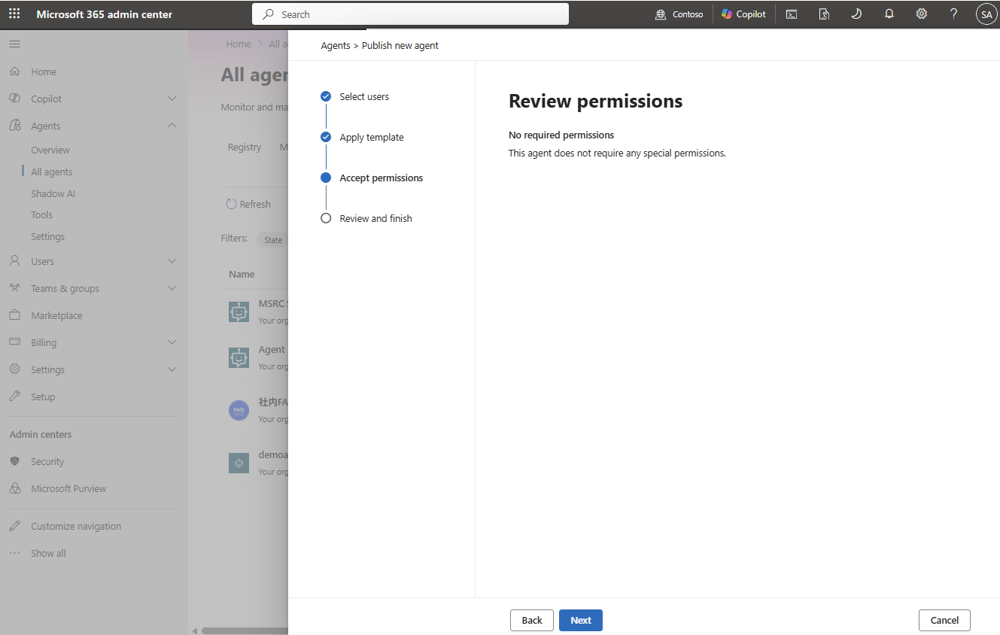
*▲ ⑥ **Accept permissions** — エージェントが要求する権限を確認（例では特別な権限なし）。*

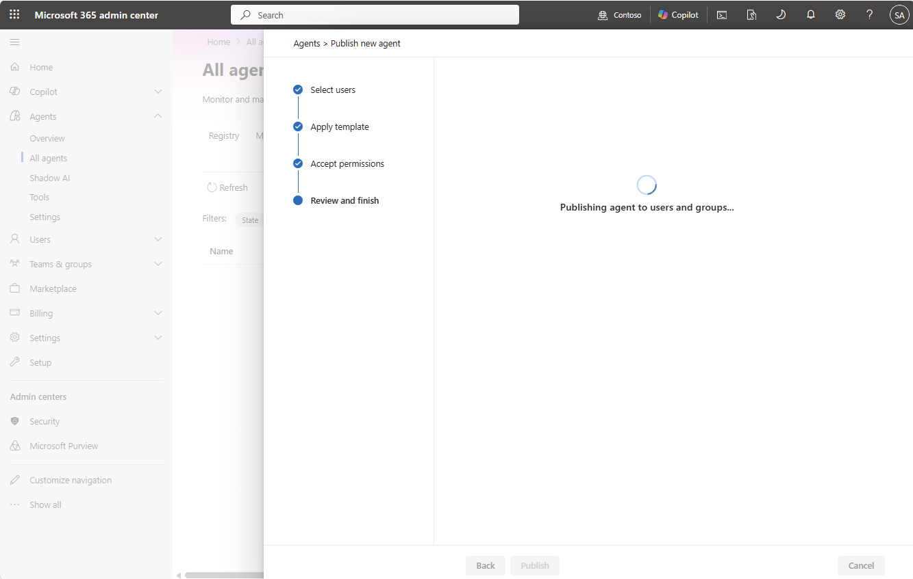
*▲ ⑦ **Review and finish** → `Publish`。ユーザー／グループへの公開処理が走る。*

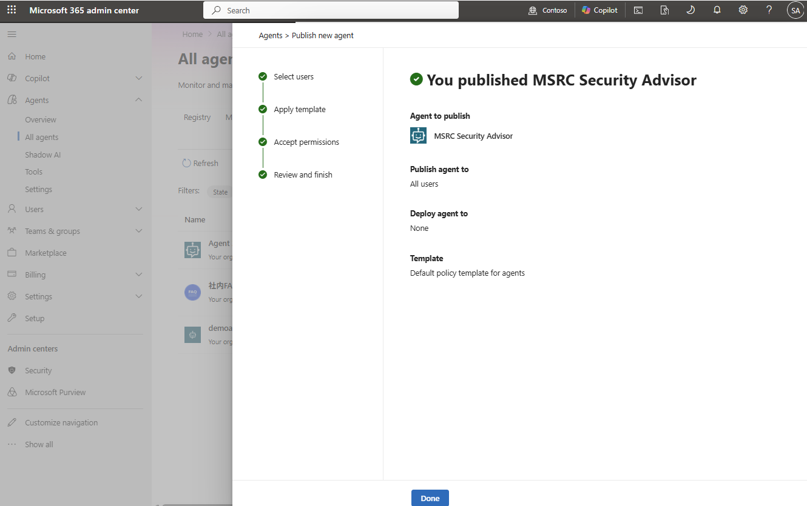
*▲ ⑧ 「You published …」。公開先（All users）・デプロイ先・適用テンプレートが表示され、承認完了。*

> [!TIP]
> 承認（公開）が完了するとエージェントは `Pending review` から外れ、利用可能になります。続いて **C（+ Add instance）** で Agent ID・User を払い出すと、Teams で使えるようになります。

---

## C：`+ Add instance` — Agent ID・User を払い出す

ここが **Agent ID 付与の瞬間**です。承認済みの blueprint を開き、**`+ Add instance`** を押して、エージェントを「使える実体」にします。

```
管理センター › Agents › blueprint を開く ─▶ [ + Add instance ] ─▶ 項目を入力 ─▶ 作成
                                                                         │
                          ┌──────────────────────────────────────────────┴───────────────┐
                          ▼                                                                ▼
        Agent Identity（Entra Agent ID）                         Agent's User Account（AI Teammate）
        blueprint 詳細の Entra agent ID が                        例 hana-assistant@tenant.onmicrosoft.com
        「—」→ 実値（例 12f560ef-…）に変化                        → Teams で @mention 可能（同期に数分）
```

### 作成画面で入力する項目

| 項目 | 内容 |
| --- | --- |
| **Instance display name** | Teams での表示名（透明性のため「Assistant」等を含めると良い：例 `Hana (Onboarding Assistant)`） |
| **Agent Instance alias** | agent user の UPN 前半（例 `hana-assistant` → `hana-assistant@tenant.onmicrosoft.com`） |
| **Owner / Reports to（Sponsor）** | instance の責任者。**Sponsor は必須**（Agent Identity では原則 User、SP 不可。blueprint レベルでは動的/Microsoft 365 グループも可） |
| **License** | agent user は実ユーザー扱い。ライセンス割り当てが必要になることがある |

### 画面の流れ（実機）

**① 管理センターから作成（メイン）**

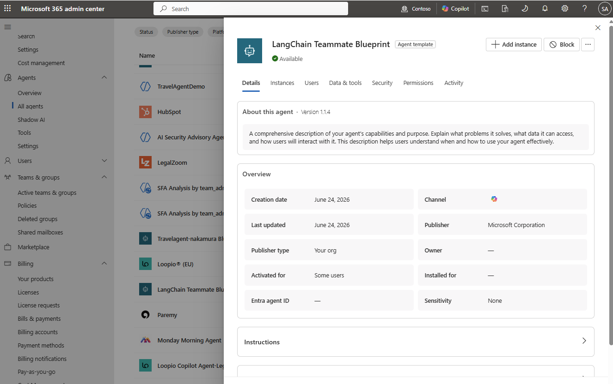
*▲ ① blueprint 詳細。右上の `+ Add instance` から作成。この時点では Overview の **Entra agent ID は「—」**。*

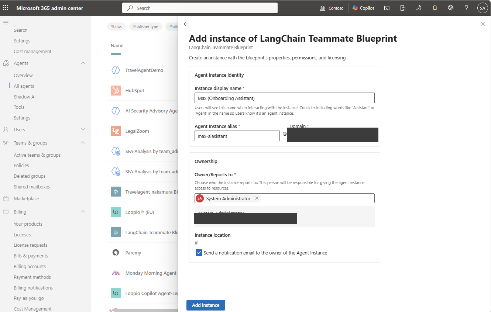
*▲ ② Instance display name（例 `Max (Onboarding Assistant)`）・Agent Instance alias・Owner/Reports to（Sponsor）・Instance location を入力。*

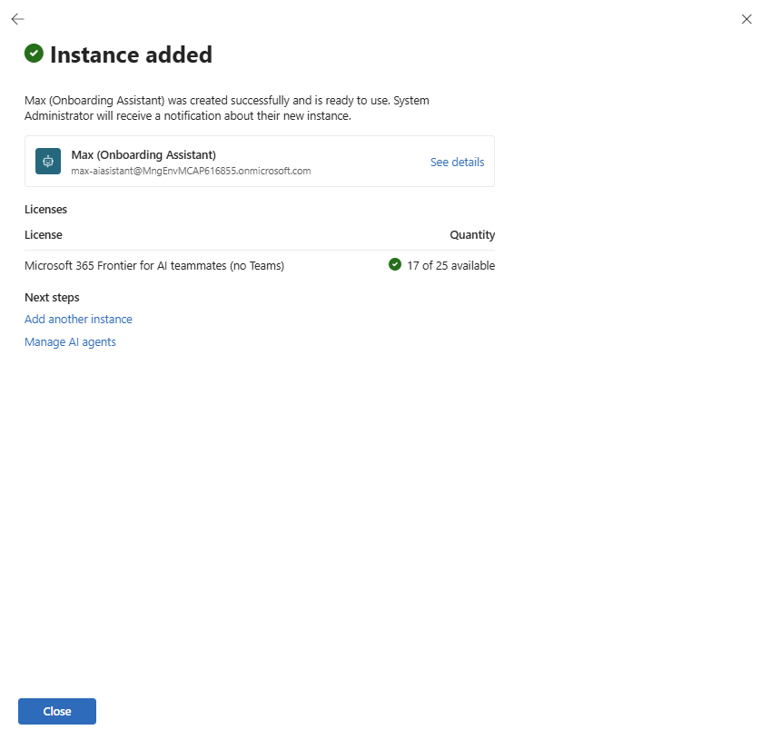
*▲ ③ 「created successfully and is ready to use」。ライセンス（Microsoft 365 Frontier for AI teammates）が 1 つ消費される（例 17 of 25 available）。*

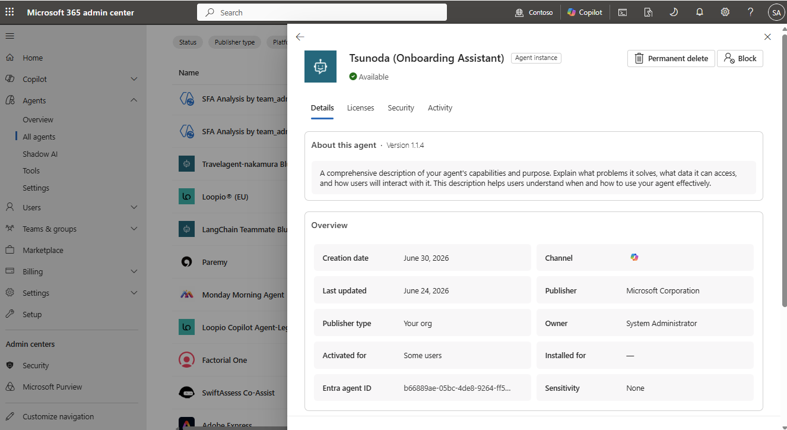
*▲ ④ 作成された instance の詳細。**Entra agent ID が「—」から実値の GUID** に変わり、Owner も設定済み。*

**② 別ルート：エージェントストア（Built by your org）から**

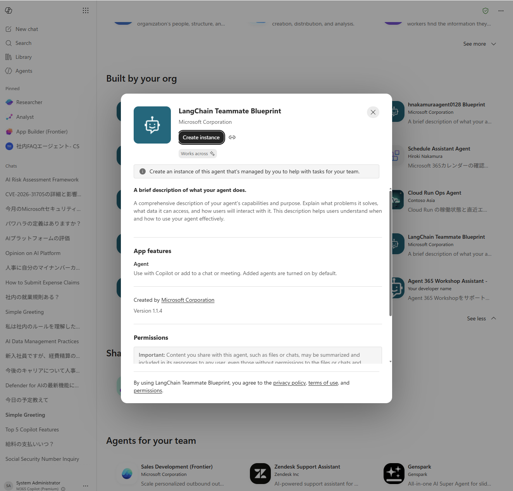
*▲ ⑤ Copilot のエージェントストア「Built by your org」→ blueprint の **Create instance**。*

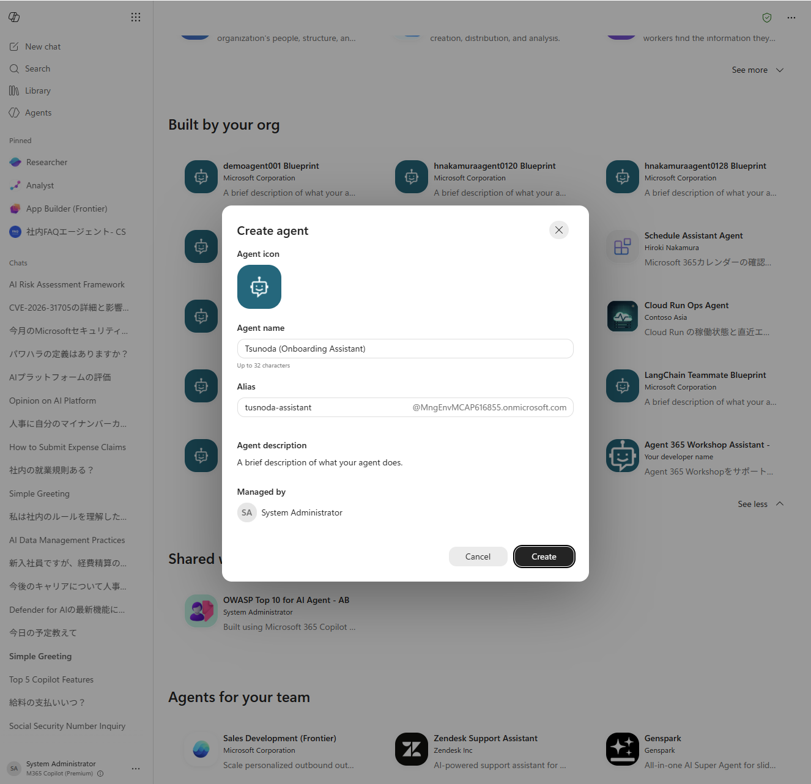
*▲ ⑥ Agent name・Alias・Managed by を入力して **Create**。*

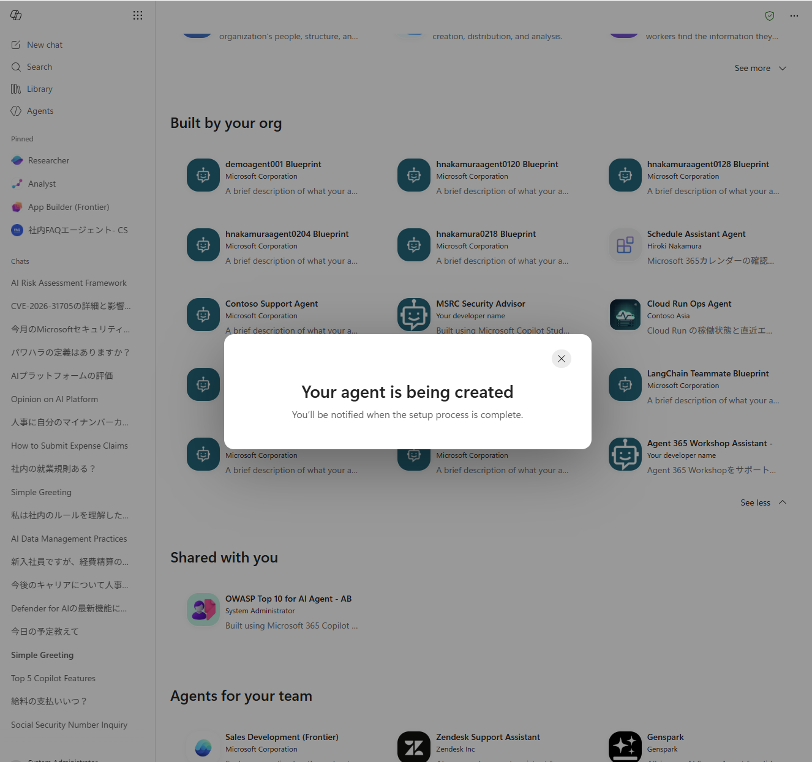
*▲ ⑦ 「Your agent is being created」。完了すると通知が届く。*

**③ 使えることの確認（Teams）**

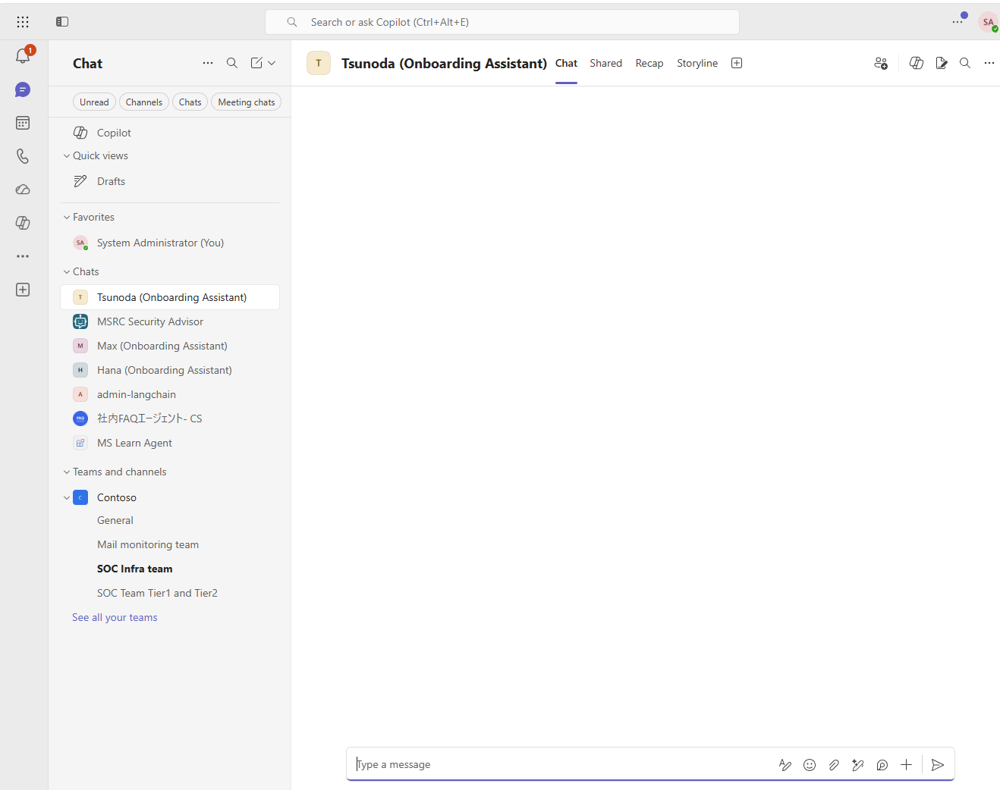
*▲ ⑧ 作成した agent user（例 `Tsunoda / Max / Hana (Onboarding Assistant)`）が Teams の Chats に出現。*

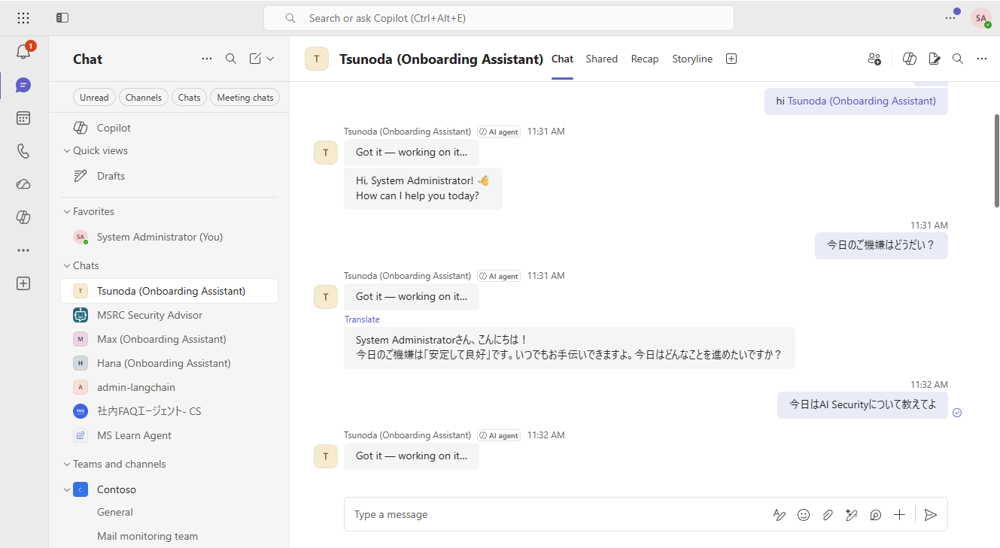
*▲ ⑨ `@mention` して会話できる（本物の agentic コンテキスト ＝ OBO・Observability が成立）。*

> [!TIP]
> 作成後、blueprint 詳細の **Entra agent ID が「—」から実値**に変わり、その値が Observability の `agentId` になります。
> あわせて **agent user** がテナントに現れ、**Teams で `@mention` して使える**ようになります（同期に数分かかることがあります）。

---

## D：管理下に置く → ① ブロック（無効化） / ② 削除

エージェントを止めるには **2 つのレベル**があります。**まず「無効化（ブロック）」で一時停止**し、調査後に解放、完全に廃止する場合のみ「**削除**」に進みます。**両者は別物**（無効化＝オブジェクトは残る／削除＝オブジェクトを消す）。

| | **① ブロック（無効化）** | **② 削除（リタイア）** |
| --- | --- | --- |
| 何が起きる | 認証・トークン発行を止める。**オブジェクトは残る** | オブジェクトを**ディレクトリから消す**（子も連鎖削除） |
| 構成・データ | **保持**（そのまま解放で復帰） | 失われる（30 日は論理削除で復元可、以後完全削除） |
| 用途 | 調査・緊急停止・段階的な使用停止 | ブループリント／エージェントの**完全廃止** |
| クォータ | 消費したまま | 完全削除まで消費し続ける（250 上限に注意） |
| 元に戻す | クリアで即復帰 | 30 日以内なら復元（連鎖削除済みは個別復元） |

> [!IMPORTANT]
> 削除する前に、まず**無効化で足りないか**を必ず検討します。削除はブループリント削除で**子 Agent ID・agent user まで連鎖（cascade）クリーンアップ**され、影響が広いためです。

---

### ① Agent 自体をブロックする（無効化）

ブロックは **Agent 365（M365 管理センター ＝ Copilot Control System）のレジストリ**から、**AI Administrator** が行います。**構成・データ接続を保持したまま即時停止（Kill Switch）**し、調査後に **Unblock（解除）**でそのまま元に戻せます。レジストリでは **2 つの粒度**でブロックできます。

| 粒度 | 対象 | 効果 |
| --- | --- | --- |
| **A-1. Blueprint（エージェント）単位** | エージェント全体（テンプレート） | そのエージェントを組織全体で利用不可に。全ユーザー・全 instance に波及。 |
| **A-2. Instance 単位** | 個々の instance（例 `Max (Onboarding Assistant)`） | その instance だけを停止。他の instance は影響なし。 |

#### A-1. Blueprint（エージェント）単位の Block / Unblock

1. M365 管理センター › **Copilot Control System › Agents › All agents**（発行元＝あなたの組織）で対象の blueprint を開く。詳細右上の **Block** を押す（この時点では `Available`）。
2. **Block agent** パネルで `Block agent` にチェック。任意で **Reason for blocking**（例：`Not compliant with policy`）と **Explain in more detail**（理由の詳細）を記入し、**Save**。
3. ステータスが **`Blocked`** になり、「*You've blocked this agent. It has been removed from all users in your organization.*」が表示される。ボタンは **Unblock** に変わる。
4. **解除（Unblock）** — 右上 **Unblock** → `Unblock agent` にチェック → **Save**。組織のユーザーが再びインストール・利用できる状態に戻る。

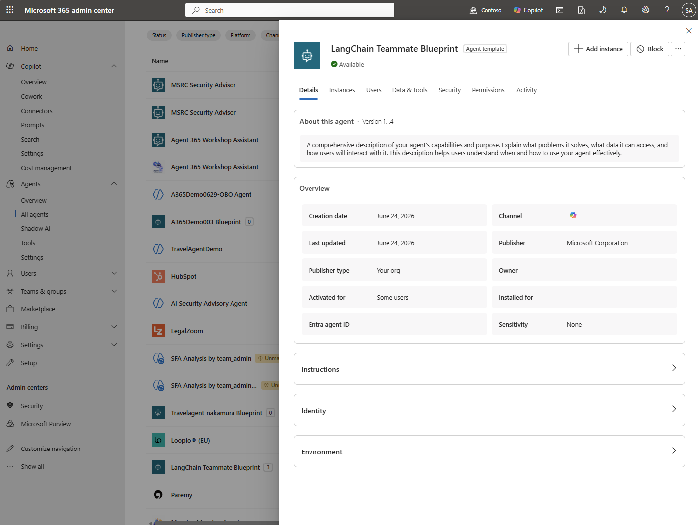
*▲ blueprint 詳細（`Available`）。右上 **+ Add instance / Block / …**。Block を押す。*

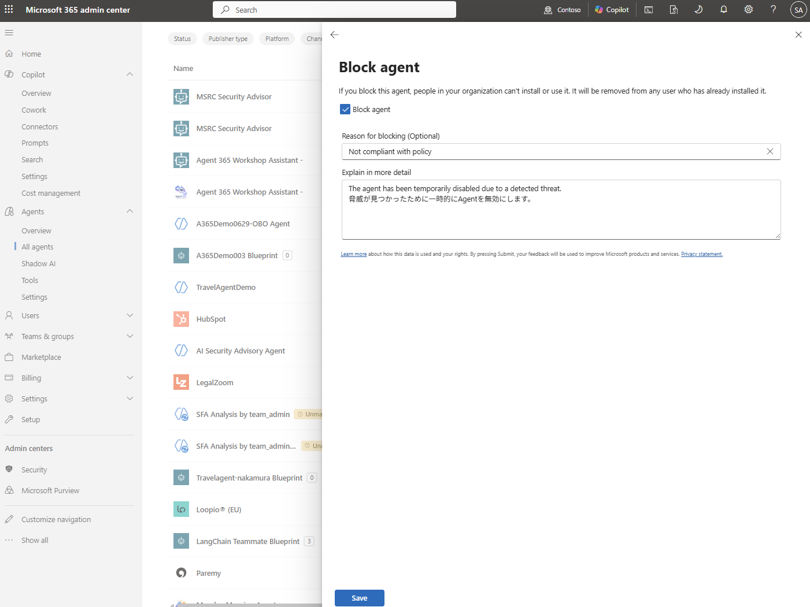
*▲ **Block agent** — 「組織のユーザーはインストール・利用不可になり、導入済みからも削除される」。`Block agent` にチェック → Reason / 詳細を任意入力 → **Save**。*

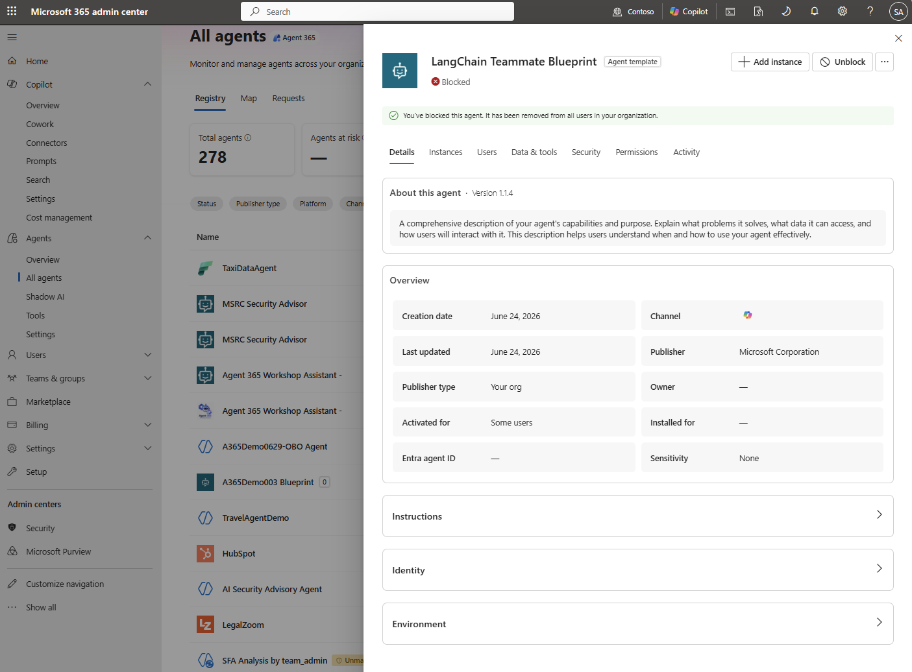
*▲ ステータス **`Blocked`**。「removed from all users in your organization」。ボタンは **Unblock** に変化。*

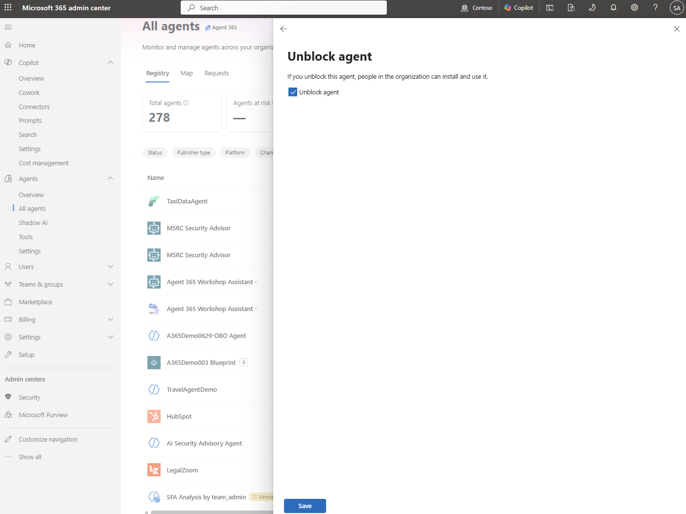
*▲ **Unblock agent** — `Unblock agent` にチェック → **Save** で利用可能に復帰。*

#### A-2. Instance 単位の Block / Unblock

特定の instance（例 `Max (Onboarding Assistant)`）だけを止めたい場合は、**instance の詳細**から Block します。**Entra agent ID が実値**を持つ稼働中の instance を、他に影響なくピンポイントで停止・復帰できます。

1. **All agents** で対象 instance（`Agent instance`）を開く。`Available`／**Entra agent ID は実値**／右上に **Permanent delete / Block**。
2. **Block** → 確認ダイアログ **Block agent instance**（「この instance のサインイン・アクションを停止します」）で **Block**。
3. ステータスが **`Blocked`** に変化。右上は **Permanent delete / Unblock** に変わる。
4. **解除** — **Unblock** → 確認ダイアログ **Unblock agent instance**（「再びサインイン・アクションを許可します」）で **Unblock** → **`Available`** に復帰。

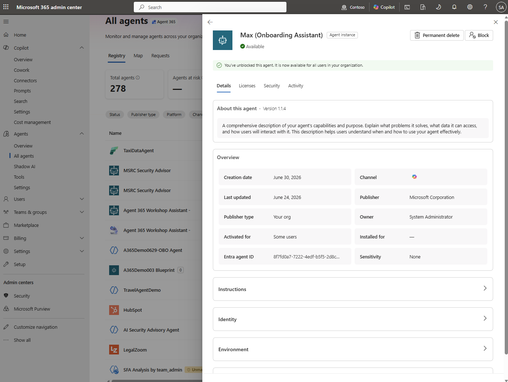
*▲ instance 詳細（`Available`）。**Entra agent ID は実値**、Owner は System Administrator。右上 **Permanent delete / Block**。*

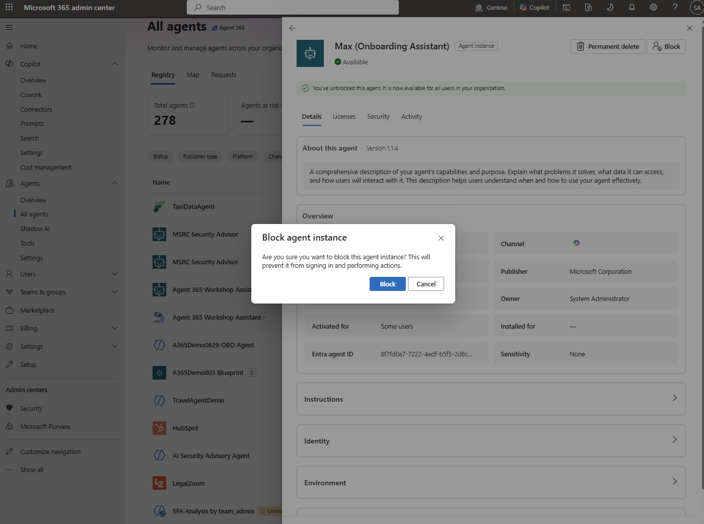
*▲ **Block agent instance** — この instance のサインイン・アクションを停止する確認 → **Block**。*

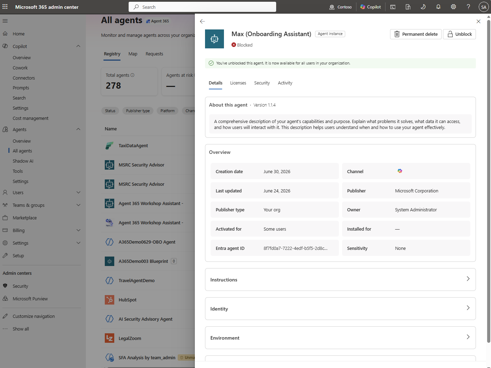
*▲ ステータス **`Blocked`**。右上は **Permanent delete / Unblock** に変化。*

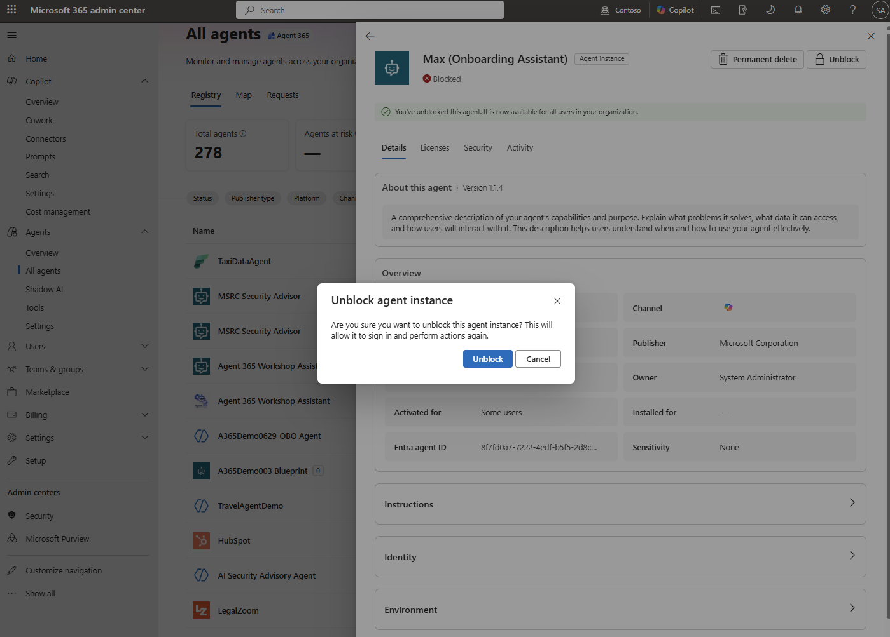
*▲ **Unblock agent instance** — 再びサインイン・アクションを許可する確認 → **Unblock**。*

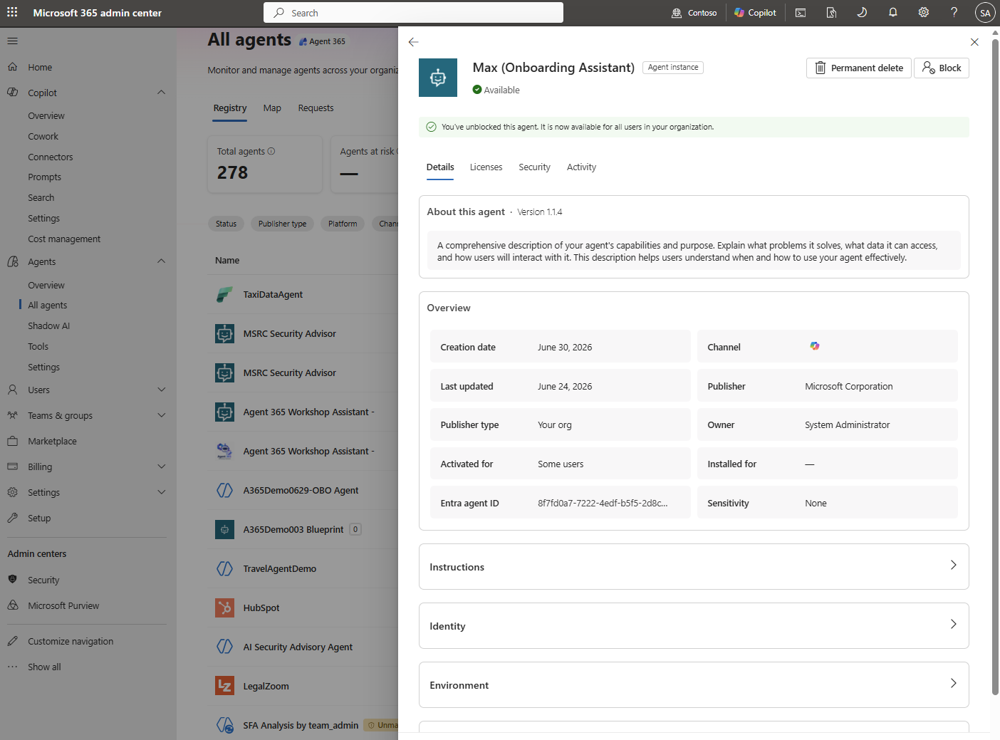
*▲ 解除後、ステータスは **`Available`** に戻る。*

> [!NOTE]
> **Blueprint 単位（A-1）と Instance 単位（A-2）の違い：** A-1 はエージェント全体（全 instance・全ユーザー）を止め、A-2 は**その instance だけ**を止めます。Instance 詳細の **Permanent delete** は完全削除（→ 後述の **② Instance を削除する**）で、Block とは別物です。

> [!TIP]
> **さらに広く・テナント全体で止めたい場合は条件付きアクセス（Entra）**も使えます。「すべてのエージェント ID」を対象に**トークン発行をブロック**するポリシーで、既存・新規の Agent ID をまとめて認証不可にできます（本番適用前に **レポート専用モード**で影響確認）。本ワークショップでは Agent 365 のレジストリ Block を中心に扱い、CA は [Step 8：ガバナンス](./08-governance.md) と [Learn：テナントでエージェント ID を無効にする](https://learn.microsoft.com/ja-jp/entra/agent-id/disable-agent-identities) を参照。

---

### ② Instance を削除する（リタイア）

無効化では不十分で、**instance やエージェントを完全に廃止**する場合は削除します。Agent 365（管理センター）の **instance 詳細 › Permanent delete** から、その instance を完全に削除できます（A-2 の画面に出ていた **Permanent delete** ボタン）。

> [!IMPORTANT]
> **Block と Permanent delete は別物。** Block は構成を保持したまま一時停止（Unblock で復帰）、**Permanent delete は完全削除**（元に戻すには復元が必要）。**ブループリント（またはその principal）を削除すると、子の Agent ID と agent user が連鎖クリーンアップ**されます（個別削除は不要）。

**自前ホスト（本ワークショップ題材）でまとめて消すなら `a365 cleanup` が正攻法**です。作業ディレクトリの config を読み、その blueprint 配下の Agent 365 リソースを一括削除します。

```powershell
cd C:\path\to\agent365-langchain-nodejs   # ← フォルダを間違えない（最重要）
Get-Content a365.generated.config.json | ConvertFrom-Json   # 対象 blueprint を確認
a365 cleanup                                # 破壊的：全 Agent 365 リソースを削除

# orphan アプリが残っていないか確認・削除
az ad app list --display-name "<blueprint名>" --query "[].{name:displayName, appId:appId}" -o table
az ad app delete --id <orphanのappId>
```

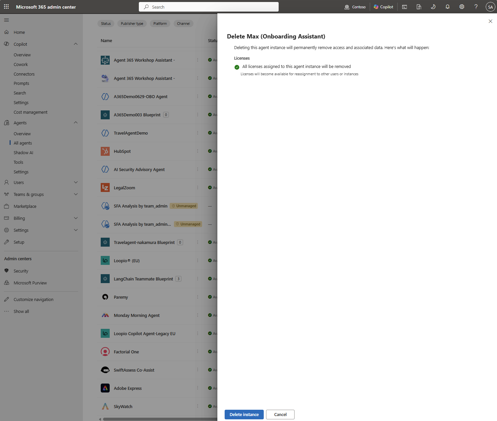
*▲ **Delete (Onboarding Assistant)** — 「この instance を削除するとアクセスと関連データが完全に削除される」。**割り当て済みライセンスは解放**され、他ユーザー／instance へ再割り当て可能に。**Delete instance** で実行（または `a365 cleanup` で一括）。*

> [!IMPORTANT]
> **連鎖クリーンアップは非同期**で、数時間〜数日かかることがあります。監査ログには各削除が *サービス プリンシパルの削除*／開始者 **「エージェント ID の削除タスク」** として個別に記録されます。
> 論理削除は **30 日間復元可能**。ただし連鎖削除が走った後に principal を復元しても**子 ID は戻りません**（各子を個別復元）。クォータをすぐ空けたいときは論理削除済みオブジェクトを**完全削除**します。

> [!TIP]
> **迷ったら：止める＝① 無効化（構成保持・即復帰）／ 廃止する＝② 削除（連鎖・30 日で完全削除）。** まず無効化、確証が取れてから削除、が安全な順序です。

---

## 参考

- [Microsoft Entra Agent ID とは](https://learn.microsoft.com/entra/agent-id/)
- [エージェントの公開（管理センター）](https://learn.microsoft.com/microsoft-agent-365/developer/publish)

[← Step 3：サードパーティ管理](./03-third-party-management.md) ｜ [次：Step 5 認証 →](./05-authentication.md)
