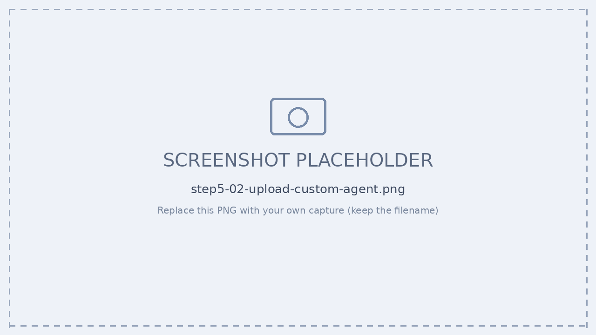
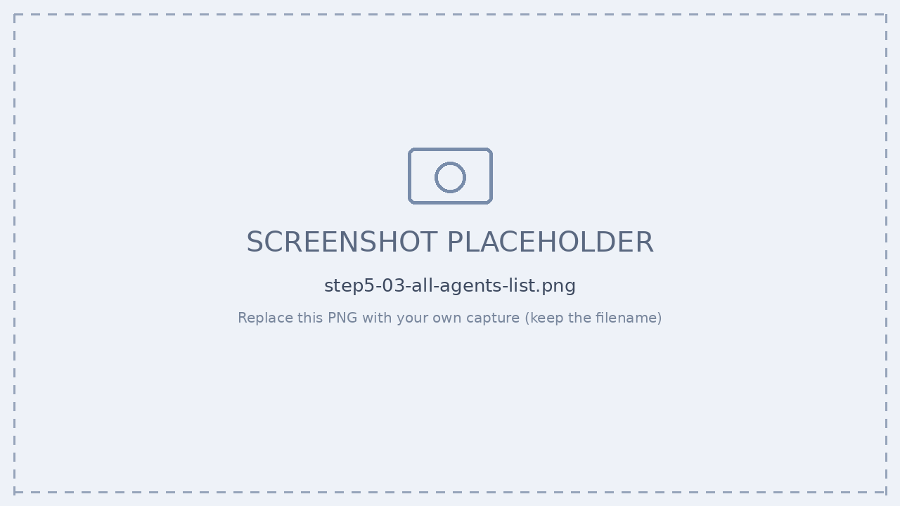

# Step 6 — Agent 365 への公開（manifest → Registry）

[← 目次](./README.md) ｜ [← Step 5：認証](./05-authentication.md) ｜ [次：Step 7 ガバナンス →](./07-governance.md)

## 目的

**Agent Card Manifest** を生成して M365 管理センターにアップロードし、**レジストリ一覧に表示**します。承認後に Instance を作成すると [Step 4](./04-register.md) の Entra Agent ID 付与につながります。

```
a365 publish ──▶ manifest 編集 ──▶ Upload custom agent ──▶ 一覧表示 ──▶ + Add instance
(manifest.zip)   (short<30字)      (管理センター)           (Name/Version)  (Agent ID 付与)
```

> ロール：管理センターのアップロードは **Global Administrator**（または Agent ID Administrator / Developer）／ Frontier preview 登録済みが前提。

---

## 演習：Manifest 登録 → 一覧表示

### 手順

1. **publish 実行**

   ```powershell
   a365 publish
   # manifest.json に blueprint ID を埋め、manifest.zip を生成
   # → 成功すると manifest フォルダに json と zip、
   #   管理センターへのアップロード手順が出力される
   ```

2. **manifest 編集** — `name.short`（**30 文字未満**）／ `description` ／ `icons` を確認・調整。
3. **アップロード** — M365 管理センター › **Copilot Control System › Agents › All agents › Upload custom agent** → `manifest.zip` を選択。
4. **確認** — 名前・アイコン・ホスト製品を確認 → **5〜10 分後**に一覧表示（`Name` / `Version` / `Publisher` / `Availability`）。
5. **Instance 化** — 管理者承認 → **+ Add instance**（Blueprint → Instance）。

### 実行ログ（マスク済み）

```console
PS C:\agent365-langchain-nodejs> a365 publish

Authentication context: user admin@<tenant>.onmicrosoft.com  (tenant <tenant-id>)

Extracting manifest templates...
    Extracted to     C:/path/to/agent365-langchain-nodejs/manifest
    Manifest updated: ...\manifest\manifest.json

Customize before packaging:
    version            - 再公開時は前回より大きく（例 1.0.1）
    name.short         - 30 文字以内（現在: "LangChain Teammate Blueprint"）
    name.full / description.* / developer.* / icons

Open manifest in your default editor now? (Y/n): n
Press Enter when you have finished editing the manifest to continue:

Package created:  C:/path/to/agent365-langchain-nodejs/manifest/manifest.zip

To publish:  https://admin.microsoft.com  >  Agents  >  All agents  >  Upload custom agent
```


*▲ 管理センター › Agents › All agents › Upload custom agent*


*▲ 公開後、一覧に表示される（Name / Version / Publisher / Availability）*

> [!TIP]
> アップロード後、管理センターと Teams に表示されるまで **5〜10 分**。承認 → **+ Add instance** で Entra Agent ID が付与され、Blueprint→Instance が完結します。

> [!WARNING]
> **`a365 cleanup` すると blueprint ID が変わり、publish 済みマニフェストの ID は古いまま**になります。`cleanup → setup` したら必ず `a365 publish` からやり直し、管理センターに**再アップロード**してください。

> [!NOTE]
> **短縮名は 30 文字未満。** マニフェストの `short name` が 30 文字以上だと publish が失敗します。

---

## 確認チェックリスト

- [ ] `manifest` フォルダに `manifest.json` と `manifest.zip` が生成された
- [ ] `name.short` が 30 文字未満
- [ ] 管理センター All agents にエージェントが表示される（Name/Version/Publisher/Availability）
- [ ] 承認 → + Add instance で Entra Agent ID が付与される

---

## 参考

- [エージェントの公開（a365 publish）](https://learn.microsoft.com/microsoft-agent-365/developer/publish)
- [カスタムエージェントのアップロード（管理センター）](https://learn.microsoft.com/microsoft-365/copilot/agent-essentials/agent-lifecycle/agent-upload-agents)

[← Step 5：認証](./05-authentication.md) ｜ [次：Step 7 ガバナンス →](./07-governance.md)
