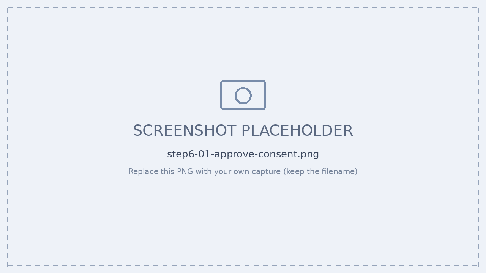
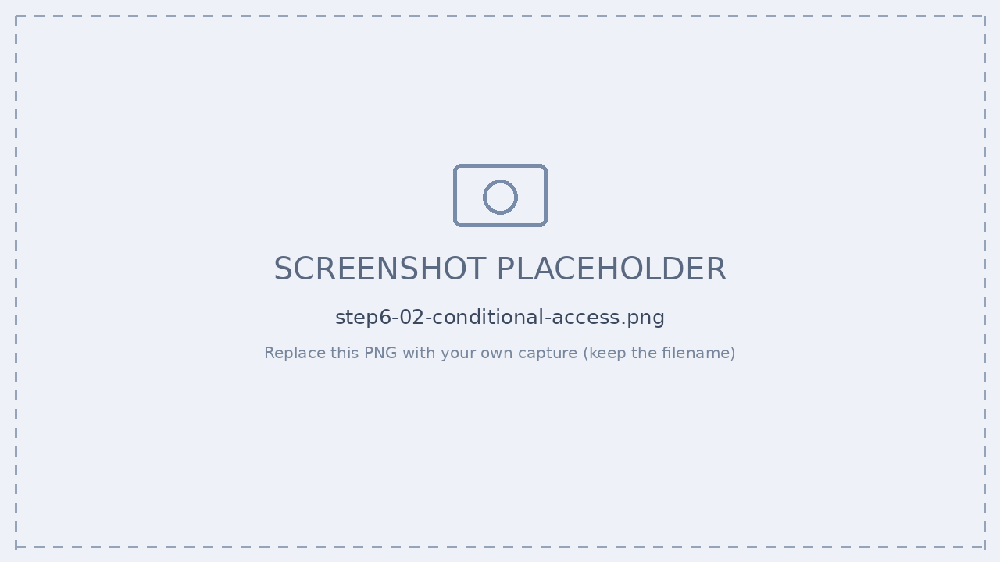
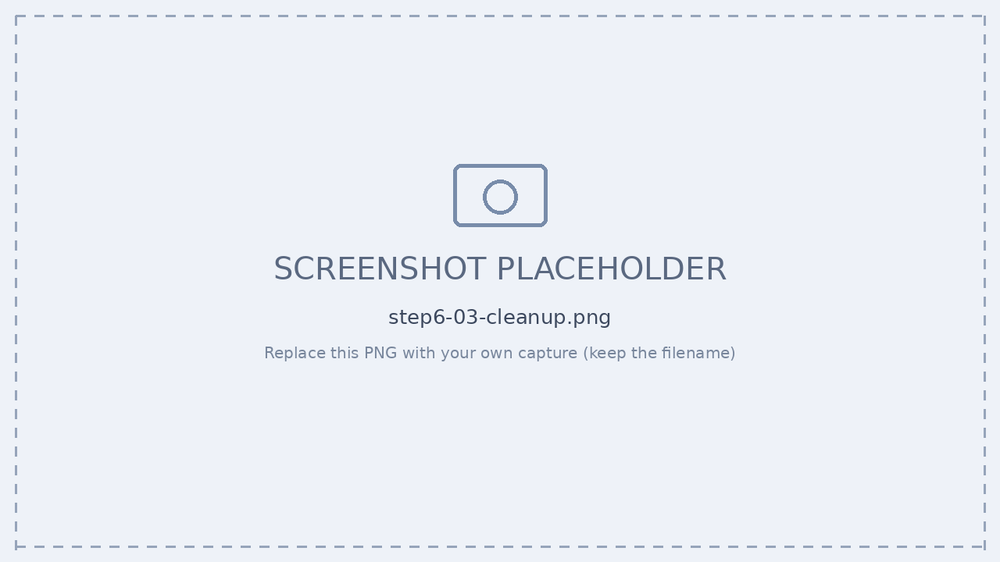

# Step 7 — 管理・ガバナンス（ポリシー / CA / ライフサイクル）

[← 目次](./README.md) ｜ [← Step 6：公開](./06-publish.md) ｜ [次：Step 8 観測 →](./08-observability.md)

## 目的

承認時のポリシー継承、**条件付きアクセス（CA）**、**停止・削除（リタイア）** の 3 本柱で統制します。

| 柱 | 概要 |
| --- | --- |
| **ポリシー設定** | 承認(activate)時に Graph / Observability 権限へ同意。Blueprint がポリシーを全 Instance に継承（DLP・外部アクセス制限・ログ規則）。 |
| **アクセス制御（CA）** | 条件付きアクセスの対象に**エージェント ID** を指定。リソース／リスクで 許可・ブロック・制限。 |
| **ライフサイクル** | Block（Kill Switch）で一時停止 → `a365 cleanup` で全リソース削除 → 90 日未使用で自動期限切れ／アクセスレビュー。 |

> 担当・ポータル：ポリシー＝AI 管理者（管理センター）／ CA・アクセスレビュー＝ID 管理者（Entra）／ 削除＝作業ディレクトリの `a365 cleanup`

---

## ポリシー / CA / ライフサイクル

### 1. ポリシー（承認 ＋ 同意）

管理センターで保留中の blueprint を**承認**。承認（activate）時に、blueprint の Graph 権限・Observability 権限への**同意フロー**が走ります（`resourceConsents`）。


*▲ blueprint 承認時の Graph / Observability 同意*

### 2. アクセス制御（条件付きアクセス）

Entra › **条件付きアクセス**で、対象に「**エージェント ID**」を指定し、リソース／リスクに応じて許可・ブロック・制限します。

| 要件 | 内容 |
| --- | --- |
| ライセンス | Microsoft Entra ID **P1 / P2** ＋ ユーザーごとの **Agent 365 ライセンス** |
| ネットワーク制御 | エージェント向けネットワーク制御は **Microsoft Entra Internet Access** が必要 |
| 対象 | エージェント ID（agent identity blueprint）を CA ポリシーの対象に指定 |


*▲ 条件付きアクセスの対象にエージェント ID を指定*

### 3. ライフサイクル（停止 → 削除）

```powershell
cd C:\path\to\target-folder          # ← フォルダを間違えない（最重要）
Get-Content a365.generated.config.json | ConvertFrom-Json   # 対象 blueprint を確認
a365 cleanup                          # 破壊的：全 Agent 365 リソースを削除

# orphan アプリが残っていないか確認
az ad app list --display-name "<blueprint名>" --query "[].{name:displayName, appId:appId}" -o table
az ad app delete --id <orphanのappId>  # 残っていれば手動削除
```


*▲ `a365 cleanup` と orphan アプリの削除*

> [!TIP]
> **停止と削除は別物。** Block（Kill Switch）は構成・データ接続を保持したまま使用を停止 → 調査後にそのまま解放できます。完全削除は `a365 cleanup`。90 日未使用で自動期限切れ、退役時は **アクセスレビュー（Entra ID Governance）** も実施。

---

## 確認チェックリスト

- [ ] blueprint を承認し、Graph / Observability 権限に同意した
- [ ] 条件付きアクセスでエージェント ID を対象にしたポリシーを作成した
- [ ] Block（一時停止）→ 解放を確認した
- [ ] `a365 cleanup` の対象フォルダ・config を実行前に確認した
- [ ] orphan アプリが残っていないか `az ad app list` で確認した

---

## 参考

- [エージェント向け条件付きアクセス](https://learn.microsoft.com/entra/identity/conditional-access/agent-id)
- [組織のエージェント ID 管理](https://learn.microsoft.com/entra/agent-id/)

[← Step 6：公開](./06-publish.md) ｜ [次：Step 8 観測 →](./08-observability.md)
