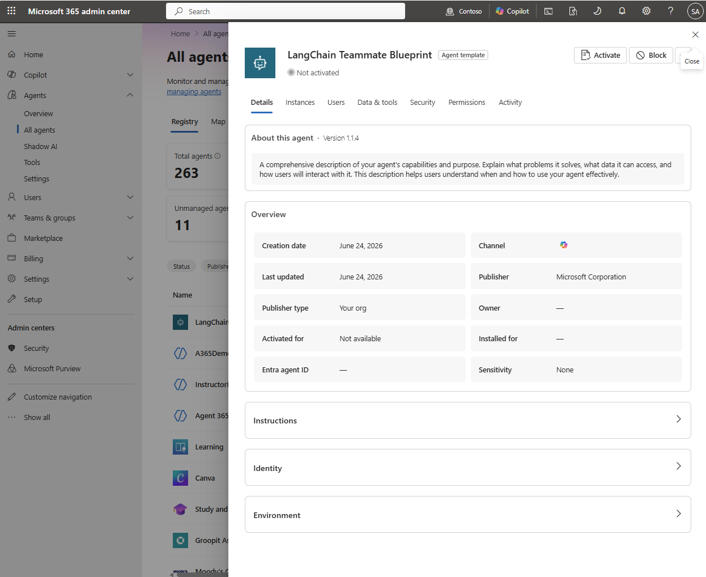
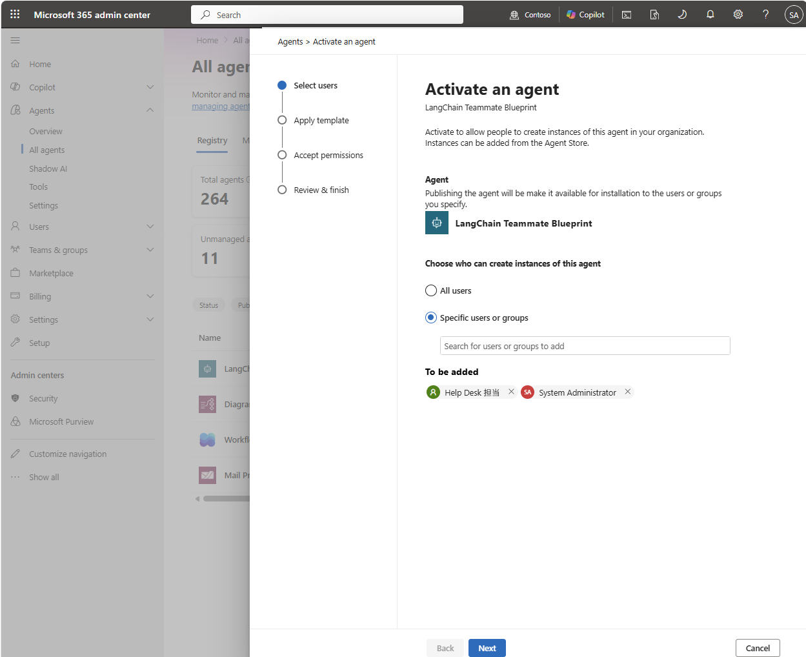
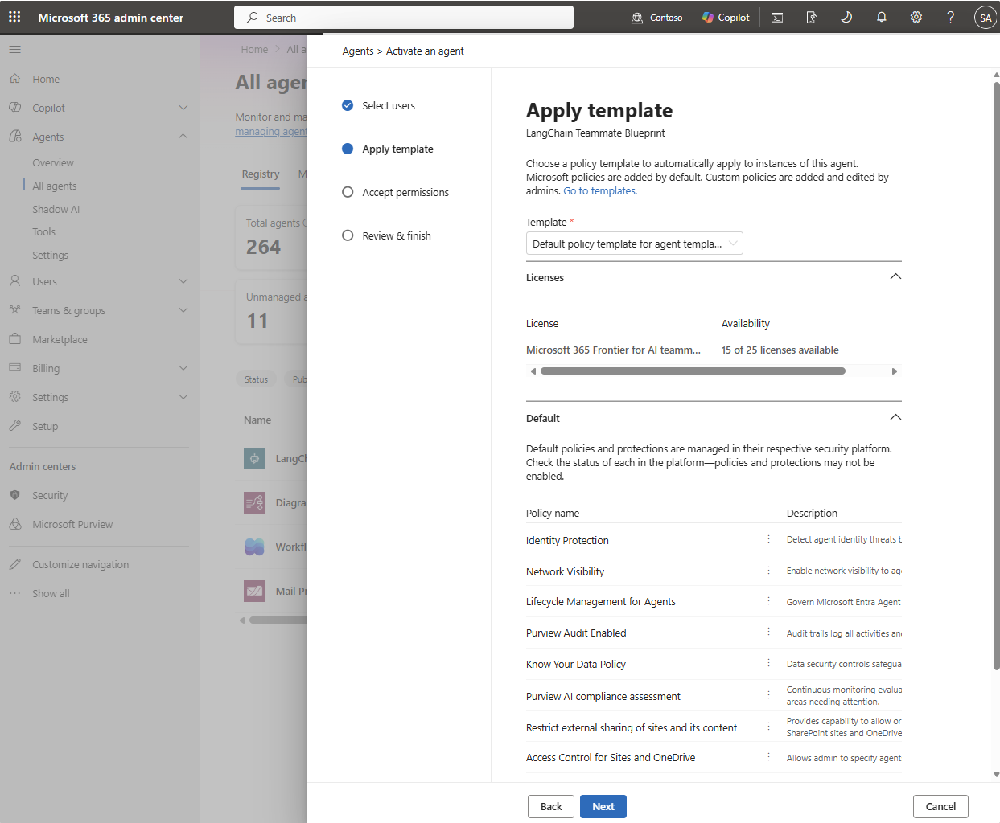
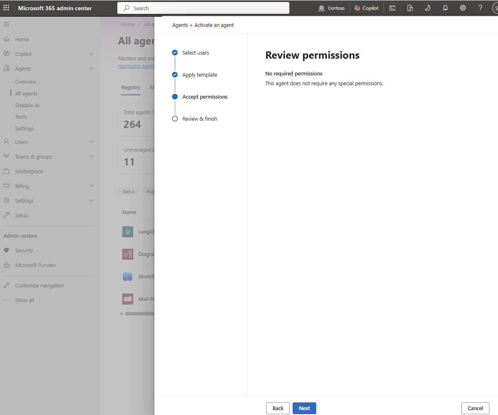
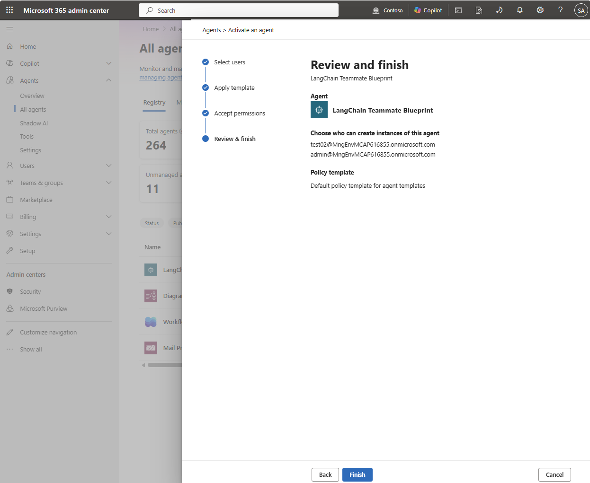
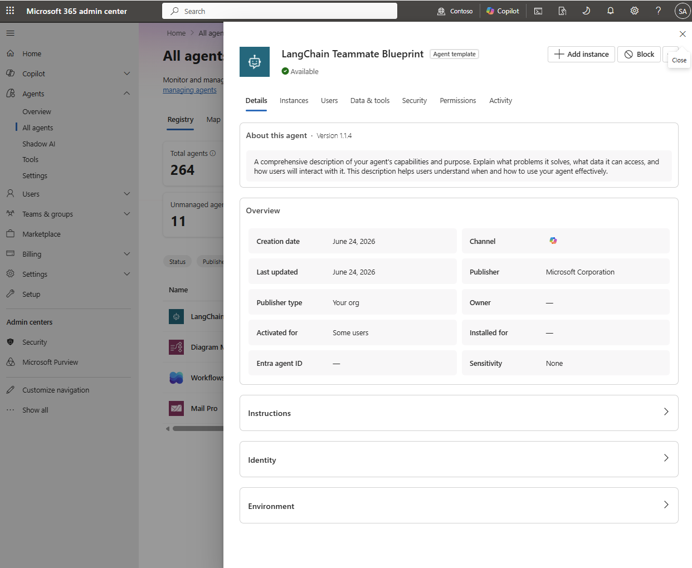
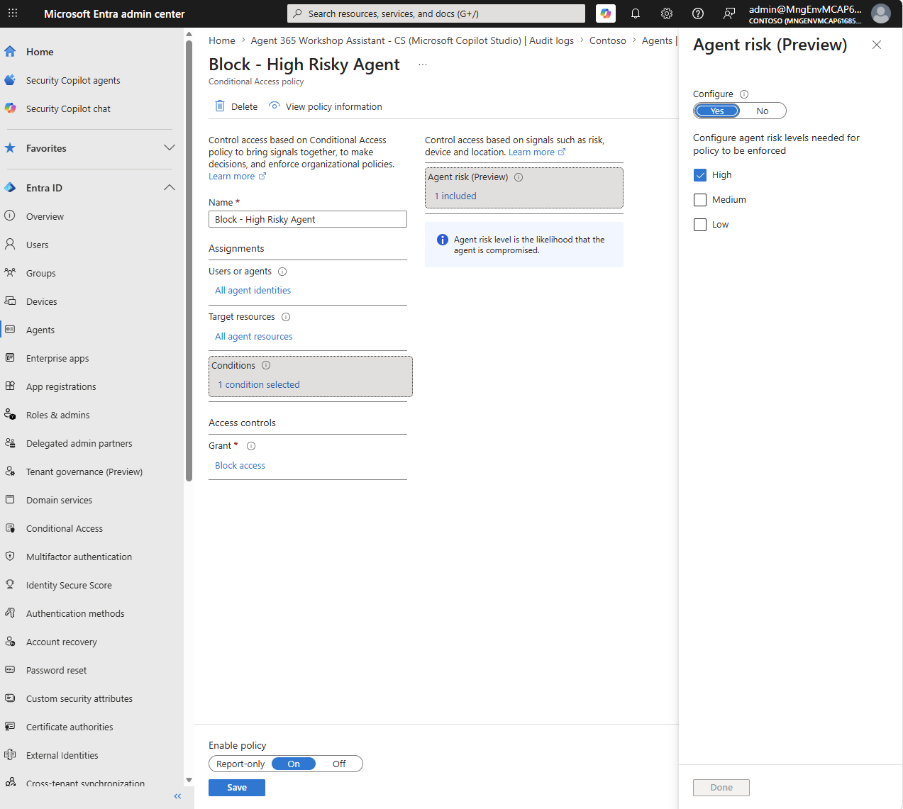

# Step 7 — 管理・ガバナンス（ポリシー / CA / ライフサイクル）

[← 目次](./README.md) ｜ [← Step 6：公開](./06-publish.md) ｜ [次：Step 8 観測 →](./08-observability.md)

## 目的

承認時のポリシー継承、**条件付きアクセス（CA）**、**停止・削除（リタイア）** の 3 本柱で統制します。

| 柱 | 概要 |
| --- | --- |
| **ポリシー設定** | 承認(activate)時に Graph / Observability 権限へ同意。Blueprint がポリシーを全 Instance に継承（DLP・外部アクセス制限・ログ規則）。 |
| **アクセス制御（CA）** | 条件付きアクセスの対象に**エージェント ID** を指定。リソース／リスクで 許可・ブロック・制限。 |
| **ライフサイクル** | Block（Kill Switch）で一時停止 → `a365 cleanup` で全リソース削除 → 未使用エージェントの自動期限切れ（例：90 日）は **Management Rule で設定可能**（設定依存・今後提供予定の機能）／アクセスレビュー。 |

> 担当・ポータル：ポリシー＝AI 管理者（管理センター）／ CA・アクセスレビュー＝ID 管理者（Entra）／ 削除＝作業ディレクトリの `a365 cleanup`

---

## Agent を Active 化する（有効化：利用者の指定とポリシー適用）

[Step 6](./06-publish.md) の **公開（Publish）** でレジストリに載せたエージェントを、実際に **利用・インスタンス作成できる状態**にするのが **Active 化（有効化）** です。ここで管理者は **① 誰に使わせるか（利用者／グループ）** と **② どのポリシーを適用するか（テンプレート）** を決めます。

> [!NOTE]
> **公開（Publish）と有効化（Activate）は別操作**です。**Publish** はエージェントを組織内で**インストール可能**にし、**Activate** は**インスタンスを作成できるユーザー**を有効化して**ポリシーテンプレートを適用**します。公開ウィザード（[Step 6](./06-publish.md)）では Activate を **None** にして、後からこの手順で実施できます。

### 1. 誰に利用させるか（アクセス／インストール）

エージェントを使えるユーザーの範囲は、他のアプリと同じ管理センターのコントロールで指定します。

| 操作 | 内容 |
| --- | --- |
| **Publish to users** | エージェントを**インストール可能**にする対象：**All users** または **特定のユーザー／グループ**。 |
| **Activate（任意）** | **インスタンスを作成できるユーザー**を有効化：**None / All users / Specific users・groups**。 |
| **Install / Uninstall** | 管理者が代理でインストール／削除。インストール時は **Review permissions → Grant admin consent → Accept → Finish deployment** で権限に同意。 |

**「Activate an agent」ウィザード（前半：利用者の指定）**


*▲ ① 公開済みエージェントの詳細。**Not activated** 状態。右上の **Activate** から有効化ウィザードを開始する（**Block** は無効化）。*


*▲ ② **Select users** — 「このエージェントのインスタンスを作成できるユーザー」を **All users** または **Specific users or groups** で指定（例：Help Desk 担当・System Administrator）→ **Next**。*

### 2. ポリシー（テンプレート）を適用する

Active 化の際、**ポリシーテンプレート**をドロップダウンから選んで適用します。テンプレートは **Microsoft Entra / Purview / SharePoint Online / Defender** のポリシーを束ねたもので、ガバナンスとセキュリティを一括で効かせます。

| 種別 | 内容 |
| --- | --- |
| **既定テンプレート（Default）** | Microsoft 提供。**Purview 監査・DSPM（機密情報検出）・AI コンプラ評価・ID Protection・ネットワーク可視化・ライフサイクル管理・Advanced Hunting** 等（**ロック・編集不可**）。「すべてのエージェント用」と「Frontier の AI teammate 用」の 2 種。 |
| **カスタムテンプレート（Custom）** | **条件付きアクセス（CA）／アクセスパッケージ／カスタムセキュリティ属性**（いずれも Entra）。**事前に Entra でポリシーを作成**しておく必要があります（CA の詳細は本ページ後半「アクセス制御（条件付きアクセス）」を参照）。 |

> [!IMPORTANT]
> - **テンプレートは「新規の Active 化」にのみ適用**されます。**承認済みのエージェントには後付けできません**（テンプレートの編集も以後の新規有効化にのみ反映）。
> - **条件付きアクセス・カスタムセキュリティ属性の適用には Global Administrator** が必要（AI Administrator はアクセスパッケージは可、CA・属性は権限不足）。
> - カスタムポリシー（Entra）の適用には **Agent 365 ライセンス**が必要。AI テンプレートのシナリオは**プレビュー（Frontier テナント限定）**。
> - テンプレートの作成・編集は **管理センター › Agents › Settings › Templates › Add a New Template**。

**「Activate an agent」ウィザード（後半：テンプレート → 確認）**


*▲ ③ **Apply template** — 適用するポリシーテンプレートをドロップダウンで選択（例：`Default policy template for agent templates`）。**Default** の各ポリシー（Identity Protection／Network Visibility／Lifecycle Management／Purview Audit／DSPM 等）と License 残数が表示される。*


*▲ ④ **Accept permissions** — エージェントが要求する権限を確認（例では **No required permissions**）→ **Next**。*


*▲ ⑤ **Review and finish** — 利用者（インスタンス作成可能なユーザー）と Policy template を確認 → **Finish**。*


*▲ ⑥ 有効化後、ステータスが **Available** に変化。Overview の **Activated for: Some users**。右上に **+ Add instance** が出現し、ここから Entra Agent ID 付与へ（→ [Step 4：登録](./04-register.md)）。*

### 3. 管理者の主なアクション（Overview › Top actions for you）

管理センターの **Agents › Overview** には、対応すべきガバナンス操作が「**Top actions for you**」として並びます。

| アクション | 内容 |
| --- | --- |
| **Manage requests** | 保留中の承認リクエストを確認し、承認／却下（→ Registry › **Requests**）。 |
| **Assign owner** | 所有者未割当のエージェントに所有者を割り当て。 |
| **Manage agent risks** | リスクありエージェント（Entra / Defender / Purview の高重大度）を確認・対応。 |
| **View details（exceptions）** | エラーのあるエージェントを調査。 |

> [!NOTE]
> 承認・所有者割当などの**重要操作は AI Administrator / Global Administrator のみ**実行できます（他ロールは閲覧のみ）。

---

## ポリシー / CA / ライフサイクル

### 1. ポリシー（blueprint の承認 ＋ 同意）

> **Active 化との違い**：ここは **blueprint（テンプレート）単位**の承認・同意です。**誰に使わせるか＋ポリシーテンプレートの適用**は、本ページ上部の「**Agent を Active 化する（有効化）**」（インスタンス単位）を参照してください。

管理センターで保留中の **blueprint を承認**します。承認（activate）時に、blueprint が要求する **Graph 権限・Observability 権限への同意フロー**（`resourceConsents`）が走ります。ここで同意した権限は **その blueprint から作られる全 Agent Identity に継承**されるため、**一度の承認で大規模にスケール**します。


*▲ blueprint 承認時の Graph / Observability 同意（`resourceConsents`）*

### 2. アクセス制御（条件付きアクセス）

Entra › **条件付きアクセス**で、対象に「**エージェント ID**」を指定し、リソース／リスクに応じて許可・ブロック・制限します。

| 要件 | 内容 |
| --- | --- |
| ライセンス | Microsoft Entra ID **P1 / P2** ＋ ユーザーごとの **Agent 365 ライセンス** |
| ネットワーク制御 | エージェント向けネットワーク制御は **Microsoft Entra Internet Access** が必要 |
| 対象 | エージェント ID（agent identity blueprint）を CA ポリシーの対象に指定 |


*▲ 例：CA ポリシー **「Block - High Risky Agent」**。対象＝**All agent identities**／ Target resources＝All agent resources／ 条件＝**Agent risk (Preview) = High**／ 許可制御＝**Block access**。まず **Report-only** で影響確認 → On。*

### 3. ライフサイクル & Agent management rules（一括ガバナンス）

**Agent management rules**（管理センター › **Agents › Settings**）で、条件に合うエージェントへ**一括で**ガバナンス操作を適用します。**「条件に合致するエージェントを特定 → 実行前にレビュー → 一括適用」** の流れで、管理者を制御ループに残したまま大規模運用できます。

| ルール（現在提供） | 内容 |
| --- | --- |
| **Install Microsoft (1P) agents** | Microsoft 製エージェントを特定し、レビュー後に**全ユーザーへ一括インストール**。 |
| **Reassign ownerless agents to manager** | 作成者の離職などで**所有者不在**になったエージェント（Agent Builder 製）を特定し、**前所有者のマネージャー**（Entra ID 階層）へ**一括で所有権移管**。 |

> [!NOTE]
> **Agents › Settings** には他に **Allowed agent types**（Microsoft／自組織／外部発行元の可否）・**Security templates**・**Sharing**・**User access**（All / No / Specific users）もあります。未使用エージェントの自動無効化（例：90 日）は、この Management Rule として**今後提供予定**です。

**開発者側の完全削除（自前ホスト）** — 作業ディレクトリの `a365 cleanup` で全 Agent 365 リソースを削除します（破壊的）。

```powershell
cd C:\path\to\target-folder          # ← フォルダを間違えない（最重要）
Get-Content a365.generated.config.json | ConvertFrom-Json   # 対象 blueprint を確認
a365 cleanup                          # 破壊的：全 Agent 365 リソースを削除

# orphan アプリが残っていないか確認
az ad app list --display-name "<blueprint名>" --query "[].{name:displayName, appId:appId}" -o table
az ad app delete --id <orphanのappId>  # 残っていれば手動削除
```

> [!TIP]
> **停止と削除は別物。** Block（Kill Switch）は構成・データ接続を保持したまま使用を停止 → 調査後にそのまま解放。完全削除は `a365 cleanup`。退役時は **アクセスレビュー（Entra ID Governance）** も実施。

---

## 参考

- [エージェントの管理・ライフサイクル アクション（管理センター）](https://learn.microsoft.com/microsoft-365/admin/manage/agent-actions)
- [エージェント テンプレート（ポリシー適用）](https://learn.microsoft.com/microsoft-agent-365/admin/agent-template)
- [Agent overview（管理センター・Top actions）](https://learn.microsoft.com/microsoft-365/admin/manage/agent-365-overview)
- [エージェント向け条件付きアクセス](https://learn.microsoft.com/entra/identity/conditional-access/agent-id)
- [組織のエージェント ID 管理](https://learn.microsoft.com/entra/agent-id/)

[← Step 6：公開](./06-publish.md) ｜ [次：Step 8 観測 →](./08-observability.md)
