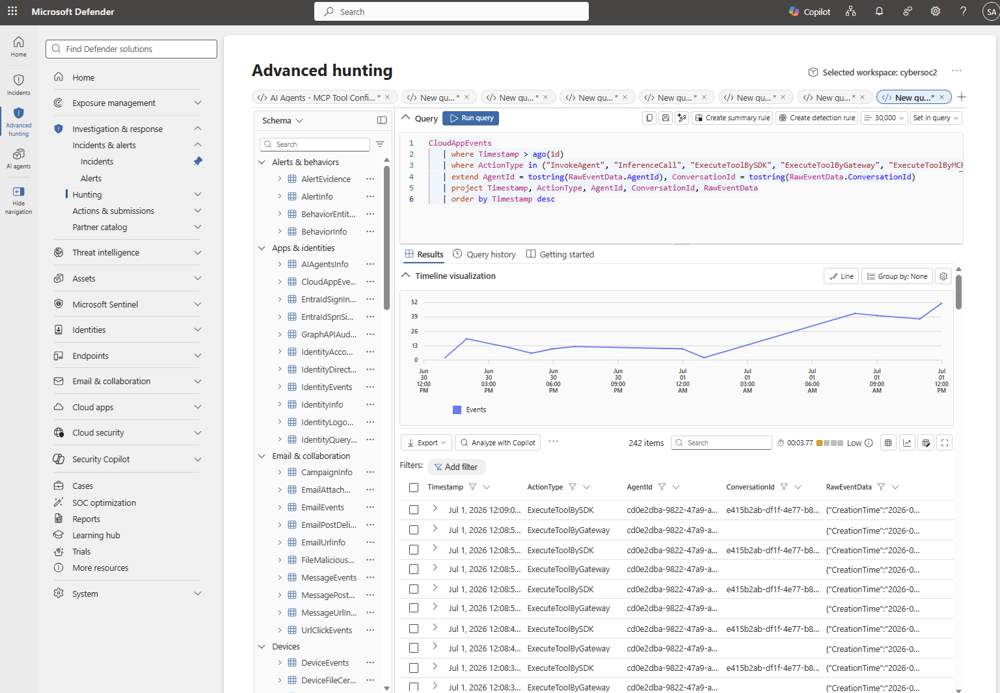
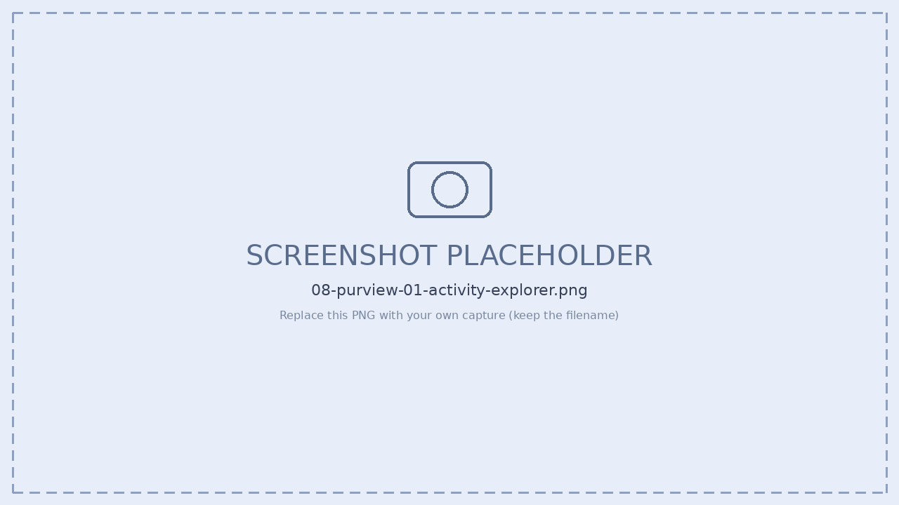
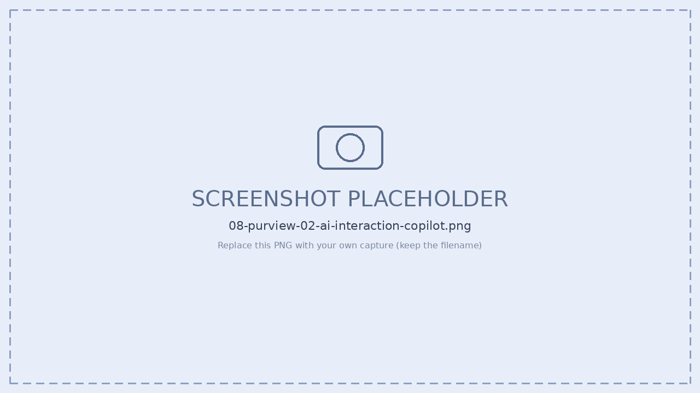
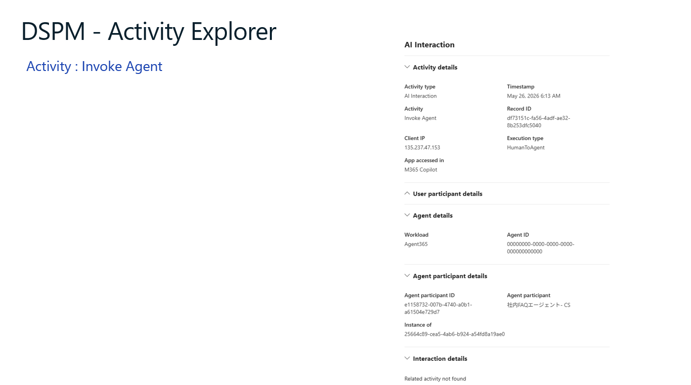
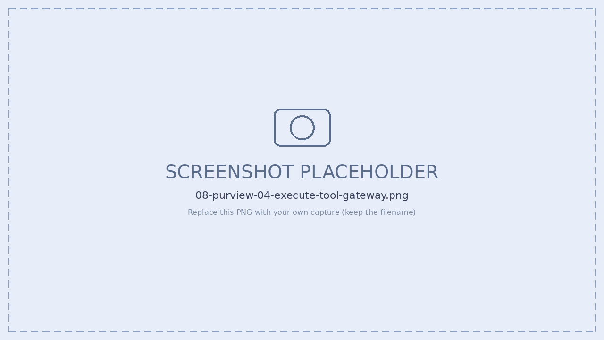
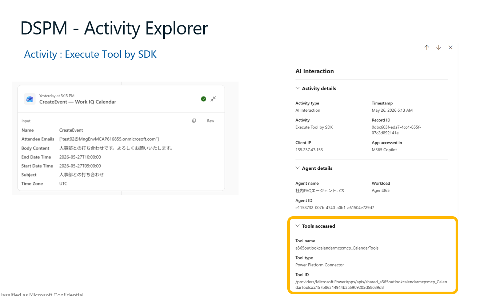
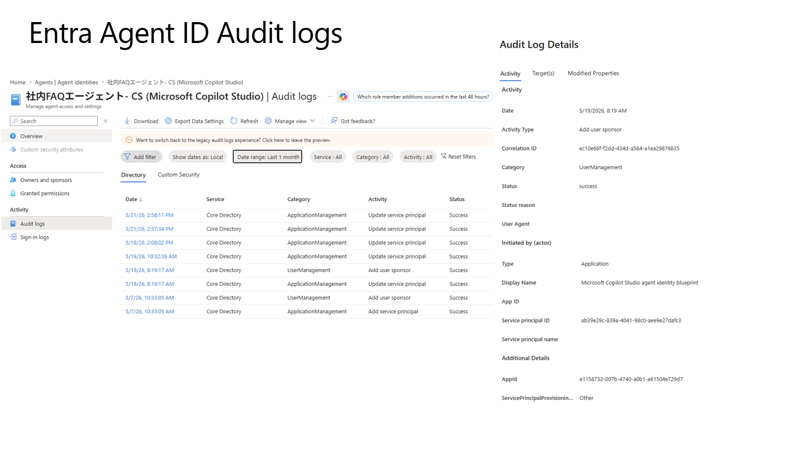
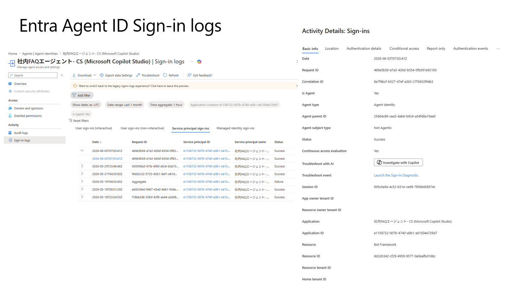

# Step 7 — 観測（ログ / 実行トレース / ツール呼び出し）

[← 目次](./README.md) ｜ [← Step 7：ガバナンス](./07-governance.md) ｜ [次：Step 9 セキュリティ →](./09-security.md)

## 目的

エージェントのテレメトリ送信を理解し、**ログ確認・実行トレース・ツール呼び出し**を実機で追います。あわせて、送信されたデータが **Microsoft 365 管理センター／Microsoft Purview／Microsoft Defender** の3方向にどう現れるかを、実際の画面（Purview DSPM Activity Explorer・Entra Agent ID のログ）で確認します。

> [!TIP]
> **画面操作だけで実技演習をしたい場合（CLI/SDK 設定なし）は [Step 8 実習ラボ](./08-observability-lab.md) を使ってください。** Copilot Studio エージェントを使い、1つの Run を4画面（管理センター/Entra/Purview/Defender）で追跡するワークシート形式の教材です。本編（このページ）は概念・データモデル・自前ホスト型の Exporter 設定を扱います。

### 送信モデル：プッシュ型

Agent 365 のサーバが取りに来るのではなく、**エージェントのプロセスが自分から外向きに HTTPS で送ります（プッシュ型）**。

**この仕組みは自前ホスト型（SDK統合）に限らず、Copilot Studio・Microsoft Foundry・Agent Builder のエージェントも含めて共通です。** 送信先（`agent365.svc.cloud.microsoft`）・データモデル（span）・反映先（M365管理センター／Defender／Purview）はすべて同じ1本の仕組みで、**違いは「誰が SDK 配線を行うか」だけ**です。

| | 自前ホスト型（本 Step の手順） | Copilot Studio / Foundry / Agent Builder |
| --- | --- | --- |
| SDK配線 | 開発者が `a365.enabled` 等を明示的に設定 | プラットフォーム側が組み込み済み。開発者の作業は不要 |
| 送信先・データモデル・反映先 | 共通（下図の通り） | 共通（下図の通り） |

> Copilot Studio の場合、「Identity: Agent ID の自動作成」「Registry: レジストリへの自動登録」と並んで「**Observability: テレメトリは自動的に Agent 365 observability backend に流れる**」ことが公式ドキュメントで明記されています（[Build agents with Copilot Studio and Agent 365 › Integration flow](https://learn.microsoft.com/microsoft-agent-365/builder/overview#integration-flow)）。

```
エージェント実行 ──▶ SDK が span 生成 ──▶ バッチ化 ──▶ POST agent365.svc.cloud.microsoft
 (invoke_agent)        (OpenTelemetry)                    (Bearer トークンを毎回添付)
                                                          ↓
                          ┌───────────────┬───────────────┬───────────────┐
                          │ M365 管理センター │ Microsoft     │ Microsoft     │
                          │ インベントリ/    │ Defender      │ Purview       │
                          │ Activity        │ CloudAppEvents │ 監査/DSPM     │
                          └───────────────┴───────────────┴───────────────┘
```

**Run = 1 往復**（ユーザー1メッセージ入力 → エージェント1応答）を **OTel span ツリー（`traceId`）** として送ります。

---

## IT管理者・セキュリティ管理者向け：Observability とガバナンスの関係（コード依存 vs コード非依存）

Observability を語るとき、しばしば見落とされるのが「**エージェントを統制する仕組みは、テレメトリ計装の有無に関わらず既に効いている**」という点です。管理者が押さえておくべき整理は次の通りです。

| レイヤー | 何に効くか | コードへの依存 |
| --- | --- | --- |
| **① Identity / ガバナンス**（Entra Agent ID・条件付きアクセス・Purview DLP・ライフサイクル管理） | エージェントを**主体（ID）**として認識し、ブロック・失効・DLP 適用ができる | **コード非依存**。Agent 365 に登録（Blueprint → Instance）されていれば、Copilot Studio でも自前ホストでも同様に効く |
| **② 深い Observability（本 Step の内容）** | `invoke_agent`／`chat`／`execute_tool` の **per-span 実行トレース** | Copilot Studio 等の Microsoft ランタイムは**自動**。自前ホスト（自社コード）は SDK 配線（Exporter・OpenTelemetry 計装）が**必須** |

> [!IMPORTANT]
> **「Observability のテレメトリが来ていない＝そのエージェントが未統制」ではありません。** 自前ホスト型エージェントで SDK 配線が未完了・不具合で span が送られていなくても、Entra Agent ID を発行済みであれば条件付きアクセスによるブロックや Purview の DLP は独立して機能します。逆に、**「Block したのに Defender の活動ビューにまだ現れる」ように見える場合は、ブロック前に送信済みだった過去の Run が保持期間内に残っているだけ**であり、ブロック自体の失敗ではない点に注意してください。
>
> セキュリティレビューでエージェントの棚卸しをする際は、①（Entra Agent ID の有無・状態）を主軸に確認し、②（Observability データの有無）はあくまで「その主体が実際に何をしたか」を裏付ける補助情報として扱うのが実務上のコツです。

```
▸ invoke_agent          ← InvokeAgentScope
   ▸ inference (LLM)     ← InferenceScope
   ▸ tool call           ← ExecuteToolScope
   ▸ reply
```

> ※ 図中のスコープ名は `InferenceScope` ですが、`gen_ai.operation.name` に入る**値は `chat`**（`inference` ではありません）。`reply` は `output_messages` に対応します。

---

## Run のデータモデル（span 種別と反映先の依存関係）

1 Run は4種類の `gen_ai.operation.name` を持つ span の木として送られます。

| `gen_ai.operation.name` | 意味 | 備考 |
| --- | --- | --- |
| `invoke_agent` | エージェント呼び出し（Run の root） | **これが無いと Defender の agent-activity 画面にも管理センターにも現れない**（`chat`/`execute_tool`/`output_messages` だけの Run は Defender Advanced Hunting からしか見えない） |
| `chat` | LLM 推論呼び出し | `inference` ではなく **`chat`** が正しい値（誤記しがちな落とし穴） |
| `execute_tool` | ツール／関数呼び出し | MCP・Power Platform コネクタ・コード実装のツール呼び出しなど |
| `output_messages` | 最終応答メッセージ | |

`gen_ai.operation.name` が未指定・不正な値の span は **黙って drop**（`partialSuccess.rejectedSpans` に計上）されます。

> [!IMPORTANT]
> **管理センターと Defender の agent-activity 画面は、Run の root にある `invoke_agent` span に依存**します。`invoke_agent` を出さないエージェントは、子 span（`chat`/`execute_tool`）を送っていても Defender Advanced Hunting の `CloudAppEvents` テーブルには残りますが、これら2つの画面には現れません。Purview 側は、`invoke_agent` 由来の **Invoke Agent／Execute Tool** レコードは同様にこの依存を受けますが、**Copilot Interaction は M365 Copilot 経路のイベント**のため `invoke_agent` が無くても現れ得ます。

### 識別子（Run を追跡するためのキー）

| 項目 | 属性 | 役割 |
| --- | --- | --- |
| Agent ID | `gen_ai.agent.id` | エージェントの Entra `appId`（本 Step の `🔎 OBS agentId=...` ログに対応） |
| Conversation | `gen_ai.conversation.id` | **Run の主キー**。Teams チャットスレッド等の論理スレッドに対応 |
| Channel | `microsoft.channel.name` | 実行面（`msteams` / `outlook` / `web` など）。管理センター／Defender のフィルタが参照する固定文字列 |
| Session | `microsoft.session.id` | 論理セッションID（省略可） |

> [!WARNING]
> **Agent ID には Blueprint と Instance の2種類があり、`gen_ai.agent.id` に入るのは常に Instance（Agent Identity）側の appId です。** Blueprint の appId を取り違えて設定すると、送信は成功（HTTP 200）していても Defender/Purview 側で **`403 Agent ID mismatch`** や、`AgentsInfo` に未登録の ID として **attribution されず 0 件**になることがあります。エージェントの棚卸しで「テレメトリを送っているはずなのに管理画面に出てこない」場合、まずこの取り違えを疑ってください（[Step 2：Agent Registry / Entra Agent ID](./02-entra-agent-id.md) で Blueprint と Instance の関係を確認できます）。

---

## ログ / 実行トレース / ツール呼び出し（自前ホスト型：Agent 365 SDK / Direct OTel）

### 手順

1. **ローカル検証（送信前）** — まず `ENABLE_A365_OBSERVABILITY_EXPORTER` を `false` にして起動し、span がコンソールに出力されることを確認（外部送信前の切り分け）。

   ```bash
   # .env もしくはシェル環境変数
   ENABLE_A365_OBSERVABILITY_EXPORTER=false
   ```

2. **送信有効化 ＋ 詳細ログ確認** — `true` に切り替え、ログレベルを上げて起動。

   ```bash
   ENABLE_A365_OBSERVABILITY_EXPORTER=true
   A365_OBSERVABILITY_LOG_LEVEL=info
   ```

   コンソールに次のようなログが出れば送信は成功しています（文言はSDKのバージョン・言語により多少異なります）。

   ```text
   DEBUG  Token resolved for agent {agentId} tenant {tenantId}
   DEBUG  Exporting {n} spans to {url}
   DEBUG  HTTP 200 - correlation ID: abc-123
   ```

   | ログ | 意味 |
   | --- | --- |
   | `Token resolved for agent ... tenant ...` | トークン取得成功 |
   | `Exporting {n} spans to {url}` | バッチ化した span をエクスポート試行 |
   | `HTTP 200 - correlation ID: abc-123` | エクスポート成功。`correlationId` で追跡可能 |
   | `Token resolution failed: {error}`（ERROR） | トークン解決失敗 → 送信スキップ |
   | `HTTP 401 exporting spans - correlation ID: ...`（ERROR） | 認証エラー（token audience 不一致・期限切れ等） |
   | `No spans with tenant/agent identity found; nothing exported.`（INFO） | tenant/agent ID を持つ span が無い（`gen_ai.agent.id` 等の設定漏れを疑う） |

   > [!TIP]
   > Python は `logging.getLogger("microsoft_agents_a365.observability.core")` に `DEBUG` を設定、.NET は `appsettings.json` の `Logging:LogLevel:Microsoft.Agents.A365.Observability` を `"Debug"` にすることで同様のログが得られます。ログの意味は言語によらず共通です。

3. **実行トレース** — Run 単位の span ツリー（`traceId`）で **セッション → 推論 → ツール → 応答**を追跡。

4. **ツール呼び出し確認** — [Microsoft Defender portal](https://security.microsoft.com/) › **Investigation & response › Hunting › Advanced hunting** で `CloudAppEvents` テーブルを次の KQL で照会する（ツール実行・推論・MCP サーバー実行を種別ごとに確認）。

   ```kusto
   CloudAppEvents
   | where Timestamp > ago(1d)
   | where ActionType in ("InvokeAgent", "InferenceCall", "ExecuteToolBySDK", "ExecuteToolByGateway", "ExecuteToolByMCPServer")
   | extend AgentId = tostring(RawEventData.AgentId), ConversationId = tostring(RawEventData.ConversationId)
   | project Timestamp, ActionType, AgentId, ConversationId, RawEventData
   | order by Timestamp desc
   ```

   直近で実行した Run の `ConversationId`（＝`gen_ai.conversation.id`）がヒットし、`ActionType` ごとに `invoke_agent`／`chat`／`execute_tool` の実行が確認できれば送信成功です（詳しいクエリは後述の「Defender Advanced Hunting」セクションを参照）。

   
   *▲ `CloudAppEvents` を上記KQLで照会した実行結果。タイムライン可視化と、`ActionType`（`ExecuteToolBySDK`／`ExecuteToolByGateway` 等）・`AgentId`・`ConversationId`・`RawEventData` を含む一覧。*

5. **管理センターで反映確認** — [Microsoft 365 admin center](https://admin.microsoft.com/) › **Agents › All agents**（Agent inventory タブ）を開き、対象エージェントを選択する。`invoke_agent` span を送信したエージェントは、この一覧と選択後の **Activity** に行が表示される（反映まで数分のタイムラグあり）。表示されない場合は `invoke_agent` span が送れていない可能性が高い。

---

## Purview DSPM の Activity Explorer で対話内容を確認する（全エージェント共通）

Copilot Studio や Microsoft Foundry で作ったエージェント（Agent 365 のテレメトリが**既定で自動送信**されるプラットフォーム）は、この手順を追わなくても、送信済みのデータを **Microsoft Purview › Activity explorer** から確認できます。自前ホスト型（SDK 統合）のエージェントも、`invoke_agent` を出していれば同じ画面に現れます。

### 手順

1. [Microsoft Purview portal](https://purview.microsoft.com/) にサインイン（**Microsoft Purview Compliance Administrator** 相当の権限が必要）。
2. 左ナビゲーション › **Agents** または対象エージェント › **Activity** から **Activity explorer** を開く（**DSPM** の **AI observability** からも同じデータにアクセス可能）。
3. タブを **AI activities** に切り替える。
4. フィルタ（Timestamp／Activity type／AI app category／App／App accessed in／Agents involved／User participant／Sensitive info type 等）で絞り込み。上部にはアクティビティ種別ごとの件数グラフ（**Sensitive info types** / **AI Interaction**）が表示される。
5. 一覧（Activity type・Timestamp（UTC）・App・Agent name・User participant 等）から行を選択すると、右側に **詳細パネル（AI Interaction）** が開く。


*▲ Activity explorer › AI activities。フィルタバーとグラフ、下段に活動一覧。*

### 詳細パネルで確認できる「Activity」の種別

1 回のユーザー発話（Run）は、Purview 側では複数の **AI Interaction レコード**に分解されて記録されます。詳細パネル上部の **Activity** フィールドに、次のような種別が表示されます（実機確認）。

| Activity（詳細パネル表示） | 対応する span / ActionType | 主なフィールド |
| --- | --- | --- |
| **Copilot Interaction** | M365 Copilot 側のプロンプト応答イベント（`AIInteraction` 系） | Client IP／User participant details／App details（AI app category・App＝Copilot Studio CustomEngine 等）／Agent details（Agent name・Workload）／**Interaction details（Prompt／Response）**／Sensitive info types detected |
| **Invoke Agent** | `invoke_agent` → `ActionType = InvokeAgent` | Execution type（例：`HumanToAgent`）／Agent details（Workload＝Agent365・Agent ID）／Agent participant details（Agent participant ID・Agent participant名・Instance of＝blueprint ID） |
| **Execute Tool by Gateway** | `execute_tool`（Power Platform Connector 経由）→ `ActionType = ExecuteToolByGateway` | Agent details／**Tools accessed**（Tool name・Tool type＝`CodefulServer` や `Power Platform Connector`・Tool ID・Tool description） |
| **Execute Tool by SDK** | `execute_tool`（SDK直接呼び出し）→ `ActionType = ExecuteToolBySDK` | 同上（例：Tool name＝`a365outlookcalendarmcp:mcp_CalendarTools`、Tool type＝`Power Platform Connector`） |

> [!TIP]
> **Prompt / Response は生テキストで見える。** 「発注情報はわかる？」のような実際のユーザー発話と、エージェントの応答（Markdown 込み）がそのまま **Copy** 可能な形で表示されます。ツール呼び出し側（Execute Tool）では、渡された **Input**（例：`CreateEvent` の Attendee Emails／Subject／Start・End Date Time）が Teams 側のアダプティブカードと Purview 側の記録の両方で確認できます。**Prompt/Response の閲覧には Microsoft Purview Content Explorer Content Viewer 相当のロールが必要**です。


*▲ Activity: Copilot Interaction。Prompt/Response と Sensitive info types detected。*


*▲ Activity: Invoke Agent。Execution type＝HumanToAgent、Agent participant details。*


*▲ Activity: Execute Tool by Gateway。Tools accessed（Tool name/type/ID/description）。*


*▲ Activity: Execute Tool by SDK。mcp_CalendarTools 等の MCP ツール呼び出し。*

### DSPM › AI observability（エージェント単位の俯瞰）

Activity explorer とは別に、**DSPM › AI observability** ページでは、直近30日間で活動があった全エージェントを **Insider Risk Management によるリスクレベル順**に一覧でき、エージェントを選ぶと以下が確認できます。

| 項目 | 内容 |
| --- | --- |
| Agent details | Entra 有効化状態・作成日・所有者・agent user ID・どの blueprint のインスタンスか |
| Agent activities | Insider Risk Management によるリスクレベル、リスクのある操作 |
| Recommendations | 検出されたリスクに対する Purview ソリューション（DLP・Communication Compliance 等）でのリマインド |

> [!NOTE]
> DSPM の「クラシック」版（**Data Security Posture Management (classic)**）は Agent 365 に対応していません。必ず新しい **DSPM**（**AI observability**）を使ってください。

---

## Entra Agent ID のログでエージェント自体の挙動を追う

Purview が「対話・ツール呼び出しの中身」を見る画面だとすると、**Microsoft Entra 管理センター**は「エージェントという ID がいつ・どこで認証され、いつ変更されたか」を追う画面です。

### 手順

1. [Microsoft Entra admin center](https://entra.microsoft.com/) にサインイン（最低 **Reports Reader**）。
2. **Agents › Agent identities** から対象エージェント（例：`社内FAQエージェント - CS (Microsoft Copilot Studio)`）を開く。
3. 左メニュー **Activity** 配下の **Audit logs** ／ **Sign-in logs** を確認。

### Audit logs（構成変更の監査証跡）

エージェントの Audit ログは、**エージェントが内部的にどの Entra オブジェクト種別として扱われているか**によって、既存の監査アクティビティ名で記録されます。

| エージェントの操作 | 監査アクティビティ | `agentType` |
| --- | --- | --- |
| Agent Identity Blueprint の作成 | Add application | `agenticApp` |
| Agent Identity（インスタンス）の作成 | Add service principal | `agenticAppInstance` |
| エージェントのユーザーアカウント作成（AI teammate） | Add user | `agentIDuser` |
| Agent Identity Blueprint の更新 | Update application | `agenticApp` |
| Agent Identity の更新 | Update service principal | `agenticAppInstance` |

実機のキャプチャでも、`Update service principal` / `Add user sponsor` / `Add service principal` といったカテゴリ **ApplicationManagement / UserManagement** のイベントが確認できました。詳細パネル（Audit Log Details）では **Correlation ID・Category・Status・Type・Display Name・App ID・Service principal ID** などが確認できます。


*▲ Agents | Agent identities › 対象エージェント › Audit logs。一覧と Audit Log Details パネル。*

### Sign-in logs（認証イベント）

エージェントのサインインは `agentSignIn` という新しいサインインイベント種別として記録され、**Service principal sign-ins** タブなど既存の4種類（Interactive／Non-interactive／Service principal／Managed identity）のいずれかに現れます。

| フィルタ | 選択肢 |
| --- | --- |
| **Agent type** | Agent ID user / Agent Identity / Agent Identity Blueprint / Not Agentic |
| **Is Agent** | Yes / No |

詳細パネル（Basic info）では、通常のサインインログ項目（Request ID・Correlation ID・Status・Conditional access・Session ID・Application・Resource 等）に加えて、エージェント固有の項目が追加されます。

| 追加項目 | 内容（実機例） |
| --- | --- |
| Is Agent | `Yes` |
| Agent type | `Agent Identity` |
| Agent parent ID | Agent Identity Blueprint の object ID |
| Agent subject type | `Not Agentic`（呼び出し先リソース側の種別） |


*▲ Sign-in logs › Service principal sign-ins。Is Agent: Yes フィルタと詳細パネル。*

Microsoft Graph（`/beta`）からも同様に取得できます。

```http
GET https://graph.microsoft.com/beta/auditLogs/signIns?$filter=signInEventTypes/any(t: t eq 'servicePrincipal') and agent/agentType eq 'AgentIdentity'
```

> [!TIP]
> 異常なサインインパターン（トークン取得の急増・想定外APIへのアクセス・見慣れないIPレンジ）の監視や、Blueprint への資格情報追加・権限付与・ロール割り当てといった **Audit log 側の構成変更監視**は、[Entra Agent ID のベストプラクティス](https://learn.microsoft.com/entra/agent-id/best-practices-agent-id#monitor-and-audit-agent-activity)で推奨されています。

---

## Microsoft Purview 統合監査ログ（Unified audit log）

Activity explorer に出る前段として、Agent 365 のアクティビティはまず **統合監査ログ**に記録されます。**Audit** ソリューション（`purview.microsoft.com` › Audit）から検索することも可能です。

| Friendly name | Operation | 内容 |
| --- | --- | --- |
| Executed AI tool | `AIExecuteTool` | エージェントがツール呼び出しを実行 |
| Invoked AI agent | `AIInvokeAgent` | ユーザー・エージェント・イベントによりエージェントが呼び出された |
| Made AI inference call | `AIInferenceCall` | エージェントが AI モデルを使って応答／次アクションを決定 |

> [!NOTE]
> Agent 365 のエージェントは「監査上はユーザーと同様に扱う」のが基本方針です。エージェントインスタンスを **DLP・Communication Compliance・Insider Risk Management・eDiscovery・Data Lifecycle Management** の対象にする場合も、人間のユーザーを指定するのと同じ操作で追加できます。

---

## Defender Advanced Hunting（`CloudAppEvents`）で横断的にハンティングする

`CloudAppEvents` テーブルは、`invoke_agent` の有無に関わらず **すべての span を受け付ける**唯一の面です。`ActionType` が操作種別を表し、span の各属性は `RawEventData`（JSON）に入ります。

| `ActionType` | 元になる span |
| --- | --- |
| `InvokeAgent` | `invoke_agent` |
| `InferenceCall` | `chat` |
| `ExecuteToolBySDK` | `execute_tool`（SDK直接呼び出し） |
| `ExecuteToolByGateway` | `execute_tool`（Power Platform コネクタ経由） |
| `ExecuteToolByMCPServer` | `execute_tool`（governed MCP サーバー経由） |

`RawEventData` 内のフィールド名は、送信した span 属性と1:1で対応します（抜粋）。

| `RawEventData` フィールド | 元の span 属性 |
| --- | --- |
| `ConversationId` | `gen_ai.conversation.id` |
| `SessionIdentity` | `microsoft.session.id` |
| `AgentId` | `gen_ai.agent.id` |
| `ChannelName` | `microsoft.channel.name` |
| `PlatformTargetAgentId` | `microsoft.a365.agent.platform.id`（Entra 未登録エージェント用の代替ID） |

サンプル KQL（直近1日の Agent 365 関連アクティビティを種別ごとに集計）：

```kusto
CloudAppEvents
| where Timestamp > ago(1d)
| where ActionType in ("InvokeAgent", "InferenceCall", "ExecuteToolBySDK", "ExecuteToolByGateway", "ExecuteToolByMCPServer")
| extend AgentId = tostring(RawEventData.AgentId), ConversationId = tostring(RawEventData.ConversationId)
| summarize Count = count() by ActionType, AgentId
| order by Count desc
```

特定の Run（会話）を追跡する場合：

```kusto
CloudAppEvents
| where ActionType in ("InvokeAgent", "InferenceCall", "ExecuteToolBySDK", "ExecuteToolByGateway", "ExecuteToolByMCPServer")
| where tostring(RawEventData.ConversationId) == "<conversation-id>"
| project Timestamp, ActionType, AccountDisplayName, RawEventData
| order by Timestamp asc
```

> [!IMPORTANT]
> **クエリが0件でも「送信失敗」とは限りません。** 着弾しているかどうかは、送信側の成功（HTTP 200）に加えて次の2点で切り分けます。
>
> 1. **テーブルが有効か**：`CloudAppEvents` は **Microsoft Defender for Cloud Apps** のレコードで populate されます。組織で Defender for Cloud Apps 未デプロイ、または **Settings › Cloud apps › App connectors › Microsoft 365 activities** が未接続だと、このテーブルを使うクエリは動作せず結果も返りません（テーブル未解決エラーになる場合があります）。
> 2. **絞り方が正しいか**：`CloudAppEvents` は `invoke_agent` の有無に関わらず span を受け付けます（前掲の通り）。ただし **Entra 未登録の ID は `AgentId` として attribution されず、`PlatformTargetAgentId` 側に入ります**（素の Entra アプリ登録の appId など）。このため `RawEventData.AgentId == ...` だけで絞ると、着弾していても 0 件に見えることがあります。棚卸しでは `PlatformTargetAgentId` も併せて確認してください。
>
> ＝ 0件は「テーブルが無効（条件1）」か「絞り方が合っていない（条件2）」を疑うのが切り分けの近道です。

> [!TIP]
> **セキュリティチームが「1画面」で見たい場合は Microsoft Sentinel への集約が有効です。** `CloudAppEvents`（Defender/Agent 365 側）と、開発者が別途 Azure Monitor / Application Insights に送っている運用テレメトリを Sentinel に集め、KQL で `join` すれば、統制面（誰が・何を）と運用面（速度・エラー・依存関係）を横断したセキュリティ調査ができます。Azure Monitor は Agent 365 の標準格納先ではなく「開発者が追加でファンアウトできる別宛先」である点に注意してください（両者は同じ `traceId` / `gen_ai.conversation.id` を共有するため、ストアが別でも同一 Run として突き合わせ可能です）。

> [!NOTE]
> `AgentsInfo`（エージェントの構成・所有者・ライフサイクル情報）や `AlertInfo` / `AlertEvidence`（脅威検知アラート）とジョインすると、**エージェント単位のリスク評価**や**インシデント調査**にも使えます。Defender は Agent 365 のテレメトリを使って *persistent jailbreak attempt* のような疑わしい挙動をニアリアルタイムで検知し、アラートを Defender Incidents に相関させます。

> [!IMPORTANT]
> **`AIAgentsInfo` は `AgentsInfo` に統合されました（2026年7月1日で `AIAgentsInfo` は利用不可）。** `AIAgentsInfo` は Copilot Studio 固有の列が中心でしたが、新しい `AgentsInfo` は Copilot Studio・Microsoft Foundry・Microsoft 365 Copilot・サードパーティ・エンドポイント検出エージェントを横断する統一スキーマです。`AIAgentsInfo` を参照しているクエリ・カスタム検出ルールは `AgentsInfo` へ移行してください（列名も変更されています）。

### `AgentsInfo` の実用KQLサンプル

`AgentsInfo` は同じエージェントについて複数のスナップショットを時系列で持つため、`arg_max(Timestamp, *)` で**最新状態**に絞ってから使うのが基本です。

**エージェント一覧（削除済みを除く最新状態）**

```kusto
AgentsInfo
| summarize arg_max(Timestamp, *) by AgentId
| where LifecycleStatus != "Deleted"
```

**稼働中かつ公開済みのエージェントのみ抽出**（`PublishedStatus` と `LifecycleStatus` は別概念なので両方で絞る）

```kusto
AgentsInfo
| summarize arg_max(Timestamp, *) by AgentId
| where PublishedStatus == "Published"
| where LifecycleStatus == "Active"
| project AgentName, Platform, Owners, SharedWith, LastUpdatedDateTime
```

**Block（一時停止）されたエージェントの検出**（[Step 7](./07-governance.md) の Kill Switch と突き合わせる）

```kusto
AgentsInfo
| summarize arg_max(Timestamp, *) by AgentId
| where LifecycleStatus == "Blocked"
| project AgentName, Platform, Owners, LastUpdatedDateTime
| order by LastUpdatedDateTime desc
```

**外部公開エンドポイントを持つエージェントのレビュー**（`Endpoints` は dynamic 型。棚卸しの起点に）

```kusto
AgentsInfo
| summarize arg_max(Timestamp, *) by AgentId
| where isnotempty(Endpoints)
| project AgentName, Platform, Owners, Endpoints, LifecycleStatus
```

**ツールを持つエージェントの洗い出し**（広く共有・機密権限を持つものを優先レビュー）

```kusto
AgentsInfo
| summarize arg_max(Timestamp, *) by AgentId
| where isnotempty(DeclaredTools)
| project AgentName, Platform, Owners, DeclaredTools, Permissions
```

> [!TIP]
> `Owners` / `Permissions` / `Endpoints` / `DeclaredTools` は **dynamic（JSON）列**です。ダッシュボードに出す場合は `tostring()` や `mv-expand` で必要なプロパティだけを取り出してください（巨大な JSON をそのまま投影すると読みにくくなります）。

---

## Agent 365 Observability SDK と Purview SDK/API の違い

似た名前の統合ポイントが2つあるため、混同しないよう整理します。

| | Agent 365 Observability SDK（本 Step の内容） | Microsoft Purview SDK / API |
| --- | --- | --- |
| 目的 | **テレメトリの送信**。実行後にログ・監査証跡として記録する | **実行時のポリシー適用**。DLPブロックや機密ラベルの尊重をインラインで強制する |
| タイミング | Run 実行後、非同期でバッチエクスポート | プロンプト送信前／応答返却前にAPIを呼び出し、可否を判定 |
| 主なAPI/SDK | `useMicrosoftOpenTelemetry` ＋ Agent365 Exporter（OTel span） | Microsoft Graph の **Compute protection scopes** / **Process content** API、または Microsoft Agent Framework の **Purview policy middleware** |
| 反映先 | M365 管理センター・Defender・Purview（Activity Explorer／統合監査ログ） | 呼び出し元アプリ自身（ブロック・警告の判定結果を受け取り、アプリ側で強制） |
| 必須要件 | Agent 365 ライセンス割り当て・テナント同意 | Entra 登録アプリへの権限付与。DLPポリシー側は `New-DlpComplianceRule`（PowerShell）でアプリを明示指定 |

> [!NOTE]
> **両者は併用が前提。** Observability SDK は「何が起きたかを後から確認・監査する」もの、Purview SDK/API は「起きる前に止める」ものです。DLPでのブロックや機密ラベルの尊重をアプリ側で実現したい場合は、[Microsoft Purview API をアプリに統合するチュートリアル](https://learn.microsoft.com/purview/developer/use-the-api)、Microsoft Agent Framework を使っている場合は [Use Microsoft Purview SDK with Agent Framework](https://learn.microsoft.com/agent-framework/tutorials/plugins/use-purview-with-agent-framework-sdk) を参照してください。

> [!TIP]
> **Defender・Purview のセキュリティ／ガバナンス機能（脅威検知・DLP・IRM など）は [Step 9：セキュリティ](./09-security.md) にまとめています。** 本 Step はあくまで「テレメトリがどう送られ、どこで確認できるか」に焦点を当てています。

---

## データの保持・上限（把握しておくべき制約）

| 項目 | 内容 | 出典 |
| --- | --- | --- |
| **保持期間（Observability / セッションデータ）** | トレース・入出力・ユーザー識別子などの Observability データは **最大30日間保持後、自動削除**（Defender ポータルで閲覧可能な範囲） | [データ取り扱い・レジデンシー・コンプライアンス › Data retention](https://learn.microsoft.com/microsoft-agent-365/admin/data-residency-protection-compliance#data-retention) |
| **保持期間（エージェント インベントリ / Defender XDR 共有データ）** | エージェントの構成・所有者・ライフサイクル情報など、Defender XDR と共有される棚卸し系データは**最大180日間保持** | [Defender as part of Agent 365（データ保管・保持）](https://learn.microsoft.com/defender-xdr/security-for-ai/privacy-defender-agent-365) |
| **データレジデンシー** | テナントのプロビジョニング地が **EU または UK の場合は EU に格納**、**それ以外はすべて US に格納**。作成後の格納地は**変更不可**。契約終了・失効から**30日以内に削除** | [データ取り扱い・レジデンシー・コンプライアンス › Data residency](https://learn.microsoft.com/microsoft-agent-365/admin/data-residency-protection-compliance#data-residency) |
| **ライセンス条件** | テナント内の**誰か1人**に M365 E7 または Agent 365 ライセンスの**割り当て**が必須（無いと `200` を返しつつ全 drop） | [Agent 365 observability concepts › Limits and drop conditions](https://learn.microsoft.com/microsoft-agent-365/developer/observability-concepts#limits-and-drop-conditions) |
| **同意（consent）** | テナント管理者による同意が**テナントにつき1回**必要。未同意は `AADSTS65001` またはトークンに `roles`/`scp` が無いまま `403` | [Agent 365 observability concepts › Tenant consent](https://learn.microsoft.com/microsoft-agent-365/developer/observability-concepts#tenant-consent) |

> [!NOTE]
> **保持期間は「何のデータか」で2種類ある点に注意してください。** 対話内容・実行トレースといった Observability の生データは30日で消えますが、**「どのエージェントが存在し、誰が所有し、どんなライフサイクル状態か」という棚卸し情報（Defender XDR 共有データ）は180日**残ります。監査・コンプライアンス対応で古い Run の中身を追いたい場合は30日以内に、エージェントの存在・所有者の変遷を追いたい場合は180日以内に確認してください。

---

## 参考

- [Agent 365 observability concepts（データモデル・送信先・上限）](https://learn.microsoft.com/microsoft-agent-365/developer/observability-concepts)
- [Observability SDK](https://learn.microsoft.com/microsoft-agent-365/developer/observability)
- [Microsoft OpenTelemetry Distro（新しい推奨統合経路）](https://learn.microsoft.com/microsoft-agent-365/developer/microsoft-opentelemetry)
- [Direct OpenTelemetry integration](https://learn.microsoft.com/microsoft-agent-365/developer/direct-open-telemetry-integration)
- [Observability attribute reference](https://learn.microsoft.com/microsoft-agent-365/developer/observability-attribute-reference)
- [データ取り扱い・レジデンシー・コンプライアンス](https://learn.microsoft.com/microsoft-agent-365/admin/data-residency-protection-compliance)
- [Defender as part of Agent 365（データ保管・保持・180日ルール）](https://learn.microsoft.com/defender-xdr/security-for-ai/privacy-defender-agent-365)
- [Microsoft Purview で Agent 365 のデータセキュリティ・コンプライアンスを管理する](https://learn.microsoft.com/purview/ai-agent-365)
- [Purview Audit log activities（Agent 365 activities）](https://learn.microsoft.com/purview/audit-log-activities#agent-365-activities)
- [Microsoft Entra Agent ID logs（Audit logs / Sign-in logs）](https://learn.microsoft.com/entra/agent-id/sign-in-audit-logs-agents)
- [Entra Agent ID のベストプラクティス（監視・監査）](https://learn.microsoft.com/entra/agent-id/best-practices-agent-id#monitor-and-audit-agent-activity)
- [Defender Advanced Hunting（CloudAppEvents）](https://learn.microsoft.com/defender-xdr/advanced-hunting-cloudappevents-table)
- [Defender Advanced Hunting（AgentsInfo：エージェント構成・ライフサイクル）](https://learn.microsoft.com/defender-xdr/advanced-hunting-agentsinfo-table)
- [Defender で AI エージェントの脅威を検知・調査する（Preview）](https://learn.microsoft.com/defender-xdr/security-for-ai/ai-agent-detection-protection)
- [Microsoft Purview API をアプリに統合する（DLP/ラベルのインライン適用）](https://learn.microsoft.com/purview/developer/use-the-api)
- [Use Microsoft Purview SDK with Agent Framework](https://learn.microsoft.com/agent-framework/tutorials/plugins/use-purview-with-agent-framework-sdk)

[← Step 7：ガバナンス](./07-governance.md) ｜ [次：Step 9 セキュリティ →](./09-security.md)
