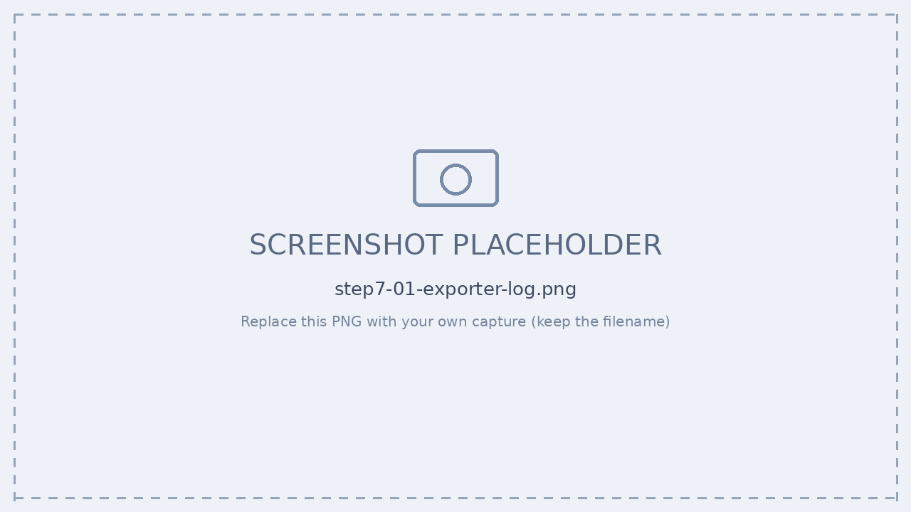
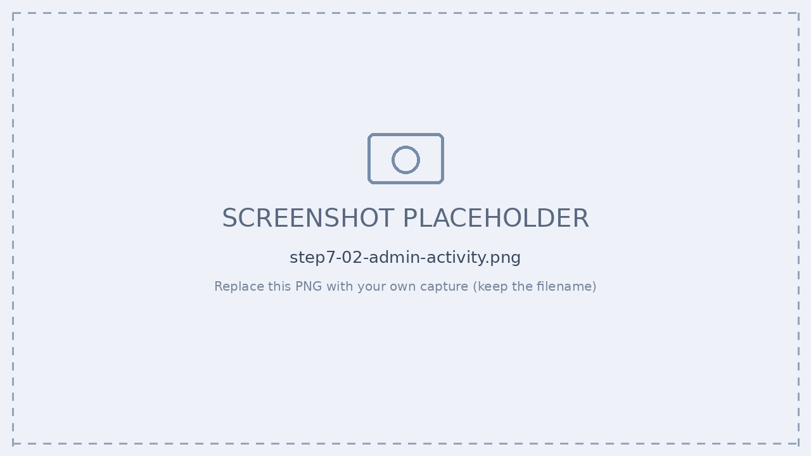
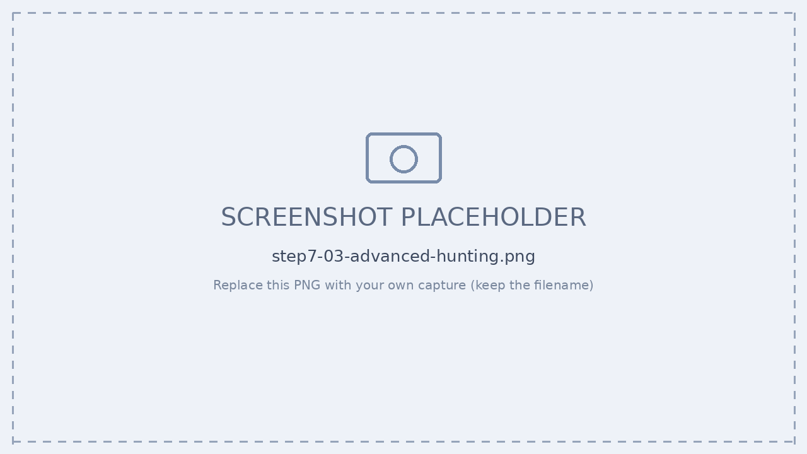

# Step 8 — 観測（ログ / 実行トレース / ツール呼び出し）

[← 目次](./README.md) ｜ [← Step 7：ガバナンス](./07-governance.md) ｜ [付録：トラブルシュート →](./99-troubleshooting.md)

## 目的

エージェントのテレメトリ送信を理解し、**ログ確認・実行トレース・ツール呼び出し**を実機で追います。

### 送信モデル：プッシュ型

Agent 365 のサーバが取りに来るのではなく、**エージェントのプロセスが自分から外向きに HTTPS で送ります（プッシュ型）**。

```
エージェント実行 ──▶ SDK が span 生成 ──▶ バッチ化 ──▶ POST agent365.svc.cloud.microsoft
 (invoke_agent)        (OpenTelemetry)                    (Bearer トークンを毎回添付)
                                                          ↓
                          ┌───────────────┬───────────────┬───────────────┐
                          │ M365 管理センター │ Microsoft     │ Microsoft     │
                          │ インベントリ/    │ Defender      │ Purview       │
                          │ Activity        │ CloudAppEvents │ 監査/DSPM     │
                          └───────────────┴───────────────┴───────────────┘
```

**Run = 1 往復**（ユーザー1メッセージ入力 → エージェント1応答）を **OTel span ツリー（`traceId`）** として送ります。

```
▸ invoke_agent          ← InvokeAgentScope
   ▸ inference (LLM)     ← InferenceScope
   ▸ tool call           ← ExecuteToolScope
   ▸ reply
```

> [!IMPORTANT]
> **Observability は 2 段で明示有効化が必須**：
> 1. コード：`a365.enabled: true` ＋ `tokenResolver` の指定（`index.ts` で他 import より前に `useMicrosoftOpenTelemetry`）
> 2. `.env`：`ENABLE_A365_OBSERVABILITY_EXPORTER=true`
>
> どちらかが欠けると、**エラーも出さず静かに console exporter にフォールバック**し、外部送信されません。

---

## 演習：ログ / 実行トレース / ツール呼び出し

### 手順

1. **ログ確認（送信成否）** — 環境変数を有効化して起動し、成功ログを確認。

   ```powershell
   $env:A365_OBSERVABILITY_LOG_LEVEL="info"
   $env:OTEL_LOG_LEVEL="INFO"
   npm run dev
   ```

   | ログ | 意味 |
   | --- | --- |
   | `🔎 OBS agentId='12f560ef-...'` | agentId が本物の値（空でない） |
   | `[AgenticTokenCache] Token cached` / ✅ | トークン取得成功（403/AADSTS が出ていない） |
   | `export-group succeeded` | エクスポート成功（correlationId 付き） |
   | `agent365-export succeeded` | 全スパン送信完了 |

2. **実行トレース** — Run 単位の span ツリー（`traceId`）で **セッション → 推論 → ツール → 応答**を追跡。
3. **ツール呼び出し確認** — Defender › **Advanced Hunting › `CloudAppEvents`** を KQL で照会（ツール実行・推論・MCP サーバー実行）。
4. **管理センターで反映確認** — `invoke_agent` 行がインベントリ／Activity に表示（数分の遅延）。

```text
[Agent365Exporter] Exporting 26 spans
  23 non-genAI spans filtered out
  2 spans skipped (missing tenant or agent ID)
  Sending chunk 1 of 1 (1 spans)
  export-group succeeded
  agent365-export succeeded
```


*▲ Exporter のフィルタリング（26 spans → 1 送信）*


*▲ 管理センターは `invoke_agent` 行を取り込む*


*▲ `CloudAppEvents` を KQL で照会（ツール呼び出し・推論・MCP）*

> [!TIP]
> **「データが少ない」は正常動作。** 1 ターンで 26 スパン生成されても、実際に送られるのは少数です。**non-genAI スパン**（HTTP・ストレージ等）は除外され、**identity が無いスパン**（tenant/agent ID 未紐づけ）は skip され、gen-AI 関連（`invoke_agent` 等）だけが送られます。`invoke_agent` スパンを出さないエージェントはインベントリに現れません。

---

## 確認チェックリスト

- [ ] `a365.enabled=true` ＋ `.env ENABLE_A365_OBSERVABILITY_EXPORTER=true` の両方が有効
- [ ] 起動ログに `🔎 OBS agentId='<実値>'` が出る
- [ ] `export-group succeeded` / `agent365-export succeeded` が出る
- [ ] 管理センターの Activity に `invoke_agent` が表示される
- [ ] Defender Advanced Hunting `CloudAppEvents` でツール呼び出しを確認できる

---

## 参考

- [Observability の概念（データモデル・送信先）](https://learn.microsoft.com/microsoft-agent-365/developer/observability-concepts)
- [Observability SDK](https://learn.microsoft.com/microsoft-agent-365/developer/observability)
- [Defender Advanced Hunting（CloudAppEvents）](https://learn.microsoft.com/defender-xdr/advanced-hunting-cloudappevents-table)

[← Step 7：ガバナンス](./07-governance.md) ｜ [付録：トラブルシュート →](./99-troubleshooting.md)
