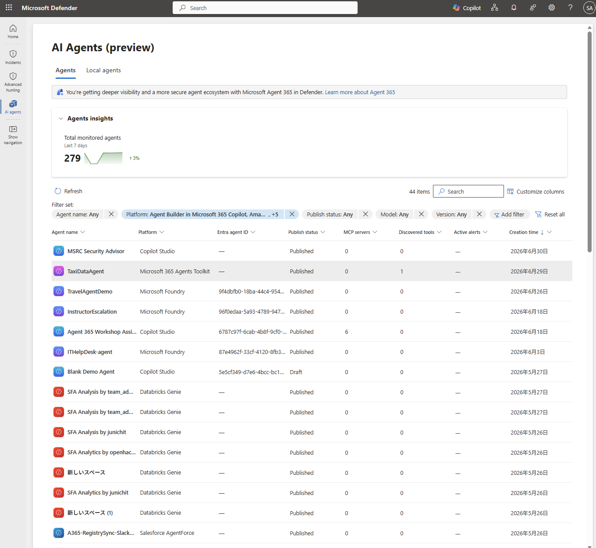
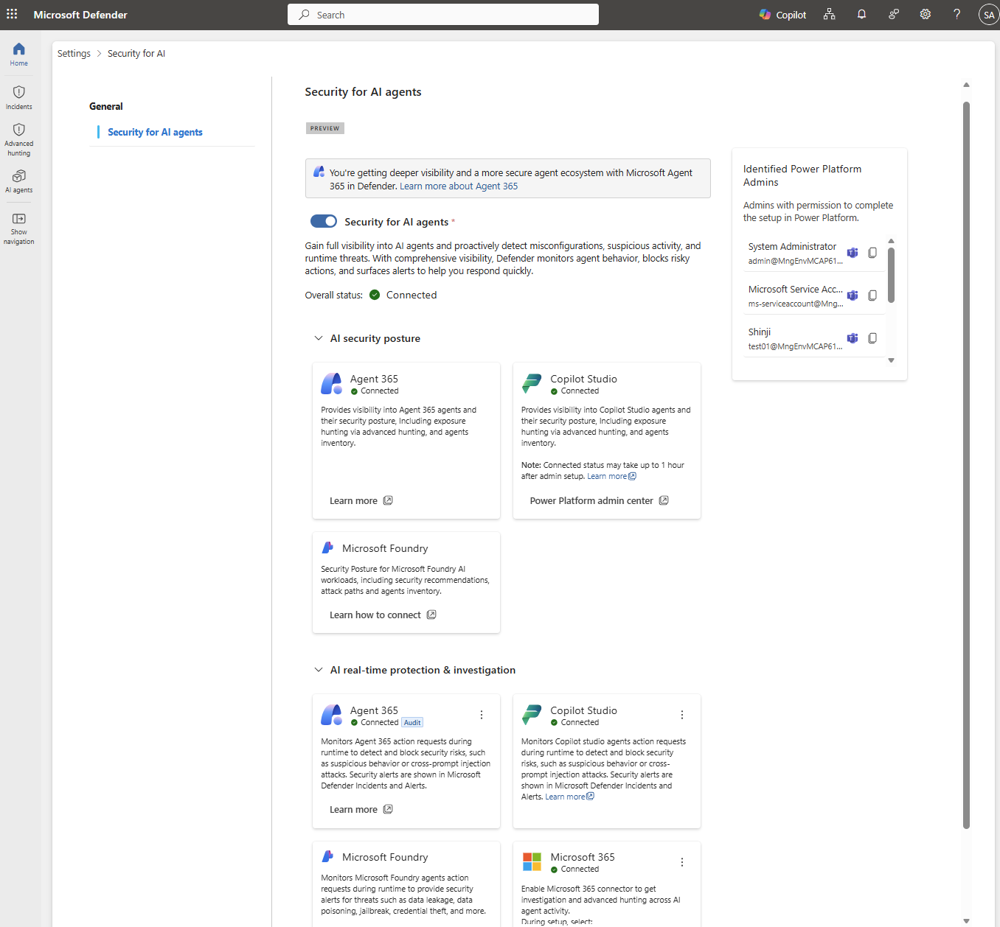
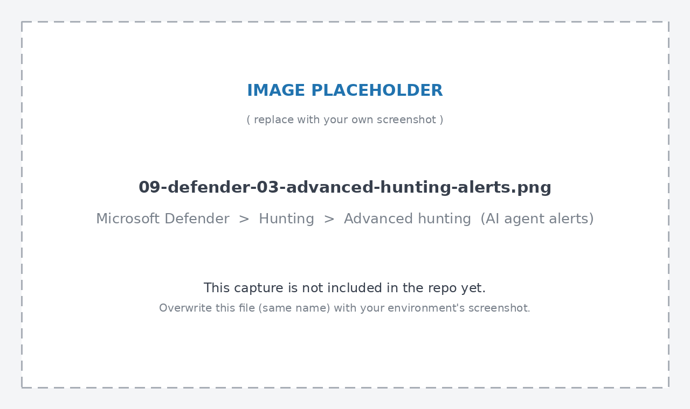
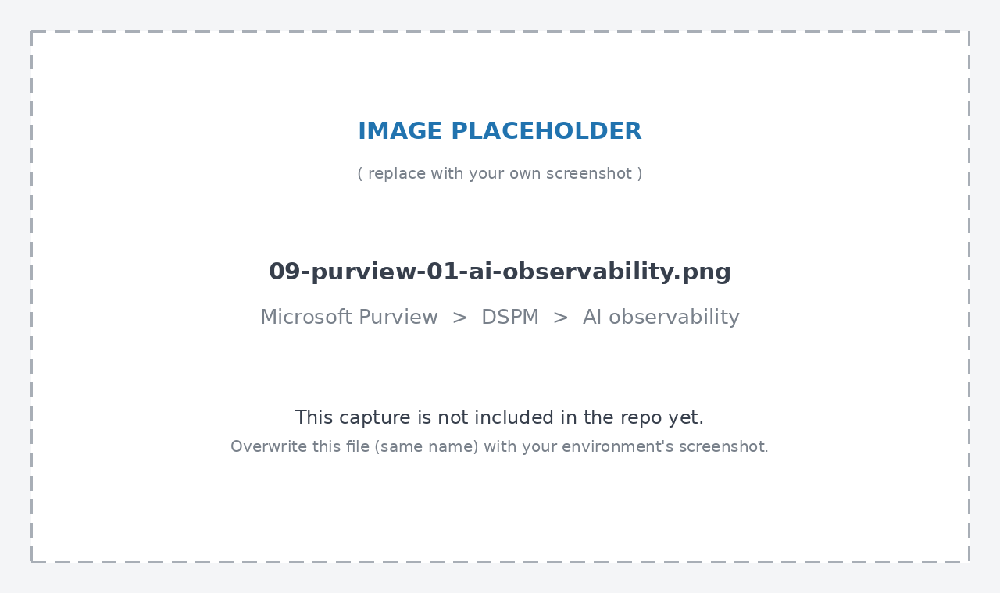

# Step 9 — セキュリティ（Defender for AI Agents / Purview DLP・IRM）

[← 目次](./README.md) ｜ [← Step 8：観測](./08-observability.md) ｜ [付録：トラブルシュート →](./99-troubleshooting.md)

## 目的

[Step 8](./08-observability.md) で送信した Agent 365 の観測データ（span／テレメトリ）が、**Microsoft Defender**（脅威検知・ランタイム保護）と **Microsoft Purview**（DLP・Insider Risk Management・監査などのデータガバナンス）にどう使われるかを確認します。観測が「何が起きたかを記録する」層だとすると、この Step は「危険な操作を止める・データ漏えいを防ぐ・コンプライアンスを証明する」層です。

## 全体像：Defender と Purview の役割分担

| | Microsoft Defender | Microsoft Purview |
| --- | --- | --- |
| 主な役割 | **脅威**の検知・ブロック・調査（セキュリティ） | **データ**の保護・統制・証跡（コンプライアンス） |
| 代表機能 | AI Assets（エージェント資産の棚卸し）、リアルタイム保護（RTP）、ほぼリアルタイム脅威検知、Advanced Hunting | DSPM/DSPM for AI、DLP、Insider Risk Management、監査、コミュニティケーションコンプライアンス、eDiscovery、データライフサイクル管理 |
| データソース | Agent 365 観測データ（テレメトリ）＋ エージェント構成情報 | Agent 365 観測データ（プロンプト／応答）＋ 統合監査ログ |
| 主なポータル | [Microsoft Defender portal](https://security.microsoft.com/) | [Microsoft Purview portal](https://purview.microsoft.com/) |

> [!NOTE]
> 両者は排他ではなく併用が前提です。たとえば「Insider Risk Management（Purview）がリスキーな AI 利用を検出 → その分析情報が Defender XDR に統合され、インシデントとして相関 → Advanced Hunting（Defender）で深掘り調査」という一連の流れが公式に想定されています。

---

## 1. Microsoft Defender で AI エージェントを守る

### 1.1 前提条件・有効化

| 項目 | 内容 |
| --- | --- |
| ライセンス | [Microsoft Agent 365](https://learn.microsoft.com/microsoft-agent-365/overview) へのオンボード |
| プレビュー機能 | Defender ポータルで**プレビュー機能**を有効化（`AgentsInfo` テーブルへのアクセス、アラートでの AI エージェント関連証跡の取得に必要） |
| 設定トグル | Defender ポータル › **System › Settings › Security for AI agent** で機能を有効化。トグルがオフだと AI 向けセキュリティ機能はすべて無効になる |

> [!IMPORTANT]
> **2026年7月1日以降、Copilot Studio / Foundry エージェントの AI セキュリティ機能には Agent 365 ライセンスが必須**です。従来 Defender for Cloud Apps／Defender for Cloud 経由で無償提供されていた検出・姿勢管理・脅威検出は、この日付でその形では提供されなくなります（[Transition agent security capabilities to Microsoft Agent 365](https://learn.microsoft.com/ja-jp/defender-xdr/security-for-ai/transition-agent-security-to-agent-365)）。

### 1.2 検出：AI Assets（エージェント資産の棚卸し）

Defender ポータル › **Assets › AI Agents** で、Agent 365 管理下の全エージェント（Copilot Studio・Foundry・サポート対象の非Microsoftクラウドプラットフォーム・エンドポイント上のローカル AI エージェント）を一覧できます。

| 操作 | 内容 |
| --- | --- |
| タブ切替 | **Agents**（クラウドエージェント）／ **Local agents**（エンドポイント検出エージェント） |
| フィルタ | Agent name／Platform／Publish status／Model／Version／Creation time |
| 詳細ペイン | エージェントを選択 → description・version・publish status・model・tools・channels・MCP servers を表示。**Go hunt** で Advanced Hunting に直接遷移可能 |


*▲ Assets › AI Agents。Agent name/Platform/Publish status/MCP servers 数/検出ツール/アクティブアラート/作成日時などが一覧表示される。*

### 1.3 リアルタイム保護（RTP）：危険な操作を実行前にブロック

Defender は **Work IQ MCP と直接統合**し、サポート対象エージェントが呼び出そうとするツールを**実行前に評価**します。危険と判断した場合は、エージェントがアクションを実行する前にブロックします。

| 対象 | 拡張方法 |
| --- | --- |
| サポート対象のローカル AI エージェント | [Defender for Endpoint のランタイム保護](https://learn.microsoft.com/defender-endpoint/ai-agent-runtime-protection-overview)によりエンドポイントまで拡張。ユーザープロンプト・ツール呼び出し前・ツール応答後を検査 |
| Copilot Studio エージェント | Work IQ に依存せず、**モデルのプロンプト・応答を評価**することでも RTP を提供 |

リアルタイム保護が対象とする代表的な脅威：

- システム命令・内部ツール詳細の抽出／流出の試み
- 機密データの直接的な漏えい試行
- 内部専用ツールの誤用
- 信頼できない宛先・悪意ある宛先への情報ルーティング
- 難読化・非表示コンテンツを使ったエージェント操作
- メールや外部APIなど正規チャネル経由の資格情報漏えい
- プロンプトインジェクション攻撃（特にランタイム保護つきのローカルエージェント）

**有効化手順**

1. [Microsoft Defender portal](https://security.microsoft.com/) を開く
2. **System › Settings › Security for AI agent** を選択
3. **AI エージェントのセキュリティ**がオンになっていることを確認
4. **AI リアルタイム保護 & 調査**で **Agent 365** が接続済みであることを確認
5. Copilot Studio エージェントの拡張 RTP を使うなら、同項目で **Copilot Studio** も接続済みであることを確認
6. エンドポイントのローカルエージェントには [Defender for Endpoint 側の設定](https://learn.microsoft.com/defender-endpoint/configure-ai-agent-runtime-protection)が別途必要


*▲ System › Settings › Security for AI agent。Agent 365／Copilot Studio の接続状態を示すトグル。*

### 1.4 ほぼリアルタイムの脅威検知

Defender は Agent 365 の観測データ（テレメトリ）・ツール使用状況・実行パターンを分析し、*persistent jailbreak attempt*（継続的な脱獄試行）や*疑わしいエージェント実行*などの脅威を検出します。検出結果は Defender ポータルに**ほぼリアルタイムのアラート**として表示され、アラートトリアージ・インシデント相関・Advanced Hunting という通常のセキュリティ運用ワークフローに乗ります。

**有効化手順**

1. **Microsoft 365 アプリ コネクタ**を有効化し、Agent 365 観測データを Defender for Cloud Apps に取り込む
2. AI エージェントが観測データを送信していることを確認（Copilot Studio は既定で送信。他プラットフォームは [Step 8](./08-observability.md) の SDK 統合が必要）

> [!TIP]
> Copilot Studio・Foundry で作ったエージェントは、関連機能を有効にすると**ベースラインを超える拡張検出セット**（モデルのプロンプト・応答評価に基づく検出を含む）が利用できます。

### 1.5 Advanced Hunting での調査

セキュリティ観点で有用な Advanced Hunting テーブル：

| テーブル | 内容 | 主なユースケース |
| --- | --- | --- |
| [`AlertInfo`](https://learn.microsoft.com/defender-xdr/advanced-hunting-alertinfo-table) | Defender が生成したアラートのメタデータ（ニアリアルタイム検出・RTPブロックイベント含む） | アラートの調査、関連インシデント／エンティティへのピボット |
| [`CloudAppEvents`](https://learn.microsoft.com/defender-xdr/advanced-hunting-cloudappevents-table) | エージェントアクション・ツール呼び出し・データアクセスイベント（Agent 365 観測データ） | 疑わしいエージェント挙動のハンティング、根本原因分析（[Step 8](./08-observability.md) 参照） |
| [`AgentsInfo`](https://learn.microsoft.com/defender-xdr/advanced-hunting-agentsinfo-table)（旧 `AIAgentsInfo`） | エージェントの構成・所有者・ライフサイクル情報 | 危険な設定・過剰権限エージェントの特定、アラートとの相関（[Step 8](./08-observability.md) 参照） |
| [`AlertEvidence`](https://learn.microsoft.com/defender-xdr/advanced-hunting-alertevidence-table) | アラートに関連するエンティティ（エージェント・ユーザー・ツール・URL・リソース） | アラートの影響範囲の把握 |

**アラートと構成情報を相関させるサンプル KQL**（過去7日のAIエージェント関連アラートに、エージェントの所有者・ライフサイクル状態を付与）

```kusto
AlertInfo
| where Timestamp > ago(7d)
| where Title has_any ("agent", "jailbreak", "prompt injection")
| join kind=leftouter (
    AgentsInfo
    | summarize arg_max(Timestamp, *) by AgentId
) on $left.Title == $right.AgentId // 実際は AlertEvidence 経由で AgentId を紐付ける
| project Timestamp, Title, Severity, AgentName, Owners, LifecycleStatus
```

> [!NOTE]
> 実運用では `AlertInfo` と `AgentsInfo` を直接 `AgentId` で join できない場合があります（アラート側のエンティティ情報は `AlertEvidence` に格納されるため）。まずは **Queries タブ › AI Agents** にある Microsoft 提供の事前構築済みクエリを使うのが確実です。


*▲ Hunting › Advanced hunting。`AlertInfo`／`CloudAppEvents`／`AgentsInfo` を横断したクエリ結果。*

### 1.6 2026年7月1日の移行チェックリスト（Copilot Studio / Foundry）

Copilot Studio・Foundry エージェントの検出・脅威検出・リアルタイム保護は、これまで Defender for Cloud Apps／Defender for Cloud 経由で提供されていましたが、Agent 365 に一本化されます。

| # | やること |
| --- | --- |
| 1 | テナントが Agent 365 対象ライセンスを持っているか確認（無ければ 2026/7/1 にエージェントセキュリティ機能を喪失） |
| 2 | ライセンス未取得なら Agent 365 トライアル（管理者主導・30日・25シート）を開始 |
| 3 | Defender の **Security for AI agent** トグルが有効か確認 |
| 4 | `AIAgentsInfo` を参照するクエリ・カスタム検出・ブックを `AgentsInfo` に更新（[Step 8](./08-observability.md) のKQLサンプル参照） |
| 5 | 既存の Agent 365 リアルタイム保護「Block」ルールを、新ポリシー体験（Settings › Security for AI › Policies）で再定義 |
| 6 | サードパーティクラウドエージェントは Agent 365 Registry Sync（旧 Defender for Cloud 経由）に接続し直す |
| 7 | レガシーアラートに依存するワークフローを、`BehaviorInfo` テーブル（RTPアラート）・Agent 365監視ログ（脅威検出アラート）に移行 |
| 8 | セキュリティ運用・IT・コンプライアンス部門に変更内容を周知 |

---

## 2. Microsoft Purview で AI エージェントを統制する

### 2.1 サポートされる機能

Agent 365 のエージェントインスタンスを作成すると、次の機能が**自動的に**有効になります。

- **監査**（Audit）
- **データ分類**による機密データ検出
- コンプライアンスマネージャーの **AI規制向け評価**（Assessments for AI regulations）への組み込み

それ以外の機能（DLP・機密ラベル・IRM・コミュニケーションコンプライアンス・eDiscovery・データライフサイクル管理）は、**エージェントインスタンスを人間のユーザーと同様にポリシー対象として明示的に指定**することでサポートされます。

| Purview の機能／ソリューション | Agent 365 での対応 |
| --- | --- |
| DSPM／DSPM for AI（クラシック） | ✓（**現行版DSPMの「AI 監視」ページ**のみ対応。クラシック版は非対応） |
| 監査 | ✓（自動） |
| データ分類 | ✓（自動） |
| 機密ラベル | ✓ |
| 機密ラベルなしの暗号化 | ✕ |
| データ損失防止（DLP） | ✓ |
| Insider Risk Management | ✓ |
| コミュニケーションコンプライアンス | ✓ |
| eDiscovery | ✓ |
| データライフサイクル管理 | ✓ |
| コンプライアンスマネージャー | ✓（自動でAI規制評価に組込） |

出典：[Use Microsoft Purview to manage data security & compliance for Microsoft Agent 365](https://learn.microsoft.com/ja-jp/purview/ai-agent-365)

### 2.2 データ損失防止（DLP）

| 項目 | 内容 |
| --- | --- |
| 対象指定 | エージェントインスタンスを DLP ポリシーに、ユーザーと同様に明示指定（または、エージェントを含むセキュリティグループを指定） |
| サポートする操作 | Microsoft Teams・OneDrive／SharePoint・メールでの**エージェント→人間**／**人間→エージェント**のブロック・監査 |
| 補完機能 | ブラウザ経由でサードパーティ生成AIサイトに機密情報を貼り付け・アップロードしようとする操作は、**エンドポイントDLP**（Windows端末をPurviewにオンボード）で警告・ブロック可能 |

> [!WARNING]
> **エージェント自身は「ブロックされたこと」を認識しません。** DLPでブロックした場合、後続のワークフローに影響が出ていないか、エージェントの所有者が能動的に監視する必要があります。

### 2.3 Insider Risk Management（IRM）

- [**危険なAI利用ポリシーテンプレート**](https://learn.microsoft.com/purview/insider-risk-management-policy-templates#risky-ai-usage)で、プロンプトインジェクション攻撃や保護対象コンテンツへのアクセスなど、危険な使用を検出
- エージェントインスタンスをユーザーと同様に明示的にポリシー対象へ指定
- データ流出などの組み込みトリガーイベントに対応
- 検出結果は **Microsoft Defender XDR に統合**され、AI関連リスクの一元的な可視化に使われる（Step 9 の Defender 側と接続する部分）

### 2.4 その他のガバナンス機能

| 機能 | Agent 365 での要点 |
| --- | --- |
| **機密ラベル** | ラベル付きファイルにアクセスするには、エージェントインスタンスが明示的に**共有**され、暗号化されている場合は **VIEW と EXTRACT** の使用権限が付与されている必要がある。**Agent 365 が新規作成したコンテンツはソースのラベルを継承しない**（自動ラベル付け・暗号化はされない） |
| **コミュニケーションコンプライアンス** | Teams・メールでの、エージェント⇄人間の非倫理的コミュニケーション（機密情報共有・ハラスメント等）を検出 |
| **eDiscovery** | プロンプト・応答はユーザーのメールボックスに格納されるため、通常の検索クエリ（**Contains any of › Copilot activity**）で収集可能 |
| **データライフサイクル管理** | 保持ポリシーでプロンプト・応答を自動保持／削除（Teams・OneDrive／SharePoint・メールが対象） |
| **コンプライアンスマネージャー** | AI規制向けの評価テンプレートで、監視・データ損失防止などの要件充足状況を評価 |

### 2.5 始め方：DSPM › AI 監視ページ

1. [Microsoft Purview portal](https://purview.microsoft.com/) にサインイン（**Microsoft Entra Compliance Administrator** または **Microsoft Purview Compliance Administrator** ロールグループが必要）
2. **データ セキュリティ態勢管理（DSPM）› AI 監視** を開く（クラシック版と混同しないこと。クラシック版は Agent 365 非対応）

**AI 監視ページで確認できること**

- 直近30日間で活動があった全エージェントの概要（**Insider Risk Managementのリスクレベル順**）
- リスクの高いアクティビティの分析（過剰共有・流出・非倫理的行動）
- エージェントを選択して詳細を確認：Entra有効化状態・作成日・所有者・agent user ID・どのblueprintのインスタンスか、リスクレベル、リマインド（Purviewソリューションでの是正案）


*▲ DSPM › AI 監視。直近30日のエージェント一覧とリスクレベル、選択後のエージェント詳細。*

---

## 3. Defender × Purview を組み合わせた実践フロー

1. **Purview（IRM／DLP）が検出** — 危険なAI利用ポリシーやDLPポリシーが、機密データの流出やプロンプトインジェクションの兆候を検出
2. **Defender XDR に相関** — IRMの分析情報がDefender XDRに統合され、他のシグナルとあわせてインシデントとして扱われる
3. **Advanced Hunting で深掘り** — `AlertInfo`／`CloudAppEvents`／`AgentsInfo` を横断的にクエリし、根本原因・影響範囲（どのエージェント・どのツール・どの会話か）を特定
4. **是正** — DSPM › AI 監視のリマインドに沿って、DLP・機密ラベル・コミュニケーションコンプライアンス等のポリシーを追加・調整

---

## 参考

- [Microsoft Defenderを使用して AI エージェントに対する脅威を検出、ブロック、調査する（プレビュー）](https://learn.microsoft.com/ja-jp/defender-xdr/security-for-ai/ai-agent-detection-protection)
- [Agent 365の一部としてのMicrosoft Defenderでのデータ処理とプライバシー](https://learn.microsoft.com/ja-jp/defender-xdr/security-for-ai/privacy-defender-agent-365)
- [Microsoft Copilot StudioとMicrosoft Foundryエージェントのセキュリティ機能をMicrosoft Agent 365に移行する](https://learn.microsoft.com/ja-jp/defender-xdr/security-for-ai/transition-agent-security-to-agent-365)
- [Discover AI agents and assess security posture using Microsoft Defender（AI Assets／Advanced Hunting）](https://learn.microsoft.com/defender-xdr/security-for-ai/ai-agent-inventory)
- [Protect AI assets from emerging threats and vulnerabilities using Microsoft Defender](https://learn.microsoft.com/defender-xdr/security-for-ai/defender-security-for-ai)
- [Microsoft Purview を使用して、Microsoft Agent 365のデータ セキュリティ＆コンプライアンスを管理する](https://learn.microsoft.com/ja-jp/purview/ai-agent-365)
- [Insider Risk Management ポリシーテンプレート（危険なAI利用）](https://learn.microsoft.com/purview/insider-risk-management-policy-templates#risky-ai-usage)
- [Microsoft Purview データ損失防止（DLP）の概要](https://learn.microsoft.com/purview/dlp-learn-about-dlp)

[← Step 8：観測](./08-observability.md) ｜ [付録：トラブルシュート →](./99-troubleshooting.md)
