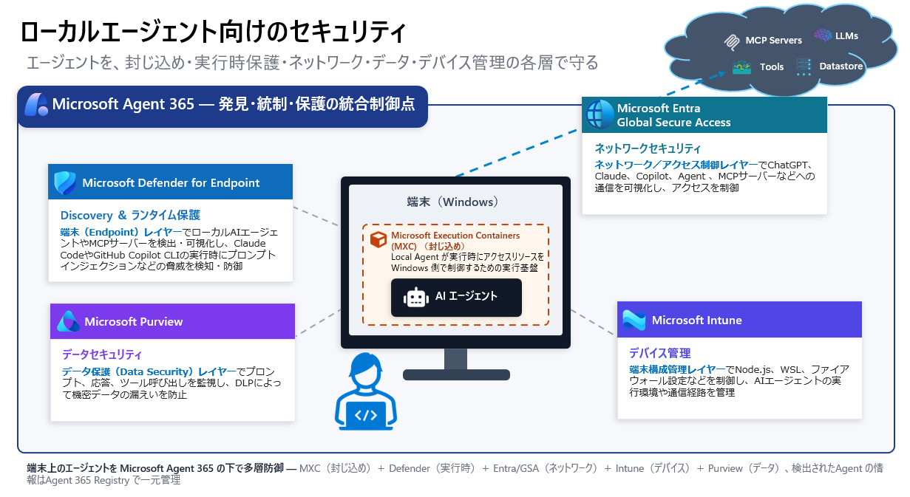

# Step 10 — ローカルエージェント（端末上で動くエージェントの検出・多層防御）

[← 目次](./README.md) ｜ [← Step 9：セキュリティ](./09-security.md) ｜ [付録：トラブルシュート →](./99-troubleshooting.md)

> [!IMPORTANT]
> 本 Step は **端末（PC）上で動作するローカル AI エージェント**（CLI・Desktop・IDE・VS Code 拡張など）を扱います。**プレビュー／ロードマップの機能を多く含み、対応製品・提供時期・成熟度は流動的**です（本ページの対応表は **2026-06-19 時点**の情報に基づきます）。実施前に本編末尾の参考リンクと Microsoft Learn で最新仕様をご確認ください。

## 目的

Step 07〜09 で見た **Observe → Govern → Secure** は、主に **Agent 365 に登録済み／プラットフォーム上のエージェント**を対象にしていました。しかし現場でもっとも「見えない」のは、**従業員が自分の PC に入れて動かすローカルエージェント**です。本 Step では、この **端末上の野良エージェント（Shadow AI）** をどう検出し、どの層でどう守るかを整理します。

> ローカルエージェントは、企業のエージェント全体像（[Step 2](./02-entra-agent-id.md) / [Step 9](./09-security.md)）の中で **最も右側＝シャドー化しやすいゾーン**にあたります。左側（Microsoft ネイティブ）を固めるだけでは届かず、**「いかに可視化して管理下に置くか」**が鍵になります。

---

## ローカルエージェントとは

**端末（Windows）上で自律的に動作する AI エージェント**です。代表的なものだけでも **20 種類以上**あり、各エージェントが **ファイル・端末・認証情報に広範な権限**を持ち、ユーザーの手を離れて自律実行します。

| 分類 | 代表例 |
| --- | --- |
| **CLI エージェント** | Claude Code / Codex CLI / Gemini CLI / GitHub Copilot CLI / OpenCode / Antigravity CLI |
| **デスクトップアプリ** | ChatGPT Desktop / Claude Desktop / Codex Desktop / Ollama Desktop / Poe Desktop |
| **エージェント IDE** | Cursor / Antigravity IDE / Windsurf |
| **VS Code 拡張機能** | Claude Code / Cline / Codex / Gemini Code Assist / GitHub Copilot / Roo Code |
| **Claw 系エージェント** | OpenClaw / Clawpilot / Claw / Nanobot |

> [!WARNING]
> **広範なアクセス権 × 自律実行 × 管理外 ＝ 攻撃対象領域（Attack Surface）の急拡大。**
> 「作った本人に悪気がない」市民開発（例：Claude Code で社内データ・BI を使うエージェントを作り、フリーの GitHub に結果を保存）でも、**オーナー不明・過剰権限・記録なし**という、かつてのマクロウイルスと同じ構造のリスクになります。

---

## エージェントの見える化スペクトラム（ローカルの位置づけ）

```
◀ 管理可能（Microsoft 統制下）              シャドー化しやすい ▶
① Microsoft ネイティブ  ② 他スタック製  ③ 自社開発・自社ホスト  ④ 外部AIサービス  ⑤ 端末上のローカルAgent
 Copilot/Studio/Foundry   SaaS/パートナー   Azure/AWS/GCP等         外部SaaS/OSS/MCP    Claude Code/Cursor/OpenClaw 等
   （深い統制）                                                                     （境界制御・要棚卸し）
```

右にいくほど「見えない」ゾーンで、**⑤ 端末上のローカルエージェントは AI Agent の棚卸しが必須**です。対策前は、次の **5 つの問い**に即答できません — 「Agent はどれくらい？／シャドー AI は？／誰の権限で？／データ保護は？／攻撃検知は？」

---

## エンドポイント上のローカルエージェントを守る — 多層防御モデル（6 層）

**単一の製品ではローカルエージェントを守りきれません。** 各レイヤーがそれぞれの役割を担い、**Agent 365 を統合制御点**として束ねます。


*▲ 端末（Windows）上のローカルエージェントを、**Microsoft Agent 365** を統合制御点に、**MXC（封じ込め）＋ Defender for Endpoint（検出・実行時保護）＋ Entra Global Secure Access（ネットワーク）＋ Intune（デバイス管理）＋ Purview（データ保護）** の各層で多層防御する。検出された情報は Agent 365 Registry で一元管理。*

| # | レイヤー | 担当製品 | 役割 |
| --- | --- | --- | --- |
| 1 | **OS コンテインメント** | **Microsoft Execution Containers (MXC)** ／ **Windows 365 for Agents** | ローカルエージェントが実行時にアクセスできるリソースを **Windows 側で封じ込め**る実行基盤 |
| 2 | **デバイス上での保護** | **Defender for Endpoint** ＋ **Purview** | 端末上のエージェント／MCP サーバーを **検出・可視化**し、実行時の脅威検知・データ保護 |
| 3 | **ネットワークフィルタリング** | **Entra Global Secure Access（GSA）** | AI サービス・MCP サーバーへの**通信を可視化・制御** |
| 4 | **ポリシー・ガバナンス** | **Microsoft Intune** | 実行環境（Node.js / WSL / ファイアウォール）を**構成管理** |
| 5 | **セッション／ID 管理** | **Entra 条件付きアクセス（CA）** | エージェント ID／デバイス準拠に基づく**アクセス制御**（[Step 8](./08-governance.md) 参照） |
| 6 | **コントロールプレーン** | **Microsoft Agent 365** | 検出された情報を **Registry で一元管理**し、Observe / Govern / Secure を適用 |

---

## 各層の役割（製品別）

- **Microsoft Defender for Endpoint（MDE）— 検出＆ランタイム保護**
  端末（Endpoint）レイヤーで**ローカル AI エージェント／MCP サーバーを検出・可視化**。Claude Code や GitHub Copilot CLI の実行時に、**プロンプトインジェクション等の脅威を検知・防御**。Advanced Hunting で構成・利用状況・デバイス／ユーザーとの関連を横断分析。
- **Microsoft Purview — データ保護**
  プロンプト・応答・ツール呼び出しを監視し、**DLP** で機密データ（個人情報・機密文書・ソースコード等）の送信・共有・外部持ち出しを検知・ブロック。監査ログとして記録。
- **Microsoft Entra Global Secure Access（GSA）— ネットワーク**
  ChatGPT／Claude／Copilot／各種 Agent／MCP サーバーへの通信を可視化し、**条件付きアクセス・ネットワークポリシー**で Shadow AI・未承認 AI サービスへの接続を制限。
- **Microsoft Intune — デバイス管理**
  **Node.js・WSL・ファイアウォール設定**などを制御し、エージェントの実行環境・通信経路を管理。導入有無・ベースライン適用・準拠状態を可視化。
- **Microsoft Execution Containers (MXC) — 封じ込め**
  ローカルエージェントの実行時アクセスリソースを Windows 側で制御する実行基盤（OS コンテインメント）。
- **Agent 365 Registry — 統合**
  検出されたローカルエージェントの情報を、他基盤のエージェントと**同じ Registry で一元的に可視化・制御**（ロードマップ）。

---

## 検出・見える化・制御の対応表（製品別）

> 凡例：**◎** GA／ネイティブ対応　**○** 対応　**△** プレビュー／一部対応　**—** 基盤依存（2026-06-19 時点）

| 製品 | 主な対象エージェント | 見える化される情報 | 制御 | 成熟度 |
| --- | --- | --- | --- | --- |
| **Defender for Endpoint**（Defender ポータル） | CLI（Claude Code / Codex CLI / Gemini CLI / GitHub Copilot CLI / OpenCode / Antigravity CLI）・Desktop（ChatGPT / Claude / Codex / Ollama / Poe）・IDE（Cursor / Antigravity / Windsurf）・VS Code 拡張（Claude Code / Cline / Codex / Gemini Code Assist / GitHub Copilot / Roo Code）・Claw 系（OpenClaw / Clawpilot / Claw・Nanobot） | 対象エージェント／MCP サーバーの存在・種類・実行端末・利用ユーザー・関連デバイス／ID・アクセス可能リソース。Advanced Hunting で横断分析 | 関連する悪意のあるプロセス・通信・攻撃活動を検知し、隔離・遮断・調査 | △ |
| **Purview** | GitHub Copilot CLI / Claude Code / OpenAI Codex / OpenClaw | エージェント一覧・ユーザープロンプト・応答・アクセスしたデータ／機密情報・利用ツール／API・実行アクション（ファイル操作等）・DLP 検知・監査ログ | プロンプト／応答／ツール呼び出しに **DLP ポリシー**を適用し、機密情報の送信・共有・持ち出しをリアルタイムに検知・ブロック | △ |
| **Entra Global Secure Access（GSA）** | 生成 AI サービス（ChatGPT / Claude / Copilot 等）・Copilot Studio Agent・SaaS AI Agent・既知／未知／社内開発／Shadow MCP サーバー | 生成 AI プロンプト・利用ユーザー・接続先 AI サービス・MCP サーバー URL・MCP メソッド（`tools/list`・`tools/call` 等）・Shadow AI/MCP 利用状況 | アクセスを条件付きアクセス・ネットワークポリシーで制御し、未承認 AI への接続を制限 | △ |
| **Intune** | OpenClaw / Claude Code / GitHub Copilot CLI などの Node.js/WSL ベースのローカル AI エージェント | 導入有無・対象デバイス・ベースライン適用状況・Node.js/WSL 設定・ファイアウォール制御状況・準拠状態 | Node.js・WSL・ローカルファイアウォール設定を制御し、通信経路や実行を制限 | ◎ |

> [!NOTE]
> **GSA と Prisma（サードパーティ SSE）を共存させる場合**は、検査対象の通信先を**事前に定義**しておく必要があります。

---

## 提供状況・前提（把握しておくべき制約）

| 項目 | 内容 |
| --- | --- |
| **対象 OS** | Windows 11（端末上ローカルエージェントの検出対象） |
| **検出経路と時期** | Intune 管理デバイス経由の検出は **GA（2026-05-01）**、Defender for Endpoint 経由・Registry Sync・Entra Suite 連携は **ロードマップ／プレビュー** |
| **多くが Preview** | MXC・Windows 365 for Agents・GSA での AI/MCP 可視化などは **プレビュー**。成熟度は上表の凡例（◎/○/△/—）を参照 |
| **ライセンス** | Microsoft Agent 365（GA 2026-05-01）／**Microsoft 365 E7（The Frontier Suite）** に含まれる。周辺は Defender・Purview・Entra Suite・Intune の各前提に依存 |

> [!IMPORTANT]
> 本 Step の対応製品・成熟度は **2026-06-19 時点**の情報です。ローカルエージェント領域はロードマップの更新が速いため、**公開・実施前に必ず最新の Microsoft Learn／ロードマップで再確認**してください。

---

## まとめ（この Step の要点）

- ローカルエージェント（端末上の CLI/Desktop/IDE/拡張）は **最もシャドー化しやすく、棚卸しが必須**。
- **単一製品では守れない** — MXC（封じ込め）＋ Defender（実行時）＋ GSA（ネットワーク）＋ Intune（デバイス）＋ Purview（データ）＋ Entra CA（ID）を **6 層**で重ね、**Agent 365 を統合制御点**にする。
- 検出情報を **Registry に集約**し、[Step 8：ガバナンス](./08-governance.md) の承認・ブロック・ライフサイクル、[Step 9：セキュリティ](./09-security.md) の脅威検知・DLP へ繋げる。
- 「見える化 × 多層防御」— これなくして安全な活用はない。

---

## 参考

- [Microsoft Agent 365 概要](https://learn.microsoft.com/microsoft-agent-365/)
- [Microsoft Defender for Endpoint（エンドポイント検出・対応）](https://learn.microsoft.com/defender-endpoint/)
- [Defender for AI エージェントの脅威検知・保護（Preview）](https://learn.microsoft.com/defender-xdr/security-for-ai/ai-agent-detection-protection)
- [Microsoft Entra Global Secure Access](https://learn.microsoft.com/entra/global-secure-access/)
- [Microsoft Intune（デバイス構成・コンプライアンス）](https://learn.microsoft.com/mem/intune/)
- [Microsoft Purview で Agent 365 のデータセキュリティ・コンプライアンスを管理する](https://learn.microsoft.com/purview/ai-agent-365)

[← 目次](./README.md) ｜ [← Step 9：セキュリティ](./09-security.md) ｜ [付録：トラブルシュート →](./99-troubleshooting.md)
