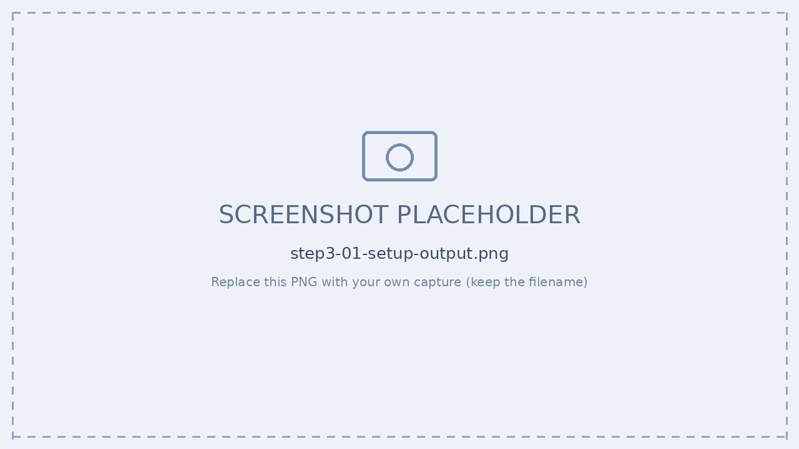
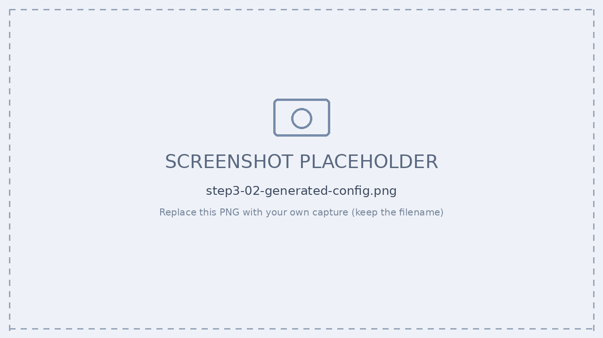
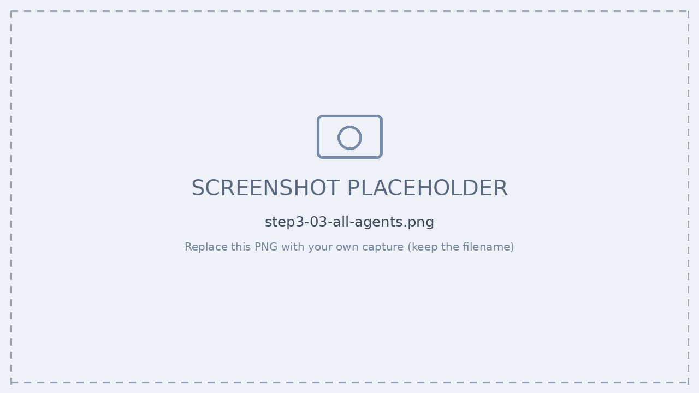
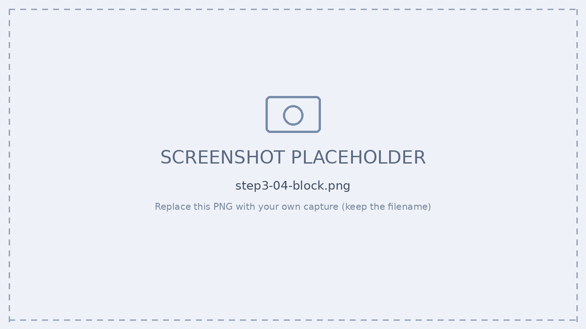

# Step 3 — Agent 365 登録（Entra Agent ID 発行）

[← 目次](./README.md) ｜ [← 前提](./00-prerequisites.md) ｜ [次：Step 4 認証 →](./step4-authentication.md)

## 目的

3P カスタムエージェントを **Agent 365 の管理下**に置き、**Entra Agent ID の付与**と **Block（Kill Switch）** までを確認します。

```
a365 setup all ──▶ a365 publish ──▶ 管理者が承認 ──▶ + Add instance ──▶ 管理下 / Block
 (--aiteammate)     (manifest.zip)   (Graph/Obs 同意)   (Entra Agent ID)   (レジストリ/Kill Switch)
```

> 担当・ポータル：**AI 管理者 ＝ M365 管理センター（Copilot Control System）**

---

## 演習 A：`a365 setup all --aiteammate` を通す

### 手順

1. **config 準備** — `a365.config.json` を AI Teammate 用に作成（`agentUserPrincipalName` / `agentUserDisplayName` の存在が AI Teammate 判定ポイント。通常 agent には無い）。
2. **setup 実行**

   ```powershell
   cd C:\path\to\agent365-langchain-nodejs
   a365 setup all --aiteammate
   ```

3. **generated config 確認**

   ```powershell
   Get-Content a365.generated.config.json | ConvertFrom-Json
   ```

   | 項目 | 確認内容 |
   | --- | --- |
   | `completed` | `True` であること（setup が完走した証拠） |
   | `agentBlueprintId` | blueprint の ID。`.env` の各 clientId/agentId と整合しているか |
   | `messagingEndpoint` | **devtunnel URL を指しているか**（古い/別物だと Teams から届かない＝最頻出の罠） |
   | `resourceConsents` | Microsoft Graph / Agent 365 Tools / Messaging Bot API / **Observability API** がすべて `consentGranted=True` か |


*▲ `a365 setup all --aiteammate` の実行結果*


*▲ generated config で `resourceConsents` が全て `True` であることを確認*

> [!TIP]
> **Observability の 403 はここで決まる。** generated config の `resourceConsents` で Observability API（`9b975845-388f-...`）が `consentGranted=True` なら、その blueprint では 403 は起きません。**新しい blueprint を作るたびに同意は付け直し**になる点に注意。

> [!WARNING]
> 逆に、**Observability 同意済みの blueprint を不用意に `a365 cleanup` しない**。同意済みの状態は貴重なので、`consentGranted=True` が揃っているなら再利用する方が早いです。

---

## 演習 B：管理下に置く → Block 確認

### 手順

1. **レジストリ確認** — M365 管理センター › **Copilot Control System › Agents › All agents**（発行元＝あなたの組織）。
2. **詳細を確認** — instance を選択 → 構成・権限・所有者（Owner / Reports to）・**Entra Agent ID の実値**を確認。
3. **Block 実行** — **Kill Switch** で使用停止。構成・データ接続は保持されたまま（協議ブロック／緊急ブロック）。
4. **解放で復帰** — クリア後に再有効化。必要なら権限是正 → 再承認。


*▲ 管理センター › Agents › All agents（レジストリ）*


*▲ Block（Kill Switch）— 構成を保持したまま使用停止*

> [!TIP]
> **Block はレジストリからの即時停止（Kill Switch）。** 構成・データ接続を保持するため、調査後にそのまま解放できます。
> 完全削除（リタイア）は [Step 6](./step6-governance.md) の `a365 cleanup` で扱います。

---

## 確認チェックリスト

- [ ] `a365.generated.config.json` の `completed=True`
- [ ] `resourceConsents` が全て `consentGranted=True`（特に Observability API）
- [ ] `messagingEndpoint` が現在の devtunnel を指している
- [ ] 管理センター All agents にエージェントが表示される
- [ ] instance の **Entra Agent ID が実値**になっている
- [ ] Block → 解放が想定どおり動く

---

## 参考

- [Microsoft Entra Agent ID とは](https://learn.microsoft.com/entra/agent-id/)
- [エージェントの公開（管理センター）](https://learn.microsoft.com/microsoft-agent-365/developer/publish)

[← 前提](./00-prerequisites.md) ｜ [次：Step 4 認証 →](./step4-authentication.md)
