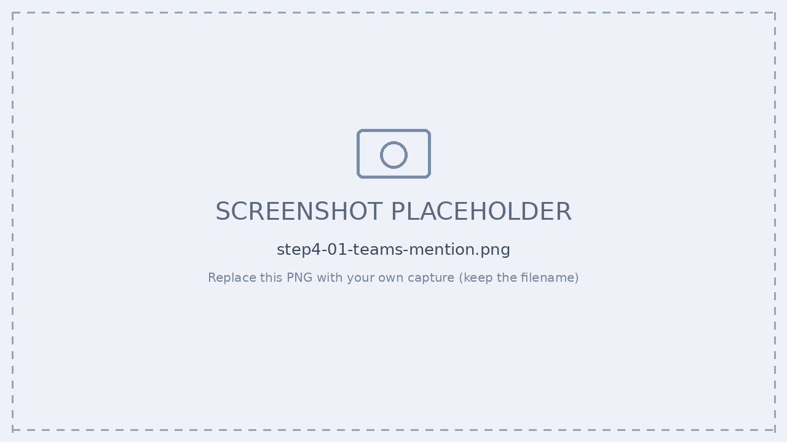
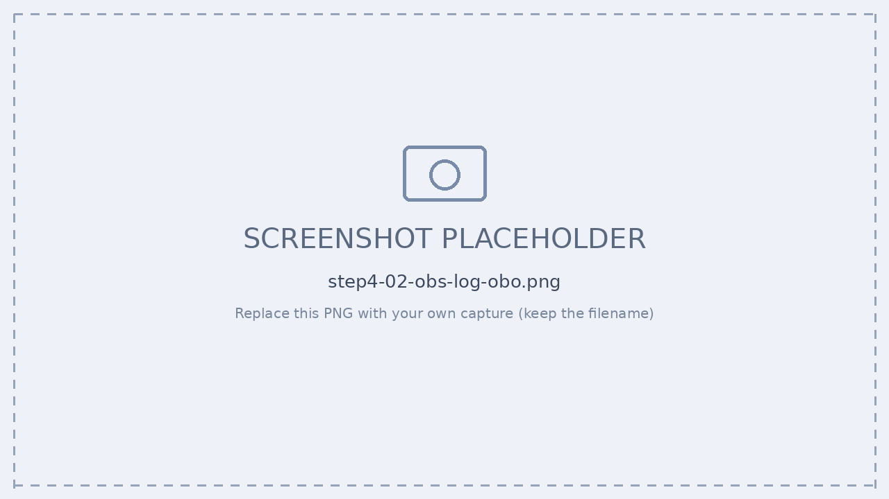
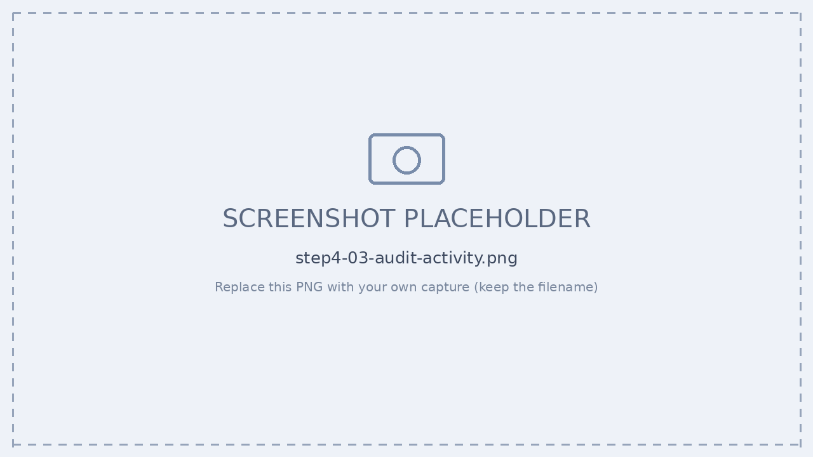
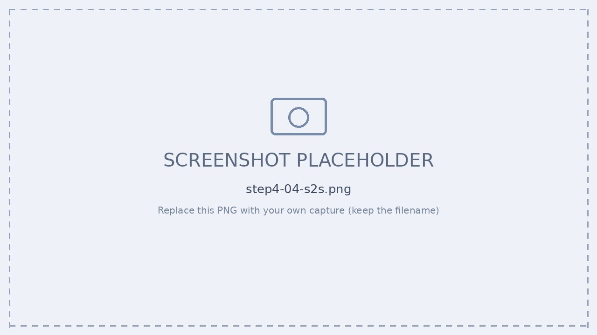

# Step 4 — 認証パターン体験（委任 OBO / 自律 S2S）

[← 目次](./README.md) ｜ [← Step 3](./step3-register.md) ｜ [次：Step 5 公開 →](./step5-publish.md)

## 目的（超重要）

Agent 365 の認証は **2 パターン**に分かれます。いずれも必ず人間に紐づきます。両方を実機で体験します。

| | A. 委任アクセス（OBO） | B. 自律型（S2S / Agent Identity） |
| --- | --- | --- |
| 主体・トリガー | ユーザー代理（**AI Teammate**） | 無人・自律（夜間処理・イベント駆動） |
| OAuth フロー | On-Behalf-Of（ユーザートークンを交換） | Service-to-Service（クライアント資格情報） |
| トークン claim | `scp` | `roles` |
| 送信ルート | `/observability/…` | `/observabilityService/…` |
| 権限の源 | ユーザーの委任権限（要ユーザー同意） | エージェント固有のアプリ権限 |
| トークン取得 | **agentic token cache**（自動） | **手動 token resolver** が必須 |
| 監査の記録主体 | **ユーザー ID として**記録 | **エージェント ID として**記録 |
| devtools authMode | `user-delegated` / `agentic-identity` | `S2S`（Service Principal） |

> [!IMPORTANT]
> **結論：OBO は自前ホストの SDK でも成立します。**
> Copilot Studio が楽なのは Microsoft がホストし、OBO のトークン交換・同意・配線をプラットフォームが肩代わりするため。
> 自前ホストの custom engine agent でも、**Teams で instance を通せば同じ agentic identity コンテキスト**が得られ、OBO・Observability は成立します。
> 「Copilot Studio では動くのに自前だと動かない」は、多くの場合「**本物の製品面 vs エミュレータ**」を比べているにすぎません。

> 必要なスコープ（共通）：`api://9b975845-388f-4429-889e-eab1ef63949c/Agent365.Observability.OtelWrite`（S2S 用 App role と OBO 用 Delegated scope の両方が同名で登録される）

---

## 事前：Teams 疎通（OBO の前提）

OBO は **本物の Teams instance 経由**で初めて成立します。受信経路の **3 点一致**を確認してください。

| 場所 | 内容 |
| --- | --- |
| devtunnel | `devtunnel host <name>` で起動。URL とポート。 |
| `.env` の `PORT` | エージェント本体の待受ポート。devtunnel のポートと一致。 |
| Bot の Notification URL | Teams Developer Portal の Bot 設定。devtunnel の `/api/messages` を指す。 |

```powershell
# 本体まで到達できるか（health は認証不要）
curl.exe https://<tunnel>-3979.use2.devtunnels.ms/api/health
# => {"status":"healthy",...}

# devtunnel の匿名アクセス許可
devtunnel access list <name>            # +Anonymous [connect] があるか
devtunnel access create <name> --anonymous
```

> [!WARNING]
> **最頻出の罠：Notification URL が古い devtunnel を指している。** devtunnel を作り直すと URL が変わるが、Bot 側の登録は古いまま残ります。Teams Developer Portal → Agent Identity Blueprint → Configuration → Notification URL を現在の devtunnel に更新してください。**名前付き devtunnel**（`devtunnel host langchain-agent`）を使い回せば URL が変わりません。

> [!WARNING]
> **Teams 経由で動かすには `NODE_ENV=production` が必須。** production のときだけ認証（JWT 検証）が有効化されます。`development` だと本物の Teams メッセージを検証できず手前で弾かれます（本体ログは無反応）。起動ログの `for appId ...` を確認：`for appId undefined`＝未設定、`for appId e722404b-...`＝正常。


*▲ Teams で instance を `@mention` → 本物の agentic コンテキスト*

---

## 演習 A：委任アクセス（OBO）— ユーザー権限で実行

### 手順

1. **OBO 経路に設定** — `Use_Custom_Resolver=false` → `AgenticTokenCacheInstance` 経路（手動 resolver 不要）。
2. **Teams で `@mention`** — `recipient.agenticAppId` に Entra Agent ID（instance の appId）が入る。
3. **ユーザー代理で実行** — OBO で M365 API を実行 → 操作は **ユーザー ID として**記録。
4. **記録を確認** — Purview 統合監査ログ「Agent 365 アクティビティ」で確認。

```ts
// agent.ts（OBO 経路：AI Teammate）
private async preloadObservabilityToken(turnContext): Promise<void> {
  const agentId  = turnContext?.activity?.recipient?.agenticAppId ?? '';
  const tenantId = turnContext?.activity?.recipient?.tenantId ?? '';
  console.log(`🔎 OBS agentId='${agentId}' tenantId='${tenantId}'`); // デバッグ用に必ず仕込む
  await AgenticTokenCacheInstance.refreshObservabilityToken(
    agentId, tenantId, turnContext, this.authorization);
}
```

```text
🔎 OBS agentId='12f560ef-...' tenantId='...'
[AgenticTokenCache] Token cached ✅
  scp claim / route=/observability/...
```


*▲ 本物の Teams instance 経由での起動ログ（agentId が実値）*


*▲ 操作が「ユーザー ID として」記録されることを確認*

> [!WARNING]
> **Playground（emulator）では検証できない。** emulator は agentic 認証コンテキストを再現せず、`agentId`/`tenantId` が空・ダミーになり `AADSTS900023` 等で失敗します。最終確認は**必ず本物の Teams instance 経由**で行ってください。

---

## 演習 B：自律型（S2S / Agent Identity）— エージェント権限で実行

### 手順

1. **S2S トークン取得** — クライアント資格情報でエージェント自身のトークン（`roles` claim）を取得。
2. **手動 resolver を実装** — token resolver でトークンを供給（OBO のような自動キャッシュは効かない）。
3. **ユーザー非依存で実行** — バックグラウンド／夜間処理として API を実行（`/observabilityService/…`）。
4. **記録と監督** — 監査で「エージェント ID として」記録。スポンサー／所有者が運用を監督。

```text
> S2S client credentials
  roles claim / route=/observabilityService/...
  scope: Agent365.Observability.OtelWrite
  ✔ autonomous (S2S) call OK
```


*▲ 自律実行（無人）— 「エージェント ID として」記録*

> [!TIP]
> 3P（カスタムエンジン）エージェントで動作確認済み。**1 つの agent アプリが OBO と S2S の両フローに参加**することも可能です（昼は AI Teammate、夜は自律バッチ）。

---

## 確認チェックリスト

- [ ] OBO：Teams `@mention` で `recipient.agenticAppId` が実値になる
- [ ] OBO：監査ログに「ユーザー ID として」記録される
- [ ] S2S：`roles` claim・`/observabilityService/` ルートで実行できる
- [ ] S2S：監査ログに「エージェント ID として」記録される
- [ ] Playground ではなく **本物の Teams instance** で検証している

---

## 参考

- [On-behalf-of フロー（Entra Agent ID）](https://learn.microsoft.com/entra/agent-id/agent-on-behalf-of-oauth-flow)
- [Agent 365 Observability の概念（認証フロー）](https://learn.microsoft.com/microsoft-agent-365/developer/observability-concepts)

[← Step 3](./step3-register.md) ｜ [次：Step 5 公開 →](./step5-publish.md)
